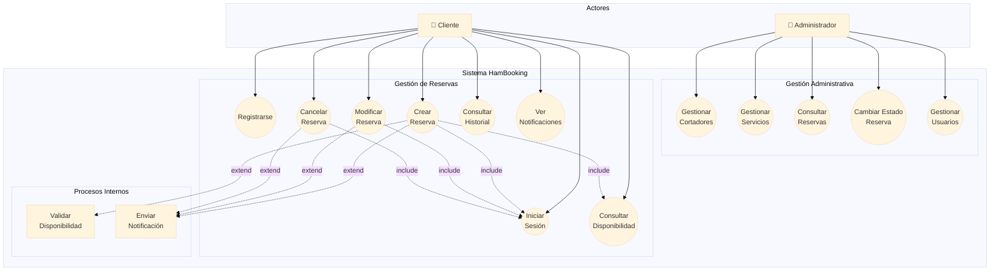

# 📋 Diagrama de Casos de Uso - HamBooking

## Diagrama UML Completo

```mermaid
graph TB
    %% Actores
    Admin((👤 Administrador))
    Cliente((👤 Cliente))
    
    %% Casos de Uso del Admin
    Admin --> UC1[Gestionar Cortadores]
    Admin --> UC2[Gestionar Servicios]
    Admin --> UC3[Consultar Reservas]
    Admin --> UC4[Cambiar Estado Reserva]
    Admin --> UC5[Gestionar Usuarios]
    
    %% Casos de Uso del Cliente
    Cliente --> UC6[Registrarse]
    Cliente --> UC7[Iniciar Sesión]
    Cliente --> UC8[Consultar Disponibilidad]
    Cliente --> UC9[Crear Reserva]
    Cliente --> UC10[Modificar Reserva]
    Cliente --> UC11[Cancelar Reserva]
    Cliente --> UC12[Consultar Historial]
    Cliente --> UC13[Ver Notificaciones]
    
    %% Relaciones Include (obligatorias)
    UC9 -.->|include| UC7
    UC10 -.->|include| UC7
    UC11 -.->|include| UC7
    UC12 -.->|include| UC7
    UC13 -.->|include| UC7
    UC9 -.->|include| UC8
    UC1 -.->|include| UC7
    UC2 -.->|include| UC7
    UC3 -.->|include| UC7
    UC4 -.->|include| UC7
    UC5 -.->|include| UC7
    
    %% Relaciones Extend (opcionales)
    UC14[Validar Disponibilidad] -.->|extend| UC9
    UC15[Enviar Notificación] -.->|extend| UC9
    UC15 -.->|extend| UC10
    UC15 -.->|extend| UC11
    
    %% Estilos
    classDef actor fill:#4ecdc4,stroke:#333,stroke-width:3px,color:#fff
    classDef usecase fill:#95e1d3,stroke:#333,stroke-width:2px
    classDef include fill:#f38181,stroke:#333,stroke-width:2px
    classDef extend fill:#ffeaa7,stroke:#333,stroke-width:2px
    
    class Admin,Cliente actor
    class UC1,UC2,UC3,UC4,UC5,UC6,UC7,UC8,UC9,UC10,UC11,UC12,UC13 usecase
    class UC14,UC15 extend
```



---

## 📊 Diagrama Alternativo (Notación UML Clásica)



---

## 📝 Especificaciones de Casos de Uso

### **Actor 1: Administrador**
Usuario con permisos totales para gestión del sistema.

---

### **CU-01: Gestionar Cortadores**

| Campo | Descripción |
|-------|-------------|
| **Actor Principal** | Administrador |
| **Precondiciones** | Admin ha iniciado sesión |
| **Flujo Principal** | 1. Admin accede al módulo de cortadores<br>2. Sistema muestra lista de cortadores<br>3. Admin selecciona acción: Crear/Editar/Activar/Desactivar<br>4. Sistema ejecuta acción y confirma |
| **Flujo Alternativo** | 3a. Si intenta eliminar último cortador activo → Error<br>3b. Si DNI/Email ya existen → Error de duplicidad |
| **Postcondiciones** | Cortador creado/modificado en BD |
| **Relaciones** | `<<include>>` Iniciar Sesión |

---

### **CU-02: Gestionar Servicios**

| Campo | Descripción |
|-------|-------------|
| **Actor Principal** | Administrador |
| **Precondiciones** | Admin ha iniciado sesión |
| **Flujo Principal** | 1. Admin accede al módulo de servicios<br>2. Sistema muestra 3 servicios predefinidos<br>3. Admin puede activar/desactivar servicios<br>4. Sistema actualiza estado |
| **Flujo Alternativo** | 3a. En v1.0 no se permite crear/modificar servicios (vía futura) |
| **Postcondiciones** | Estado del servicio actualizado |
| **Relaciones** | `<<include>>` Iniciar Sesión |
| **Nota** | En v1.0 los servicios son fijos: Jamón, Paleta, Embutidos |

---

### **CU-03: Consultar Reservas**

| Campo | Descripción |
|-------|-------------|
| **Actor Principal** | Administrador |
| **Precondiciones** | Admin ha iniciado sesión |
| **Flujo Principal** | 1. Admin accede al módulo de reservas<br>2. Sistema muestra todas las reservas<br>3. Admin puede filtrar por: Estado, Fecha, Cortador, Cliente<br>4. Sistema actualiza listado según filtros |
| **Postcondiciones** | Admin visualiza reservas solicitadas |
| **Relaciones** | `<<include>>` Iniciar Sesión |

---

### **CU-04: Cambiar Estado de Reserva**

| Campo | Descripción |
|-------|-------------|
| **Actor Principal** | Administrador |
| **Precondiciones** | Admin ha iniciado sesión y hay reservas en el sistema |
| **Flujo Principal** | 1. Admin consulta reservas<br>2. Selecciona una reserva<br>3. Cambia estado manualmente (ej: PENDING → CONFIRMED)<br>4. Sistema valida transición de estado<br>5. Sistema actualiza reserva y envía notificaciones |
| **Flujo Alternativo** | 4a. Si transición no válida (CANCELLED → CONFIRMED) → Error |
| **Postcondiciones** | Estado de reserva actualizado, notificaciones enviadas |
| **Relaciones** | `<<include>>` Iniciar Sesión<br>`<<extend>>` Enviar Notificación |

---

### **CU-05: Gestionar Usuarios**

| Campo | Descripción |
|-------|-------------|
| **Actor Principal** | Administrador |
| **Precondiciones** | Admin ha iniciado sesión |
| **Flujo Principal** | 1. Admin accede al módulo de usuarios<br>2. Sistema muestra lista de clientes<br>3. Admin puede: Ver detalles, Activar/Desactivar cuenta<br>4. Sistema ejecuta acción |
| **Flujo Alternativo** | 3a. Admin NO puede modificar datos personales (RGPD) |
| **Postcondiciones** | Usuario activado/desactivado |
| **Relaciones** | `<<include>>` Iniciar Sesión |
| **Nota** | Por privacidad, admin solo puede activar/desactivar, no editar datos |

---

### **Actor 2: Cliente**
Usuario que realiza reservas de servicios de corte.

---

### **CU-06: Registrarse**

| Campo | Descripción |
|-------|-------------|
| **Actor Principal** | Cliente (nuevo usuario) |
| **Precondiciones** | Ninguna |
| **Flujo Principal** | 1. Cliente accede a pantalla de registro<br>2. Completa formulario: DNI, Nombre, Apellidos, Email, Teléfono, Contraseña<br>3. Sistema valida datos en tiempo real<br>4. Cliente confirma registro<br>5. Sistema encripta contraseña (BCrypt), crea usuario, y confirma |
| **Flujo Alternativo** | 3a. Si DNI o Email ya existen → Error de duplicidad<br>3b. Si formato DNI inválido → Error de validación<br>3c. Si contraseña débil → Error de seguridad |
| **Postcondiciones** | Usuario creado con rol CLIENT, puede iniciar sesión |
| **Validaciones** | DNI: 8 números + 1 letra<br>Email: formato válido<br>Contraseña: min 8 chars, 1 mayúscula, 1 número |

---

### **CU-07: Iniciar Sesión**

| Campo | Descripción |
|-------|-------------|
| **Actor Principal** | Cliente o Administrador |
| **Precondiciones** | Usuario registrado en el sistema |
| **Flujo Principal** | 1. Usuario ingresa email y contraseña<br>2. Sistema valida credenciales con BCrypt<br>3. Sistema identifica rol (ADMIN o CLIENT)<br>4. Redirige a dashboard correspondiente |
| **Flujo Alternativo** | 2a. Si credenciales incorrectas → Error "Email o contraseña incorrectos"<br>2b. Si cuenta desactivada → Error "Cuenta inactiva, contacte administrador" |
| **Postcondiciones** | Sesión iniciada, usuario autenticado |
| **Nota** | Caso de uso base incluido por casi todos los demás |

---

### **CU-08: Consultar Disponibilidad**

| Campo | Descripción |
|-------|-------------|
| **Actor Principal** | Cliente |
| **Precondiciones** | Cliente ha iniciado sesión, existe al menos 1 cortador activo |
| **Flujo Principal** | 1. Cliente selecciona tipo de servicio (Jamón/Paleta/Embutido)<br>2. Cliente selecciona fecha mediante DatePicker<br>3. Sistema consulta disponibilidad de cortadores<br>4. Sistema muestra calendario visual con slots:<br>   - Verde: Disponible<br>   - Rojo: Ocupado<br>   - Gris: Insuficiente tiempo |
| **Flujo Alternativo** | 3a. Si no hay cortadores activos → Mensaje "Sistema en mantenimiento" |
| **Postcondiciones** | Cliente visualiza disponibilidad real |
| **Relaciones** | `<<include>>` Iniciar Sesión |

---

### **CU-09: Crear Reserva**

| Campo | Descripción |
|-------|-------------|
| **Actor Principal** | Cliente |
| **Precondiciones** | Cliente ha iniciado sesión, hay disponibilidad |
| **Flujo Principal** | 1. Cliente consulta disponibilidad<br>2. Hace click en slot verde (disponible)<br>3. Sistema muestra formulario de confirmación con resumen<br>4. Cliente confirma reserva<br>5. Sistema ejecuta validaciones:<br>   - No excede 2 reservas diarias<br>   - No excede 4 reservas semanales<br>   - Cortador tiene slots libres<br>   - Cortador no excede 3 jamones/día<br>   - Fecha >= mañana<br>6. Sistema crea reserva con estado CONFIRMED<br>7. Sistema envía 3 notificaciones (cliente, cortador, admin)<br>8. Sistema confirma al cliente |
| **Flujo Alternativo** | 5a. Si falla validación → Mostrar error específico<br>5b. Si slot ya reservado (concurrencia) → Error "Slot no disponible" |
| **Postcondiciones** | Reserva creada en BD, notificaciones enviadas, slot bloqueado |
| **Relaciones** | `<<include>>` Iniciar Sesión<br>`<<include>>` Consultar Disponibilidad<br>`<<extend>>` Validar Disponibilidad<br>`<<extend>>` Enviar Notificación |

---

### **CU-10: Modificar Reserva**

| Campo | Descripción |
|-------|-------------|
| **Actor Principal** | Cliente o Administrador |
| **Precondiciones** | Reserva existe, fecha >= mañana |
| **Flujo Principal** | 1. Usuario consulta su historial de reservas<br>2. Selecciona reserva a modificar<br>3. Sistema valida fecha (>= mañana)<br>4. Usuario modifica: Fecha, Hora, Servicio o Cortador<br>5. Sistema recalcula end_time<br>6. Sistema revalida disponibilidad y límites<br>7. Sistema actualiza reserva (mantiene ID)<br>8. Sistema envía notificaciones MODIFIED |
| **Flujo Alternativo** | 3a. Si fecha < mañana → Error "Debe modificar con 1 día de antelación"<br>6a. Si nueva configuración no válida → Error específico |
| **Postcondiciones** | Reserva modificada, notificaciones enviadas, slots actualizados |
| **Relaciones** | `<<include>>` Iniciar Sesión<br>`<<extend>>` Enviar Notificación |

---

### **CU-11: Cancelar Reserva**

| Campo | Descripción |
|-------|-------------|
| **Actor Principal** | Cliente o Administrador |
| **Precondiciones** | Reserva existe con estado CONFIRMED o PENDING, fecha >= mañana |
| **Flujo Principal** | 1. Usuario consulta reservas<br>2. Selecciona reserva a cancelar<br>3. Sistema valida fecha (>= mañana)<br>4. Usuario confirma cancelación<br>5. Sistema cambia estado a CANCELLED<br>6. Sistema libera slots del cortador<br>7. Sistema envía notificaciones CANCELLED |
| **Flujo Alternativo** | 3a. Si fecha < mañana → Error "Debe cancelar con 1 día de antelación"<br>5a. Si reserva ya COMPLETED → Error "No se puede cancelar reserva completada" |
| **Postcondiciones** | Reserva cancelada, slots liberados, notificaciones enviadas |
| **Relaciones** | `<<include>>` Iniciar Sesión<br>`<<extend>>` Enviar Notificación |

---

### **CU-12: Consultar Historial**

| Campo | Descripción |
|-------|-------------|
| **Actor Principal** | Cliente |
| **Precondiciones** | Cliente ha iniciado sesión |
| **Flujo Principal** | 1. Cliente accede a "Mis Reservas"<br>2. Sistema muestra tabla con todas sus reservas<br>3. Cliente puede filtrar:<br>   - Próximas (fecha >= hoy, estado CONFIRMED)<br>   - Pasadas (estado COMPLETED)<br>   - Todas<br>4. Cliente puede ordenar por fecha<br>5. Cliente hace click en reserva para ver detalles completos |
| **Postcondiciones** | Cliente visualiza su historial |
| **Relaciones** | `<<include>>` Iniciar Sesión |

---

### **CU-13: Ver Notificaciones**

| Campo | Descripción |
|-------|-------------|
| **Actor Principal** | Cliente |
| **Precondiciones** | Cliente ha iniciado sesión |
| **Flujo Principal** | 1. Cliente accede a "Notificaciones"<br>2. Sistema muestra lista de notificaciones ordenadas por fecha<br>3. Cliente hace click en notificación<br>4. Sistema muestra mensaje completo y marca como leída |
| **Postcondiciones** | Cliente lee notificación, estado actualizado a leída=true |
| **Relaciones** | `<<include>>` Iniciar Sesión |

---

### **Casos de Uso Internos (Extend)**

---

### **CU-14: Validar Disponibilidad**

| Campo | Descripción |
|-------|-------------|
| **Actor Principal** | Sistema (automático) |
| **Descripción** | Proceso interno que verifica disponibilidad real del cortador considerando reservas existentes, horario laboral, y restricciones |
| **Algoritmo** | 1. Generar todos los slots posibles (10:00-18:00 cada 30 min)<br>2. Obtener reservas del cortador en esa fecha<br>3. Eliminar slots ocupados<br>4. Filtrar slots según duración del servicio<br>5. Retornar lista de LocalTime disponibles |
| **Relaciones** | `<<extend>>` Crear Reserva |

---

### **CU-15: Enviar Notificación**

| Campo | Descripción |
|-------|-------------|
| **Actor Principal** | Sistema (automático) |
| **Descripción** | Proceso interno que genera notificaciones simuladas tras eventos de reserva |
| **Flujo** | 1. Determinar tipo (CREATED/MODIFIED/CANCELLED)<br>2. Generar 3 registros en tabla notifications:<br>   - Destinatario: Cliente (email de users)<br>   - Destinatario: Cortador (email de carvers.user)<br>   - Destinatario: Admin (admin@hambooking.com)<br>3. Escribir log en consola: Logger.info("EMAIL → destinatario: asunto")<br>4. Marcar is_sent=true |
| **Relaciones** | `<<extend>>` Crear Reserva, Modificar Reserva, Cancelar Reserva |

---

## 📊 Resumen de Casos de Uso

| ID | Nombre | Actor | Tipo | Relaciones |
|----|--------|-------|------|------------|
| CU-01 | Gestionar Cortadores | Admin | CRUD | include: CU-07 |
| CU-02 | Gestionar Servicios | Admin | CRUD | include: CU-07 |
| CU-03 | Consultar Reservas | Admin | Consulta | include: CU-07 |
| CU-04 | Cambiar Estado Reserva | Admin | Actualización | include: CU-07, extend: CU-15 |
| CU-05 | Gestionar Usuarios | Admin | CRUD | include: CU-07 |
| CU-06 | Registrarse | Cliente | Creación | - |
| CU-07 | Iniciar Sesión | Ambos | Autenticación | - |
| CU-08 | Consultar Disponibilidad | Cliente | Consulta | include: CU-07 |
| CU-09 | Crear Reserva | Cliente | Creación | include: CU-07, CU-08, extend: CU-14, CU-15 |
| CU-10 | Modificar Reserva | Ambos | Actualización | include: CU-07, extend: CU-15 |
| CU-11 | Cancelar Reserva | Ambos | Actualización | include: CU-07, extend: CU-15 |
| CU-12 | Consultar Historial | Cliente | Consulta | include: CU-07 |
| CU-13 | Ver Notificaciones | Cliente | Consulta | include: CU-07 |
| CU-14 | Validar Disponibilidad | Sistema | Interno | - |
| CU-15 | Enviar Notificación | Sistema | Interno | - |

**Total:** 15 casos de uso (13 principales + 2 internos)

---

## 🎯 Explicación de Relaciones

### **Relaciones `<<include>>`** (Obligatorias)
```
CU-09 (Crear Reserva) ──include──> CU-07 (Iniciar Sesión)
```
**Significado:** Para crear una reserva, el cliente DEBE haber iniciado sesión previamente. La sesión es obligatoria.

**Todos los casos que incluyen Iniciar Sesión:**
- Gestionar Cortadores
- Gestionar Servicios
- Consultar Reservas
- Cambiar Estado Reserva
- Gestionar Usuarios
- Crear Reserva
- Modificar Reserva
- Cancelar Reserva
- Consultar Historial
- Ver Notificaciones

### **Relaciones `<<extend>>`** (Opcionales)
```
CU-14 (Validar Disponibilidad) ──extend──> CU-09 (Crear Reserva)
```
**Significado:** Al crear una reserva, el sistema PUEDE ejecutar validación de disponibilidad si es necesario. Es un comportamiento adicional opcional.

**Extensiones principales:**
- `Validar Disponibilidad` extiende `Crear Reserva` (verifica slots antes de confirmar)
- `Enviar Notificación` extiende `Crear/Modificar/Cancelar Reserva` (genera logs tras evento)

---

## ✅ Checklist para la Entrega Intermedia

```yaml
Diagrama de Casos de Uso: ✅ COMPLETADO

Contiene:
- [x] 2 actores claramente identificados (Admin, Cliente)
- [x] 15 casos de uso bien definidos
- [x] Relaciones include (CU-07 es base de casi todos)
- [x] Relaciones extend (CU-14, CU-15 extienden operaciones)
- [x] Notación UML estándar
- [x] Formato Mermaid (renderizable en GitHub)
- [x] Especificaciones detalladas de cada caso de uso
- [x] Tabla resumen con relaciones

Archivos a entregar:
📁 docs/diagramas/
  └── CasosDeUso-HamBooking.md (este documento completo)

Próximo paso:
- Issue #? (siguiente): Diagrama de Clases
```

---

## 🚀 Próximo Diagrama: Clases

Ya tienes:
- ✅ Diagrama ER (5 tablas con relaciones)
- ✅ Diagrama de Casos de Uso (15 casos con especificaciones)

Falta:
- ❌ **Diagrama de Clases** (entidades JPA + relaciones)

**¿Continuamos con el Diagrama de Clases?** 🎯

Incluirá:
- 5 clases principales (User, Carver, Service, Reservation, Notification)
- Atributos con tipos de datos
- Métodos principales
- Relaciones UML: composición, agregación, herencia
- Multiplicidades (1..1, 0..*, 1..*)
- Notación UML estándar