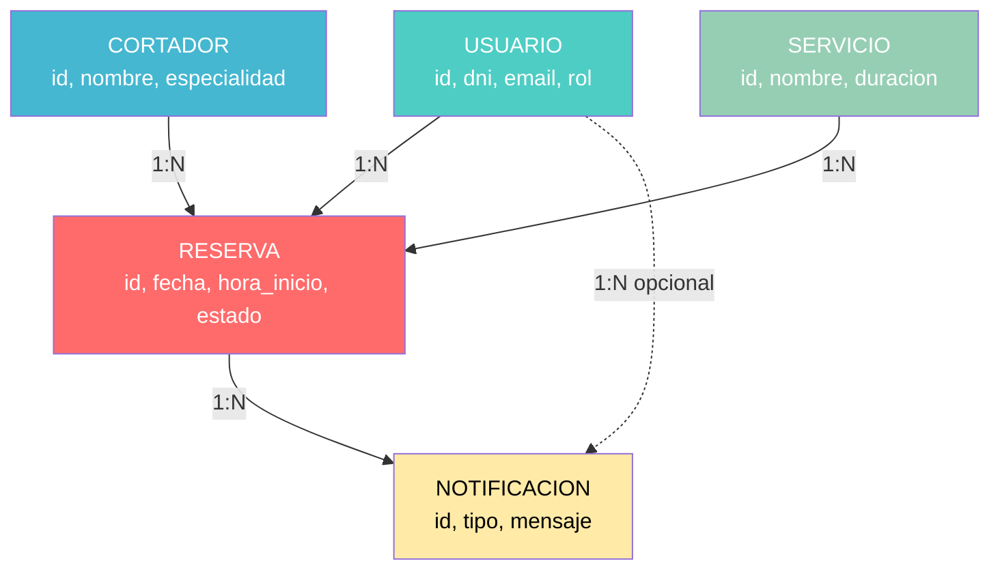
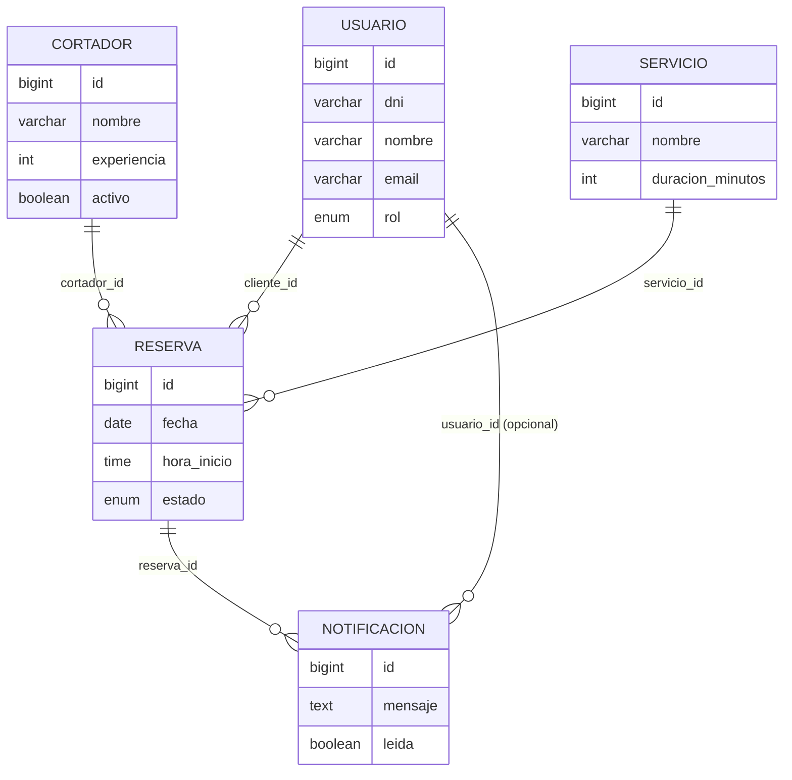

# 📊 Diagrama Entidad-Relación - JamonBooking

## Diagrama ER Completo (Notación Mermaid)

```mermaid
erDiagram
    USUARIO ||--o{ RESERVA : "realiza"
    CORTADOR ||--o{ RESERVA : "atiende"
    SERVICIO ||--o{ RESERVA : "se_solicita_en"
    RESERVA ||--o{ NOTIFICACION : "genera"
    USUARIO ||--o{ NOTIFICACION : "recibe"

    USUARIO {
        bigint id PK "Auto-increment"
        varchar(9) dni UK "NOT NULL, UNIQUE"
        varchar(100) nombre "NOT NULL"
        varchar(200) apellidos "NOT NULL"
        varchar(150) email UK "NOT NULL, UNIQUE"
        varchar(15) telefono "NOT NULL"
        varchar(255) password "NOT NULL, BCrypt"
        enum rol "NOT NULL (ADMIN, CLIENTE)"
        boolean activo "DEFAULT TRUE"
        timestamp fecha_registro "DEFAULT CURRENT_TIMESTAMP"
    }

    CORTADOR {
        bigint id PK "Auto-increment"
        varchar(100) nombre "NOT NULL"
        varchar(200) apellidos "NOT NULL"
        varchar(9) dni UK "NOT NULL, UNIQUE"
        varchar(150) email UK "NOT NULL, UNIQUE"
        varchar(15) telefono "NULL"
        int experiencia "Años de experiencia"
        varchar(100) especialidad "Jamón, Paleta, Embutidos, Todos"
        boolean activo "DEFAULT TRUE"
        timestamp fecha_alta "DEFAULT CURRENT_TIMESTAMP"
    }

    SERVICIO {
        bigint id PK "Auto-increment"
        varchar(100) nombre "NOT NULL (Corte Jamón, Paleta, Embutido)"
        int duracion_minutos "NOT NULL (120, 60, 30)"
        decimal(10,2) precio "Informativo (45.00, 25.00, 12.00)"
        text descripcion "NULL"
        boolean activo "DEFAULT TRUE"
    }

    RESERVA {
        bigint id PK "Auto-increment"
        bigint cliente_id FK "NOT NULL, ref USUARIO(id)"
        bigint cortador_id FK "NOT NULL, ref CORTADOR(id)"
        bigint servicio_id FK "NOT NULL, ref SERVICIO(id)"
        date fecha "NOT NULL"
        time hora_inicio "NOT NULL"
        time hora_fin "NOT NULL, Calculado automáticamente"
        enum estado "NOT NULL (PENDIENTE, CONFIRMADA, REALIZADA, CANCELADA)"
        timestamp created_at "DEFAULT CURRENT_TIMESTAMP"
        timestamp updated_at "ON UPDATE CURRENT_TIMESTAMP"
    }

    NOTIFICACION {
        bigint id PK "Auto-increment"
        bigint usuario_id FK "NULL, ref USUARIO(id)"
        bigint reserva_id FK "NOT NULL, ref RESERVA(id)"
        enum tipo "NOT NULL (NUEVA_RESERVA, CANCELACION, MODIFICACION)"
        varchar(150) destinatario_email "NOT NULL"
        text mensaje "NOT NULL"
        boolean leida "DEFAULT FALSE"
        timestamp fecha_envio "DEFAULT CURRENT_TIMESTAMP"
    }
```

---

## 📐 Explicación de Relaciones

### **1. USUARIO ─(1:N)─ RESERVA**
```
Cardinalidad: Un usuario puede realizar MUCHAS reservas
              Una reserva pertenece a UN SOLO usuario (cliente)

Relación: USUARIO.id ──► RESERVA.cliente_id (FK)

Justificación:
- Los clientes registrados pueden hacer múltiples reservas a lo largo del tiempo
- Cada reserva está asociada a un único cliente que la solicitó
- Permite historial completo de reservas por usuario
```

### **2. CORTADOR ─(1:N)─ RESERVA**
```
Cardinalidad: Un cortador puede atender MUCHAS reservas
              Una reserva es atendida por UN SOLO cortador

Relación: CORTADOR.id ──► RESERVA.cortador_id (FK)

Justificación:
- Los cortadores son recursos que se asignan a múltiples trabajos
- Cada reserva tiene un cortador específico asignado
- Permite calcular carga de trabajo por cortador
```

### **3. SERVICIO ─(1:N)─ RESERVA**
```
Cardinalidad: Un servicio puede estar en MUCHAS reservas
              Una reserva corresponde a UN SOLO servicio

Relación: SERVICIO.id ──► RESERVA.servicio_id (FK)

Justificación:
- Los servicios son tipos predefinidos (Jamón, Paleta, Embutido)
- Cada reserva solicita un tipo específico de servicio
- La duración del servicio determina los slots ocupados
```

### **4. RESERVA ─(1:N)─ NOTIFICACION**
```
Cardinalidad: Una reserva puede generar MUCHAS notificaciones
              Una notificación pertenece a UNA reserva

Relación: RESERVA.id ──► NOTIFICACION.reserva_id (FK)

Justificación:
- Cada evento de reserva (crear, modificar, cancelar) genera notificaciones
- Se envían a múltiples destinatarios (cliente, cortador, admin)
- Permite trazabilidad de comunicaciones por reserva
```

### **5. USUARIO ─(1:N)─ NOTIFICACION (Opcional)**
```
Cardinalidad: Un usuario puede recibir MUCHAS notificaciones
              Una notificación puede asociarse a UN usuario (o ninguno)

Relación: USUARIO.id ──► NOTIFICACION.usuario_id (FK, NULL)

Justificación:
- Las notificaciones a clientes se vinculan a su cuenta
- Las notificaciones a cortadores no tienen usuario_id (solo email)
- Permite que los clientes vean su historial de notificaciones en la app
```

---

## 🔑 Constraints e Índices Críticos

### **Unique Constraints**
```sql
-- Evitar duplicados en datos sensibles
UNIQUE KEY uk_usuario_dni (dni)
UNIQUE KEY uk_usuario_email (email)
UNIQUE KEY uk_cortador_dni (dni)
UNIQUE KEY uk_cortador_email (email)

-- CRÍTICO: Evitar solapamientos de reservas
UNIQUE KEY uk_reserva_slot (cortador_id, fecha, hora_inicio)
```

### **Índices para Rendimiento**
```sql
-- Búsquedas frecuentes
INDEX idx_reserva_fecha_estado (fecha, estado)
INDEX idx_reserva_cortador_fecha (cortador_id, fecha)
INDEX idx_reserva_cliente (cliente_id)
INDEX idx_notificacion_usuario_leida (usuario_id, leida)
INDEX idx_usuario_email (email)  -- Para login
INDEX idx_cortador_activo (activo)  -- Para disponibilidad
```

### **Foreign Keys con Acciones**
```sql
-- Si se elimina un usuario, sus reservas NO se borran (para historial)
FOREIGN KEY (cliente_id) REFERENCES usuario(id) ON DELETE RESTRICT

-- Si se elimina un cortador, sus reservas NO se borran (para historial)
FOREIGN KEY (cortador_id) REFERENCES cortador(id) ON DELETE RESTRICT

-- Si se elimina una reserva, sus notificaciones SÍ se borran
FOREIGN KEY (reserva_id) REFERENCES reserva(id) ON DELETE CASCADE

-- Usuario en notificación es opcional
FOREIGN KEY (usuario_id) REFERENCES usuario(id) ON DELETE CASCADE
```

---

## 📊 Diagrama ER Simplificado (Visión General)



---

## 🎯 Reglas de Negocio Implementadas en el Modelo

### **1. Control de Unicidad**
```sql
-- Un DNI/Email solo puede pertenecer a un usuario o cortador
UNIQUE (dni), UNIQUE (email) en USUARIO y CORTADOR

-- Un cortador no puede tener dos reservas al mismo tiempo
UNIQUE (cortador_id, fecha, hora_inicio) en RESERVA
```

### **2. Integridad Referencial**
```sql
-- Toda reserva DEBE tener un cliente, cortador y servicio válidos
NOT NULL en cliente_id, cortador_id, servicio_id

-- Las notificaciones DEBEN estar asociadas a una reserva
NOT NULL en reserva_id
```

### **3. Validaciones de Estado**
```sql
-- Estados válidos de reserva (ENUM)
estado IN ('PENDIENTE', 'CONFIRMADA', 'REALIZADA', 'CANCELADA')

-- Roles de usuario válidos (ENUM)
rol IN ('ADMIN', 'CLIENTE')

-- Tipos de notificación (ENUM)
tipo IN ('NUEVA_RESERVA', 'CANCELACION', 'MODIFICACION')
```

### **4. Datos Predefinidos**
```sql
-- Los 3 servicios son fijos en el sistema
INSERT INTO servicio VALUES
(1, 'Corte de Jamón', 120, 45.00, 'Corte profesional de jamón serrano o ibérico', TRUE),
(2, 'Corte de Paleta', 60, 25.00, 'Corte profesional de paleta ibérica', TRUE),
(3, 'Corte de Embutido', 30, 12.00, 'Corte de embutidos variados', TRUE);

-- Usuario administrador único predefinido
INSERT INTO usuario VALUES
(1, '12345678A', 'Admin', 'Sistema', 'admin@jamonbooking.com', 
 '600000000', '$2a$10$...', 'ADMIN', TRUE, NOW());
```

---

## 🔍 Consultas SQL Críticas del Sistema

### **Q1: Verificar disponibilidad de cortador**
```sql
SELECT COUNT(*) AS conflictos
FROM reserva
WHERE cortador_id = ?
  AND fecha = ?
  AND estado IN ('PENDIENTE', 'CONFIRMADA')
  AND (
    (hora_inicio < ? AND hora_fin > ?) OR  -- Solapa inicio
    (hora_inicio < ? AND hora_fin > ?) OR  -- Solapa fin
    (hora_inicio >= ? AND hora_fin <= ?)   -- Está dentro
  );
-- Si conflictos = 0, slot disponible
```

### **Q2: Contar reservas diarias de un cliente**
```sql
SELECT COUNT(*) AS reservas_hoy
FROM reserva
WHERE cliente_id = ?
  AND fecha = ?
  AND estado IN ('PENDIENTE', 'CONFIRMADA');
-- Límite: reservas_hoy < 2
```

### **Q3: Contar reservas semanales de un cliente**
```sql
SELECT COUNT(*) AS reservas_semana
FROM reserva
WHERE cliente_id = ?
  AND fecha BETWEEN ? AND ?  -- Lunes a Viernes de esa semana
  AND estado IN ('PENDIENTE', 'CONFIRMADA');
-- Límite: reservas_semana < 4
```

### **Q4: Contar jamones diarios de un cortador**
```sql
SELECT COUNT(*) AS jamones_hoy
FROM reserva r
JOIN servicio s ON r.servicio_id = s.id
WHERE r.cortador_id = ?
  AND r.fecha = ?
  AND s.duracion_minutos = 120  -- Jamón
  AND r.estado IN ('PENDIENTE', 'CONFIRMADA');
-- Límite: jamones_hoy < 3
```

### **Q5: Calcular minutos ocupados de un cortador en un día**
```sql
SELECT COALESCE(SUM(s.duracion_minutos), 0) AS minutos_ocupados
FROM reserva r
JOIN servicio s ON r.servicio_id = s.id
WHERE r.cortador_id = ?
  AND r.fecha = ?
  AND r.estado IN ('PENDIENTE', 'CONFIRMADA');
-- Límite: minutos_ocupados < 360 (6 horas)
```

### **Q6: Obtener slots libres de un cortador**
```sql
-- Pseudo-código (implementado en Java Service)
1. Generar todos los slots posibles (10:00-18:00 cada 30 min)
2. SELECT hora_inicio, hora_fin FROM reserva 
   WHERE cortador_id = ? AND fecha = ? AND estado IN ('PENDIENTE','CONFIRMADA')
3. Eliminar slots que solapen con reservas existentes
4. Filtrar slots que cumplan con la duración del servicio solicitado
5. Retornar lista de LocalTime disponibles
```

---

## 📁 Normalización del Modelo

### **Primera Forma Normal (1FN)** ✅
- Todos los atributos contienen valores atómicos
- No hay grupos repetitivos
- Cada columna tiene un tipo de dato único

### **Segunda Forma Normal (2FN)** ✅
- Cumple 1FN
- Todos los atributos no clave dependen completamente de la clave primaria
- No hay dependencias parciales

### **Tercera Forma Normal (3FN)** ✅
- Cumple 2FN
- No hay dependencias transitivas
- Ejemplo: `hora_fin` en RESERVA depende de `hora_inicio + duracion_minutos` (del servicio)
  - Se calcula en el Service, NO se almacena como campo independiente calculable

---

## 🎨 Diagrama ER Visual (Formato Crow's Foot)



**Leyenda Crow's Foot:**
- `||` = Uno y solo uno (obligatorio)
- `o{` = Cero o muchos (opcional múltiple)
- `|{` = Uno o muchos (obligatorio múltiple)

---

## 📝 Diccionario de Datos (Resumen)

| Entidad | Descripción | PK | FKs |
|---------|-------------|----|----|
| **USUARIO** | Clientes y administrador del sistema | id | - |
| **CORTADOR** | Profesionales que realizan los cortes | id | - |
| **SERVICIO** | Tipos de servicios ofrecidos (3 fijos) | id | - |
| **RESERVA** | Citas agendadas de clientes con cortadores | id | cliente_id, cortador_id, servicio_id |
| **NOTIFICACION** | Logs de comunicaciones del sistema | id | reserva_id, usuario_id (null) |

**Total de entidades:** 5
**Total de relaciones:** 5 (cumple requisito mínimo de 3 tablas relacionadas)

---

## ✅ Verificación de Requisitos de la Normativa

| Requisito | Estado | Detalles |
|-----------|--------|----------|
| Mínimo 3 tablas relacionadas | ✅ CUMPLE | 5 tablas con relaciones explícitas |
| Claves primarias definidas | ✅ CUMPLE | Todas las entidades tienen PK |
| Claves foráneas correctas | ✅ CUMPLE | 7 FKs con integridad referencial |
| Normalización | ✅ CUMPLE | Modelo en 3FN |
| Constraints de negocio | ✅ CUMPLE | UNIQUE, NOT NULL, ENUM, índices |

---

## 🚀 Próximos Pasos

**Ahora que tienes el diagrama ER:**

1. ✅ **Issue #4 Completada** - Guardar este diagrama en `/docs/diagramas/ER-JamonBooking.md`
2. ➡️ **Issue #5**: Crear el script SQL completo (`database/schema.sql`)
3. ➡️ **Issue #6-10**: Implementar entidades JPA en el backend

**Para incluir en la memoria:**
- Diagrama ER visual (exportar PNG desde Mermaid Live)
- Explicación de relaciones (sección Análisis)
- Diccionario de datos (Anexo)

---

**¿Quieres que ahora creemos el script SQL completo (Issue #5)?** 🎯