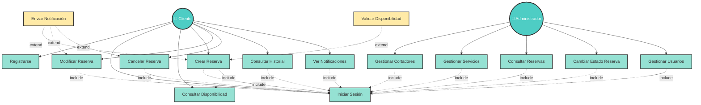

```mermaid
graph TB
    %% Actores
    Admin((👤 Administrador))
    Cliente((👤 Cliente))
    
    %% Casos de Uso del Admin
    Admin --> UC1[Gestionar Cortadores]
    Admin --> UC2[Gestionar Servicios]
    Admin --> UC3[Consultar Reservas]
    Admin --> UC4[Cambiar Estado Reserva]
    Admin --> UC5[Gestionar Usuarios]
    
    %% Casos de Uso del Cliente
    Cliente --> UC6[Registrarse]
    Cliente --> UC7[Iniciar Sesión]
    Cliente --> UC8[Consultar Disponibilidad]
    Cliente --> UC9[Crear Reserva]
    Cliente --> UC10[Modificar Reserva]
    Cliente --> UC11[Cancelar Reserva]
    Cliente --> UC12[Consultar Historial]
    Cliente --> UC13[Ver Notificaciones]
    
    %% Relaciones Include (obligatorias)
    UC9 -.->|include| UC7
    UC10 -.->|include| UC7
    UC11 -.->|include| UC7
    UC12 -.->|include| UC7
    UC13 -.->|include| UC7
    UC9 -.->|include| UC8
    UC1 -.->|include| UC7
    UC2 -.->|include| UC7
    UC3 -.->|include| UC7
    UC4 -.->|include| UC7
    UC5 -.->|include| UC7
    
    %% Relaciones Extend (opcionales)
    UC14[Validar Disponibilidad] -.->|extend| UC9
    UC15[Enviar Notificación] -.->|extend| UC9
    UC15 -.->|extend| UC10
    UC15 -.->|extend| UC11
    
    %% Estilos
    classDef actor fill:#4ecdc4,stroke:#333,stroke-width:3px,color:#fff
    classDef usecase fill:#95e1d3,stroke:#333,stroke-width:2px
    classDef include fill:#f38181,stroke:#333,stroke-width:2px
    classDef extend fill:#ffeaa7,stroke:#333,stroke-width:2px
    
    class Admin,Cliente actor
    class UC1,UC2,UC3,UC4,UC5,UC6,UC7,UC8,UC9,UC10,UC11,UC12,UC13 usecase
    class UC14,UC15 extend
```