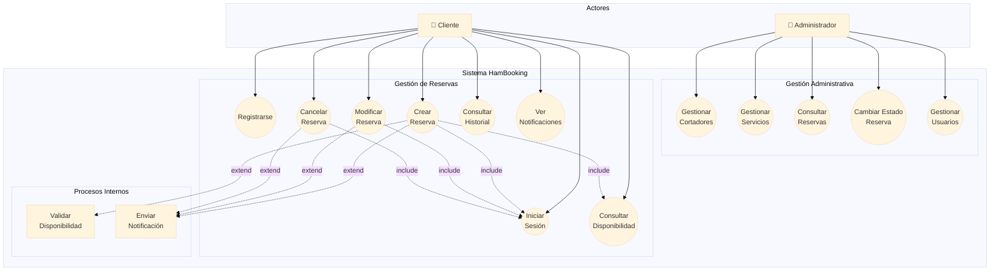

```mermaid
%%{init: {'theme':'base'}}%%
flowchart TB
    subgraph Actores
        A1[👤 Administrador]
        A2[👤 Cliente]
    end
    
    subgraph "Sistema HamBooking"
        subgraph "Gestión Administrativa"
            UC1((Gestionar<br/>Cortadores))
            UC2((Gestionar<br/>Servicios))
            UC3((Consultar<br/>Reservas))
            UC4((Cambiar Estado<br/>Reserva))
            UC5((Gestionar<br/>Usuarios))
        end
        
        subgraph "Gestión de Reservas"
            UC6((Registrarse))
            UC7((Iniciar<br/>Sesión))
            UC8((Consultar<br/>Disponibilidad))
            UC9((Crear<br/>Reserva))
            UC10((Modificar<br/>Reserva))
            UC11((Cancelar<br/>Reserva))
            UC12((Consultar<br/>Historial))
            UC13((Ver<br/>Notificaciones))
        end
        
        subgraph "Procesos Internos"
            UC14[Validar<br/>Disponibilidad]
            UC15[Enviar<br/>Notificación]
        end
    end
    
    A1 --> UC1
    A1 --> UC2
    A1 --> UC3
    A1 --> UC4
    A1 --> UC5
    
    A2 --> UC6
    A2 --> UC7
    A2 --> UC8
    A2 --> UC9
    A2 --> UC10
    A2 --> UC11
    A2 --> UC12
    A2 --> UC13
    
    UC9 -.->|include| UC7
    UC9 -.->|include| UC8
    UC9 -.->|extend| UC14
    UC9 -.->|extend| UC15
    
    UC10 -.->|include| UC7
    UC10 -.->|extend| UC15
    
    UC11 -.->|include| UC7
    UC11 -.->|extend| UC15
```