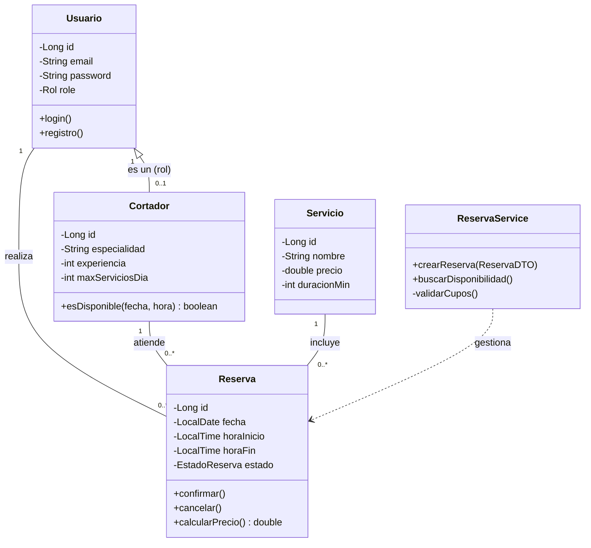

```mermaid
classDiagram
    class Usuario {
        -Long id
        -String email
        -String password
        -Rol role
        +login()
        +registro()
    }

    class Cortador {
        -Long id
        -String especialidad
        -int experiencia
        -int maxServiciosDia
        +esDisponible(fecha, hora) boolean
    }

    class Servicio {
        -Long id
        -String nombre
        -double precio
        -int duracionMin
    }

    class Reserva {
        -Long id
        -LocalDate fecha
        -LocalTime horaInicio
        -LocalTime horaFin
        -EstadoReserva estado
        +confirmar()
        +cancelar()
        +calcularPrecio() double
    }

    class ReservaService {
        +crearReserva(ReservaDTO)
        +buscarDisponibilidad()
        -validarCupos()
    }

    Usuario "1" <|-- "0..1" Cortador : es un (rol)
    Usuario "1" -- "0..*" Reserva : realiza
    Cortador "1" -- "0..*" Reserva : atiende
    Servicio "1" -- "0..*" Reserva : incluye
    ReservaService ..> Reserva : gestiona
```
