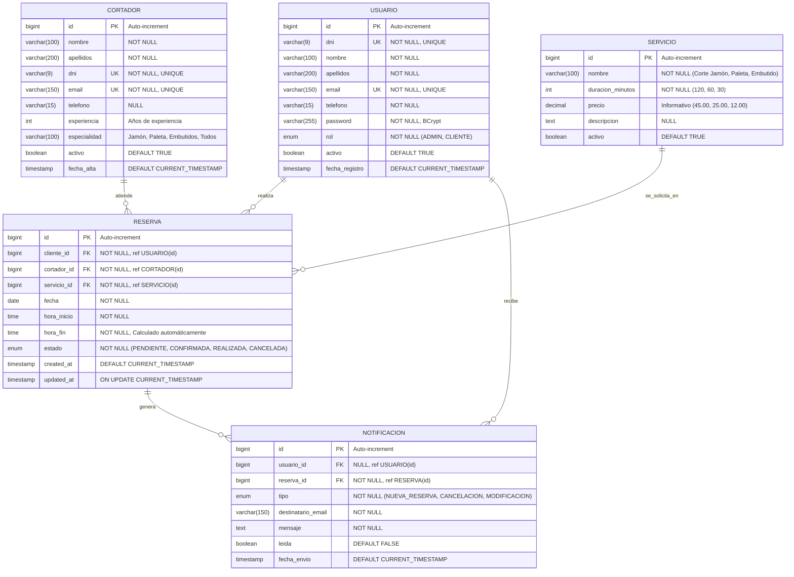

```mermaid
erDiagram
    USUARIO ||--o{ RESERVA : "realiza"
    CORTADOR ||--o{ RESERVA : "atiende"
    SERVICIO ||--o{ RESERVA : "se_solicita_en"
    RESERVA ||--o{ NOTIFICACION : "genera"
    USUARIO ||--o{ NOTIFICACION : "recibe"

    USUARIO {
        bigint id PK "Auto-increment"
        varchar(9) dni UK "NOT NULL, UNIQUE"
        varchar(100) nombre "NOT NULL"
        varchar(200) apellidos "NOT NULL"
        varchar(150) email UK "NOT NULL, UNIQUE"
        varchar(15) telefono "NOT NULL"
        varchar(255) password "NOT NULL, BCrypt"
        enum rol "NOT NULL (ADMIN, CLIENTE)"
        boolean activo "DEFAULT TRUE"
        timestamp fecha_registro "DEFAULT CURRENT_TIMESTAMP"
    }

    CORTADOR {
        bigint id PK "Auto-increment"
        varchar(100) nombre "NOT NULL"
        varchar(200) apellidos "NOT NULL"
        varchar(9) dni UK "NOT NULL, UNIQUE"
        varchar(150) email UK "NOT NULL, UNIQUE"
        varchar(15) telefono "NULL"
        int experiencia "Años de experiencia"
        varchar(100) especialidad "Jamón, Paleta, Embutidos, Todos"
        boolean activo "DEFAULT TRUE"
        timestamp fecha_alta "DEFAULT CURRENT_TIMESTAMP"
    }

    SERVICIO {
        bigint id PK "Auto-increment"
        varchar(100) nombre "NOT NULL (Corte Jamón, Paleta, Embutido)"
        int duracion_minutos "NOT NULL (120, 60, 30)"
        decimal precio "Informativo (45.00, 25.00, 12.00)"
        text descripcion "NULL"
        boolean activo "DEFAULT TRUE"
    }

    RESERVA {
        bigint id PK "Auto-increment"
        bigint cliente_id FK "NOT NULL, ref USUARIO(id)"
        bigint cortador_id FK "NOT NULL, ref CORTADOR(id)"
        bigint servicio_id FK "NOT NULL, ref SERVICIO(id)"
        date fecha "NOT NULL"
        time hora_inicio "NOT NULL"
        time hora_fin "NOT NULL, Calculado automáticamente"
        enum estado "NOT NULL (PENDIENTE, CONFIRMADA, REALIZADA, CANCELADA)"
        timestamp created_at "DEFAULT CURRENT_TIMESTAMP"
        timestamp updated_at "ON UPDATE CURRENT_TIMESTAMP"
    }

    NOTIFICACION {
        bigint id PK "Auto-increment"
        bigint usuario_id FK "NULL, ref USUARIO(id)"
        bigint reserva_id FK "NOT NULL, ref RESERVA(id)"
        enum tipo "NOT NULL (NUEVA_RESERVA, CANCELACION, MODIFICACION)"
        varchar(150) destinatario_email "NOT NULL"
        text mensaje "NOT NULL"
        boolean leida "DEFAULT FALSE"
        timestamp fecha_envio "DEFAULT CURRENT_TIMESTAMP"
    }
```
