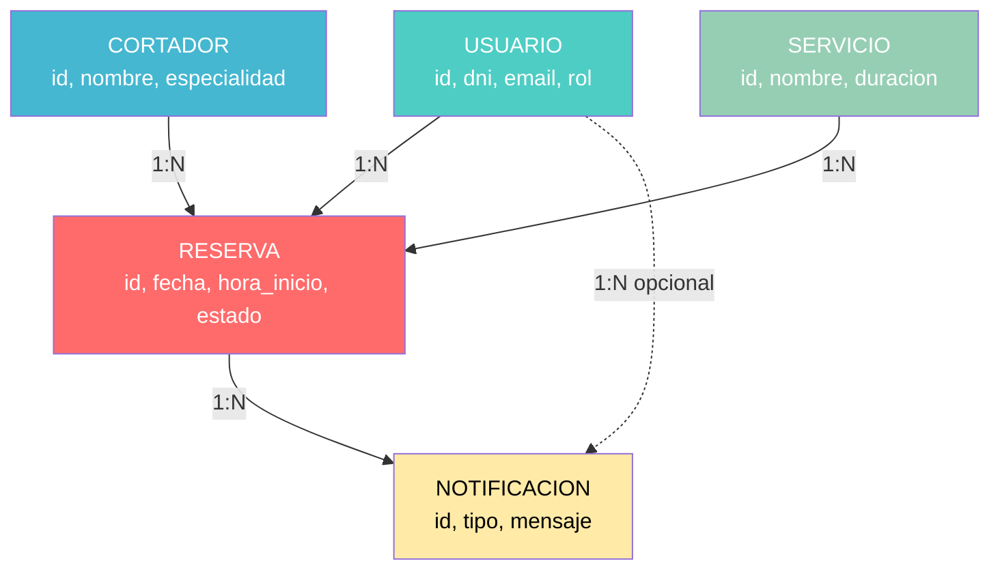

```mermaid
graph TB
    U[USUARIO<br/>id, dni, email, rol]
    C[CORTADOR<br/>id, nombre, especialidad]
    S[SERVICIO<br/>id, nombre, duracion]
    R[RESERVA<br/>id, fecha, hora_inicio, estado]
    N[NOTIFICACION<br/>id, tipo, mensaje]

    U -->|1:N| R
    C -->|1:N| R
    S -->|1:N| R
    R -->|1:N| N
    U -.->|1:N opcional| N

    style R fill:#ff6b6b,color:#fff
    style U fill:#4ecdc4,color:#fff
    style C fill:#45b7d1,color:#fff
    style S fill:#96ceb4,color:#fff
    style N fill:#ffeaa7,color:#000
```
