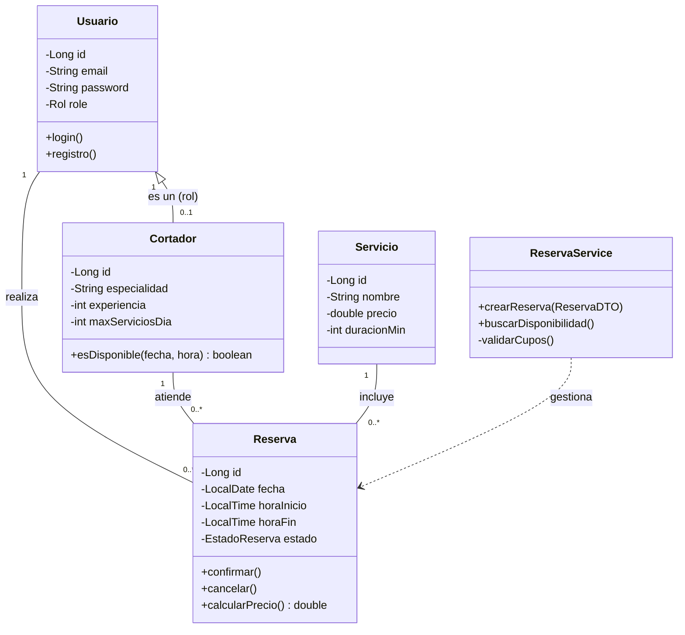

¡Manos a la obra! Tienes dos objetivos claros: **cerrar la burocracia inicial** (la propuesta formal con los 16 módulos) y **preparar la entrega técnica intermedia** (los diagramas que te faltan).

Aquí tienes el plan de ataque dividido en dos partes.

---

### 📝 PARTE 1: Propuesta Formal del Proyecto (Lista para enviar)

Esta es la versión definitiva que integra tu stack tecnológico con las asignaturas del ciclo formativo. Copia y pega esto en tu documento oficial.

---

**Título del proyecto:**
**HamBooking: Sistema Integral de Gestión de Reservas para Servicios de Corte de Jamón Profesional.**

**Resumen del proyecto:**
Desarrollo de una solución de software distribuida (Cliente-Servidor) para la digitalización del sector de corte de jamón. El sistema consta de un **Backend (API REST con Spring Boot)** que gestiona la lógica de negocio, persistencia y seguridad, y un **Frontend de Escritorio (JavaFX)** para la administración y reserva de servicios. La aplicación permite gestionar usuarios con diferentes roles (Admin, Clientes), administrar una base de datos de cortadores profesionales, y realizar reservas controlando automáticamente la disponibilidad, horarios y cupos máximos de trabajo mediante reglas de negocio complejas.

**Tecnologías y herramientas (Integración Curricular):**
El proyecto integra las competencias de los siguientes módulos del ciclo DAM:

* **Infraestructura y Sistemas (M01, M02, M09):** Despliegue sobre **Linux** optimizando recursos (**M01**). Digitalización de un proceso manual tradicional (**M02**) aplicando criterios de sostenibilidad y eficiencia de código (**M09**).
* **Desarrollo Software (M03, M04A, M04B, M07, M13):** Uso de **Java** como lenguaje vehicular (**M04A/B**), gestionado en **IntelliJ IDEA** con control de versiones **Git/GitHub** y testing unitario **JUnit** (**M07**). El proyecto constituye el portfolio principal para la empleabilidad (**M03, M13**).
* **Bases de Datos y Persistencia (M05A, M05B, M10):** Diseño de bases de datos relacionales normalizadas en **MySQL** (**M05A/B**) y acceso a datos mediante ORM **Hibernate/Spring Data JPA** (**M10**).
* **Interfaz y Multimedia (M06, M11, M15):** Interfaz de escritorio rica (RIA) con **JavaFX** y CSS (**M11**), uso de XML/JSON para intercambio de datos (**M06**) y arquitectura preparada para futura movilidad (**M15**).
* **Servicios y Negocio (M08, M12, M14, M16):** Desarrollo de servicios en red **API RESTful** (**M16**) simulando un sistema de gestión empresarial (ERP vertical) (**M12**). Documentación técnica y código en inglés profesional (**M08**). Uso de **Docker** para la contenerización de servicios (**M14**).

**Objetivos:**

* **Generales:** Implementar una arquitectura completa de microservicios (o modular) que desacople el frontend del backend, garantizando la integridad de los datos.
* **Específicos:**
1. Desarrollar una API REST robusta que exponga endpoints documentados para la gestión de recursos.
2. Implementar seguridad y autenticación (Login/Registro) diferenciando permisos entre Administradores y Clientes.
3. Crear un algoritmo de validación que impida solapamientos de reservas y respete los límites de carga de trabajo de los cortadores (máx. 3 servicios/día).
4. Diseñar una interfaz gráfica intuitiva en JavaFX que permita visualizar la disponibilidad en un calendario interactivo.
5. Gestionar la persistencia de datos complejos (relaciones 1:N y N:M) asegurando la consistencia transaccional.


**Justificación de la elección de la temática:**
Se ha elegido este proyecto por la necesidad de **profesionalizar un nicho de mercado** (el corte de jamón para eventos) que carece de herramientas de software específicas. A nivel técnico, permite demostrar el dominio "Full Stack" del alumno: desde el diseño de la base de datos (Backend) hasta la experiencia de usuario final (Frontend), enfrentándose a retos reales como la concurrencia de reservas y la validación de reglas de negocio temporales.

---

---

### 🎨 PARTE 2: Entrega Intermedia (Diagramas)

Para tu entrega opcional, ya tienes el **Diagrama E/R** (el de la base de datos). Ahora necesitas el de **Casos de Uso** (funcionalidad) y el de **Clases** (código Java).

Aquí tienes el código Mermaid y la explicación para que los generes y los incluyas en tu memoria.

#### 1. Diagrama de Casos de Uso (UML Use Case)

*Muestra **quién** hace **qué** en el sistema.*

```mermaid
usecaseDiagram
    actor "Cliente" as User
    actor "Administrador" as Admin

    package "Sistema HamBooking" {
        usecase "Registrarse / Login" as UC1
        usecase "Consultar Disponibilidad" as UC2
        usecase "Reservar Servicio" as UC3
        usecase "Cancelar Reserva" as UC4
        usecase "Ver Historial" as UC5
        
        usecase "Gestionar Cortadores (CRUD)" as UC6
        usecase "Gestionar Servicios" as UC7
        usecase "Ver Todas las Reservas" as UC8
        usecase "Validar Reglas de Negocio" as UC_Rule
    }

    User --> UC1
    User --> UC2
    User --> UC3
    User --> UC4
    User --> UC5

    Admin --> UC1
    Admin --> UC6
    Admin --> UC7
    Admin --> UC8
    Admin --> UC4

    UC3 ..> UC_Rule : <<include>>
    UC6 ..> UC_Rule : <<include>>

```

**Explicación para la memoria:**
El diagrama diferencia dos actores principales. El **Cliente** interactúa con las funciones de reserva y consulta personal. El **Administrador** tiene acceso privilegiado para la gestión de recursos (Cortadores/Servicios) y supervisión global. El caso de uso "Validar Reglas de Negocio" es incluido obligatoriamente al crear reservas o cortadores para asegurar la integridad (cupos, horarios).

---

#### 2. Diagrama de Clases (UML Class Diagram)

*Muestra la estructura de tu código Java (Entidades y Controladores).*
*Nota: Este diagrama es diferente al E/R. Aquí hablamos de clases, listas y métodos.*



**Explicación para la memoria:**
Representa el modelo de dominio. Destaca la clase `Reserva` como entidad central que vincula `Usuario`, `Cortador` y `Servicio`. Se incluye `ReservaService` para evidenciar dónde reside la lógica de negocio (validaciones) separada de las entidades de datos (POJOs).

---

#### 3. Estructura de la Memoria (Índice Propuesto)

Para que tu tutor vea que tienes la cabeza amueblada, presenta este índice provisional para la memoria final:

1. **Introducción**
* 1.1 Motivación y Contexto (El sector del Jamón)
* 1.2 Objetivos del Proyecto
* 1.3 Planificación (Diagrama de Gantt)


2. **Tecnologías y Herramientas**
* 2.1 Entorno de Desarrollo (IntelliJ, Git, Maven)
* 2.2 Backend (Spring Boot, Hibernate, Docker)
* 2.3 Frontend (JavaFX, Controles UI)


3. **Análisis del Sistema**
* 3.1 Requisitos Funcionales y No Funcionales
* 3.2 Diagrama de Casos de Uso
* 3.3 Modelo de Datos (Diagrama E/R)


4. **Diseño de la Aplicación**
* 4.1 Arquitectura Cliente-Servidor REST
* 4.2 Diagrama de Clases y Patrones (DTO, MVC)
* 4.3 Diseño de Interfaz (Mockups/Wireframes)


5. **Implementación**
* 5.1 Desarrollo del Backend (Servicios clave)
* 5.2 Desarrollo del Frontend (Vistas clave)
* 5.3 Problemas encontrados y soluciones


6. **Pruebas y Manuales**
* 6.1 Pruebas Unitarias (JUnit)
* 6.2 Manual de Instalación y Usuario


7. **Conclusiones y Vías Futuras**

¿Te parece bien el plan? Con la **Propuesta (Parte 1)** copiada y los **Diagramas (Parte 2)** generados, tienes la entrega intermedia lista. ✅