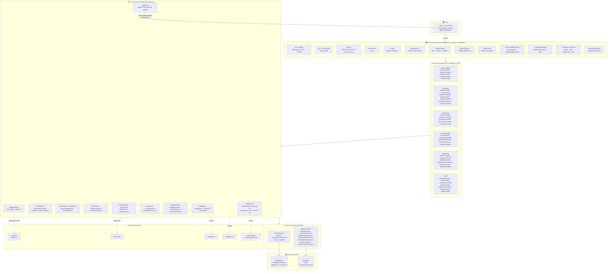
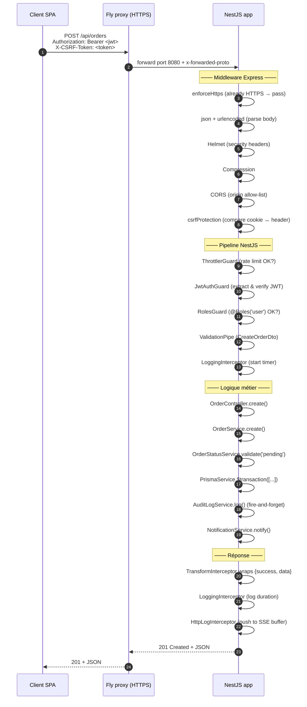
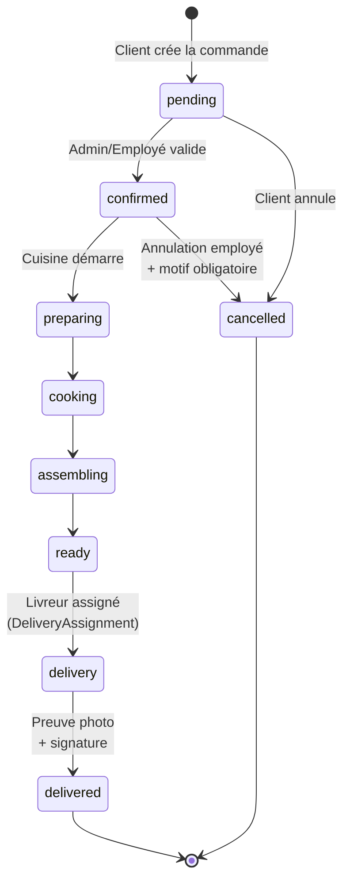

# Vite Gourmand — Architecture Backend (NestJS)

> Diagramme d'architecture multicouche du backend NestJS. Audité directement
> contre le code source pour garantir l'exactitude (37 contrôleurs réels,
> 50+ services, deux SGBD, IA Groq, SSE temps réel).

---

## 1. Vue d'ensemble — 4 couches

---

## 2. Détail — chaîne d'exécution d'une requête (du clic au commit DB)

---

## 3. Machine à états des commandes

Implémentée dans [`OrderStatusService`](../../Back/src/order/order-status.service.ts) avec transitions validées avant chaque mise à jour, et historique persisté dans la table `OrderStatusHistory`.

---

## 4. Inventaire exhaustif (audit du code, 2026-05-27)

### Contrôleurs (37 fichiers `*.controller.ts`)

| Domaine | Fichiers |
|---|---|
| Authentification & identité | `auth`, `session`, `gdpr`, `consent`, `role` |
| Catalogue | `menu`, `dish`, `allergen`, `diet`, `theme`, `ingredient`, `image` |
| Commerce | `order`, `delivery`, `discount`, `promotion`, `loyalty`, `review` |
| Communication | `user`, `message`, `newsletter`, `contact`, `support` |
| Opérations | `admin`, `kanban`, `timeoff`, `working-hours`, `site-info` |
| Outils & IA | `ai-agent`, `logging` (`log.controller`), `analytics`, `crud`, `unsplash`, `seed`, `app` |

### Services métier (50+ fichiers `*.service.ts`)

Cas notables où **plusieurs services par module** :
- `auth/` → `AuthService` + `PasswordService` + `TokenService`
- `order/` → `OrderService` + `OrderStatusService` (machine à états)
- `gdpr/` → `GdprService` + `ConsentService` + `DataDeletionService`
- `session/` → `SessionService` + `UserSessionService` + `AdminSessionService`
- `timeoff/` → `TimeoffService` + `EmployeeTimeoffService` + `AdminTimeoffService`
- `role/` → `RoleService` + `PermissionService` + `RolePermissionService`
- `image/` → `ImageService` + `MenuImageService` + `ReviewImageService`
- `admin/` → `AdminService` + `StatsService`
- `user/` → `UserService` + `AddressService` + `SessionService`

### Cross-cutting concerns (couche transversale globale)

| Type | Implémentation |
|---|---|
| Filtres | `AllExceptionsFilter`, `HttpExceptionFilter` |
| Guards | `JwtAuthGuard`, `OptionalAuthGuard`, `RolesGuard`, `ThrottlerGuard` |
| Interceptors | `LoggingInterceptor`, `HttpLogInterceptor` (alimente le SSE), `TransformInterceptor` |
| Pipes | `CustomValidationPipe` (class-validator), `SafeParseIntPipe` |
| Middlewares Express | `enforceHttps`, `csrfProtection`, body parsers, `helmet`, `compression`, CORS |

### Accès aux données

- **PostgreSQL via Prisma 7** : 44 modèles relationnels. `PrismaService` étend `PrismaClient` avec lifecycle hooks NestJS (`onModuleInit`/`onModuleDestroy`), pool `pg` + `PrismaPg` adapter via PgBouncer.
- **MongoDB Atlas** : 7 services qui consomment 7 collections analytics : `audit-log`, `user-activity`, `order-snapshot`, `menu-analytics`, `dashboard-stats`, `revenue`, `search-analytics`. Driver natif `mongodb` (singleton, `maxPoolSize: 10`).

### Intégrations externes

| Service | Usage |
|---|---|
| **Groq API** (`@groq/sdk`) | LLaMA 3.3 pour l'assistant IA (composeur de menu, conseil événement) |
| **Titan SMTP** (`nodemailer`) | E-mails transactionnels |
| **Resend** (HTTPS) | Fallback d'envoi e-mail si Titan indisponible |
| **Unsplash API** | Recherche d'images pour les menus |
| **Google OAuth** (Passport.js) | Connexion sociale, gated par consentement RGPD |

---

## 5. Ce qu'on peut prouver aux jurys (CP6, CP7, CP9, CP10)

| Compétence | Preuve dans le diagramme |
|---|---|
| **CP6 — Composants d'accès SQL et NoSQL** | Couche dédiée `PrismaService` (44 modèles) + 7 services Mongo, séparés des services métier |
| **CP7 — Architecture multicouche répartie sécurisée** | 4 couches strictement séparées + couche transversale (Helmet, CSP, CORS, rate limit, JWT, RBAC, CSRF, validation) — la sécurité **ne touche pas** au code métier |
| **CP8 — Composants métier serveur** | 50+ services regroupés par domaine, plusieurs services par module quand la responsabilité unique l'exige (Auth = 3 services, Order = 2 services dont une FSM) |
| **CP9 — Application multicouche** | Le diagramme de séquence § 2 montre la traversée des 4 couches sans court-circuit, avec wrappers de réponse uniformes et journalisation transversale |
| **CP10 — APIs externes** | 5 intégrations distinctes (Groq, Titan, Resend, Unsplash, Google OAuth) avec gestion d'erreurs *fire-and-forget* pour ne pas bloquer le métier |
| **Plus-value : temps réel** | `LogService` → SSE `/api/logs/stream` (authentifié par token JWT en query string) → DevBoard live |

---

## 6. Comment exporter

1. Aller sur **https://mermaid.live**
2. Coller un des blocs `mermaid` ci-dessus
3. Export → PNG (zoom 2× pour qualité haute résolution)
4. A4 paysage recommandé pour le diagramme global ; portrait pour la machine à états et le diagramme de séquence

Pour le dossier DREETS : insérer la **vue d'ensemble** comme **Figure 1** (architecture globale), le **diagramme de séquence** comme **Figure 2** (parcours d'une requête), et la **machine à états** comme **Figure 3** (cycle de vie d'une commande).
