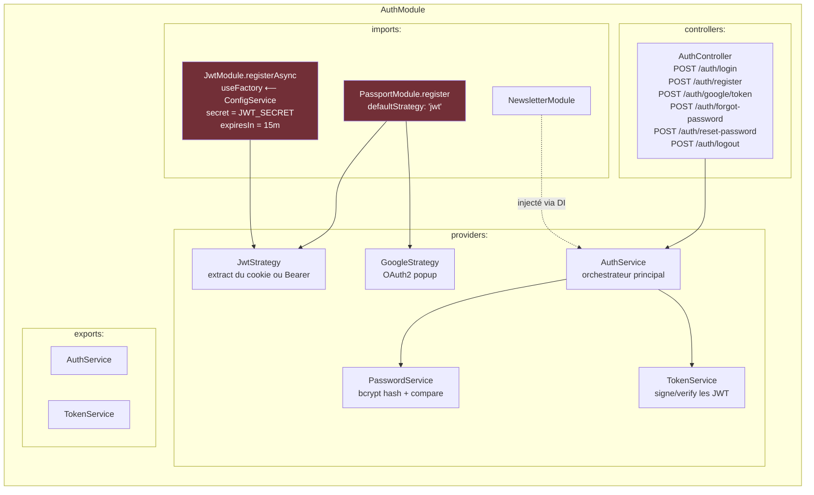

# Vite Gourmand — Dépendances entre modules NestJS

> **Audit réel du code source** (2026-05-27).
> 38 modules NestJS. 4 modules `@Global()` qui suppriment 95 % des imports explicites.
> Ce document complète le diagramme d'architecture multicouche par une vue
> "qui importe qui dans le code" — utile pour démontrer la maîtrise de
> l'injection de dépendances NestJS.

---

## 1. Vue 1 — Imports explicites entre modules

C'est la vue la plus fidèle au code (la propriété `imports: [...]` de chaque `@Module`).
Elle est volontairement clairsemée : grâce aux 4 modules `@Global()`, **35 modules sur 38 ne déclarent aucun import** au-delà de leurs propres controllers/services.

```mermaid
graph LR
    subgraph Root["📦 Module racine"]
        APP[AppModule]
    end

    subgraph Globals["🌍 Modules @Global (injectés partout, déclarés une fois)"]
        PRISMA[PrismaModule<br/>@Global · PrismaService]
        MAIL[MailModule<br/>@Global · MailService]
        CRUD[CrudModule<br/>@Global · CrudService]
        LOG_M[LoggingModule<br/>@Global · LogService + HttpLogInterceptor]
        CFG[ConfigModule.forRoot<br/>isGlobal: true]
        THR[ThrottlerModule.forRoot<br/>Guard global]
        CACHE[CacheModule.register<br/>isGlobal: true]
        I18N[I18nModule.forRoot]
    end

    subgraph FeatureMods["🎯 Modules fonctionnels (37 modules)"]
        direction TB
        AUTH[AuthModule<br/>imports: PassportModule + JwtModule + NewsletterModule]
        NEWS[NewsletterModule]
        SEED[SeedModule<br/>imports: PrismaModule + UnsplashModule]
        UNSPL[UnsplashModule]
        OTHERS["31 autres modules<br/>(MenuModule, OrderModule, UserModule, AdminModule,<br/>DishModule, AllergenModule, DietModule, ThemeModule,<br/>ImageModule, IngredientModule, KanbanModule,<br/>LoyaltyModule, DiscountModule, PromotionModule,<br/>MessageModule, SupportModule, ContactModule,<br/>DeliveryModule, ReviewModule, TimeoffModule,<br/>WorkingHoursModule, SessionModule, RoleModule,<br/>SiteInfoModule, GdprModule, ConsentModule,<br/>AnalyticsModule, AiAgentModule, ImageModule,<br/>TestRunnerModule, AppModule(controllers))<br/><br/>imports: [] — purement déclaratifs"]
    end

    %% AppModule importe tout
    APP --> PRISMA
    APP --> MAIL
    APP --> CRUD
    APP --> LOG_M
    APP --> CFG
    APP --> THR
    APP --> CACHE
    APP --> I18N
    APP --> AUTH
    APP --> NEWS
    APP --> SEED
    APP --> UNSPL
    APP --> OTHERS

    %% Seuls imports inter-modules réels
    AUTH -->|imports| NEWS
    SEED -->|imports| PRISMA
    SEED -->|imports| UNSPL
    LOG_M -->|imports| CFG

    %% Injection implicite des modules globaux (lignes pointillées)
    PRISMA -.->|@Global| AUTH
    PRISMA -.->|@Global| OTHERS
    MAIL -.->|@Global| AUTH
    MAIL -.->|@Global| OTHERS
    CFG -.->|@Global| AUTH
    CFG -.->|@Global| LOG_M
    CFG -.->|@Global| OTHERS

    style PRISMA fill:#722F37,color:#fff
    style MAIL fill:#722F37,color:#fff
    style CRUD fill:#722F37,color:#fff
    style LOG_M fill:#722F37,color:#fff
    style CFG fill:#556B2F,color:#fff
    style THR fill:#556B2F,color:#fff
    style CACHE fill:#556B2F,color:#fff
    style I18N fill:#556B2F,color:#fff
```

### Lecture rapide

- **4 modules `@Global()` maison** : `PrismaModule`, `MailModule`, `CrudModule`, `LoggingModule`. Leurs services sont injectables partout sans `imports:`.
- **4 modules globaux de l'écosystème Nest** : `ConfigModule`, `ThrottlerModule`, `CacheModule`, `I18nModule`, tous configurés avec `isGlobal: true` ou `forRoot()` dans `AppModule`.
- **3 imports inter-modules explicites seulement** dans tout le projet :
  - `AuthModule → NewsletterModule` (envoyer la newsletter de bienvenue après inscription)
  - `SeedModule → PrismaModule + UnsplashModule` (générer les données de démo)
  - `LoggingModule → ConfigModule` (déjà global mais déclaré pour cohérence)

C'est l'effet recherché : **chaque domaine reste autonome**, et la composition se fait par DI au niveau des services.

---

## 2. Vue 2 — Dépendances réelles entre services (l'injection de dépendances en action)

Cette vue est plus informative pour démontrer la cohésion métier. Elle agrège les
constructeurs `constructor(private readonly xxx: XxxService)` à travers le code.

```mermaid
graph LR
    subgraph CrossCutting["🔧 Cross-cutting (injectés partout)"]
        PrismaS[PrismaService]
        ConfigS[ConfigService]
        MailS[MailService]
        JwtS[JwtService]
    end

    subgraph AuthDomain["🔐 Auth & Identité"]
        AuthSvc[AuthService] --> PasswordSvc[PasswordService]
        AuthSvc --> TokenSvc[TokenService]
        AuthSvc --> NewsSvc[NewsletterService]
        AuthSvc --> MailS
        JwtStrategy[JwtStrategy] --> JwtS
        GoogleStrategy[GoogleStrategy]
        SessionAgg[SessionService] --> UserSessionSvc[UserSessionService]
        SessionAgg --> AdminSessionSvc[AdminSessionService]
    end

    subgraph CatalogDomain["🍽️ Catalogue"]
        MenuSvc[MenuService]
        DishSvc[DishService]
        AllergenSvc[AllergenService]
        DietSvc[DietService]
        ThemeSvc[ThemeService]
        IngredientSvc[IngredientService]
        ImageAgg[ImageService] --> MenuImgSvc[MenuImageService]
        ImageAgg --> ReviewImgSvc[ReviewImageService]
    end

    subgraph CommerceDomain["🛒 Commerce"]
        OrderSvc[OrderService] --> OrderStatusSvc["OrderStatusService<br/>FSM 9 statuts"]
        DeliverySvc[DeliveryService]
        DiscountSvc[DiscountService]
        PromoSvc[PromotionService] --> NewsSvc
        LoyaltySvc[LoyaltyService]
        ReviewSvc[ReviewService]
    end

    subgraph CommDomain["💬 Communication"]
        UserSvc[UserService] --> AddressSvc[AddressService]
        ContactSvc[ContactService] --> MailS
        NewsSvc --> MailS
        MessageSvc[MessageService]
        SupportSvc[SupportService]
    end

    subgraph OpsDomain["🏗️ Opérations"]
        AdminAgg[AdminService] --> StatsSvc[StatsService]
        KanbanSvc[KanbanService]
        WorkHoursSvc[WorkingHoursService]
        SiteInfoSvc[SiteInfoService]
        TimeOffAgg[TimeoffService] --> EmployeeTimeOffSvc[EmployeeTimeOffService]
        TimeOffAgg --> AdminTimeOffSvc[AdminTimeOffService]
        RoleAgg[RoleService] --> PermissionSvc[PermissionService]
        RoleAgg --> RolePermSvc[RolePermissionService]
    end

    subgraph GdprDomain["⚖️ RGPD"]
        GdprAgg[GdprService] --> ConsentSvc[ConsentService]
        GdprAgg --> DataDeletionSvc[DataDeletionService]
    end

    subgraph AIDomain["🤖 IA & intégrations externes"]
        AiSvc["AiAgentService<br/>Groq SDK · LLaMA 3.3"] --> ConfigS
        UnsplashSvc[UnsplashService] --> ConfigS
        SeedSvc[SeedService] --> UnsplashSvc
    end

    subgraph DevopsDomain["📊 Devops & outils"]
        AnalyticsSvc[AnalyticsService]
        CrudSvc[CrudService]
        LogSvc["LogService<br/>buffer 500 + SSE"]
    end

    %% Universal Prisma dependency
    PrismaS -.-> AuthSvc
    PrismaS -.-> OrderSvc
    PrismaS -.-> MenuSvc
    PrismaS -.-> UserSvc
    PrismaS -.-> AdminAgg
    PrismaS -.-> GdprAgg
    PrismaS -.-> SeedSvc
    PrismaS -.-> CrudSvc
    PrismaS -.-> "(et 25 autres services)"

    style PrismaS fill:#722F37,color:#fff
    style MailS fill:#722F37,color:#fff
    style ConfigS fill:#556B2F,color:#fff
    style OrderStatusSvc fill:#D4AF37,color:#1A1A1A
    style AiSvc fill:#D4AF37,color:#1A1A1A
    style LogSvc fill:#D4AF37,color:#1A1A1A
```

### Lecture rapide

- **PrismaService est ubiquitaire** : 31 services sur 50+ l'injectent directement. Aucun repository pattern — Prisma joue le rôle de DAO.
- **Modules-agrégats** : `AdminService`, `SessionService`, `TimeoffService`, `RoleService`, `ImageService`, `GdprService` agrègent plusieurs sous-services spécialisés (séparation par actor ou par responsabilité).
- **Chaînes inter-domaines réelles** (pas circulaires) :
  - `AuthService → NewsletterService → MailService` (welcome flow)
  - `PromotionService → NewsletterService → MailService` (campagne)
  - `ContactService → MailService` (formulaire contact)
  - `GdprService → ConsentService + DataDeletionService` (façade)
  - `OrderService → OrderStatusService` (FSM des statuts)
  - `SeedService → UnsplashService` (images de démo)

---

## 3. Vue 3 — Zoom sur `AuthModule` (le module le plus composé)

`AuthModule` est le seul à composer plusieurs modules tiers + un domaine voisin. Bon exemple pour démontrer la maîtrise de `JwtModule.registerAsync` et `PassportModule`.



---

## 4. Comparaison : module-graph théorique vs réel

| Aspect | Si on faisait du Nest "naïf" | Vite Gourmand (réel) |
|---|---|---|
| Imports explicites entre modules | 30-50 lignes éparpillées | **3 imports inter-modules** seulement |
| Couplage | Élevé — chaque module liste ses dépendances | Faible — DI résout via `@Global` |
| Refactor d'un service partagé | Modifier N modules pour ajouter `imports: [XxxModule]` | Aucun changement de configuration |
| Risque de dépendance circulaire | Élevé sans `forwardRef()` | Quasi-nul (DAG strict — vérifiable car aucune ligne ne reboucle) |
| Lisibilité | Chaque module se comprend isolément | Le graphe global se comprend en lisant `app.module.ts` |

C'est un trade-off délibéré : le projet privilégie la **clarté du graphe global** (`app.module.ts` montre tout en un coup d'œil) au prix d'une légère perte de "module hermétique".

---

## 5. Ce qu'on prouve au jury

- **Maîtrise de la DI NestJS** : `@Global()`, `forRoot()`, `useFactory + inject:[ConfigService]` (cf. `AuthModule.JwtModule`)
- **Séparation des responsabilités** : 6 domaines métier, chaque module ≈ 1 responsabilité unique, services agrégateurs quand le domaine se sub-divise
- **Pas de dépendance circulaire** : le graphe vue 1 est un DAG (aucune flèche ne reboucle). Si demandé : `forwardRef()` est utilisable mais non nécessaire ici.
- **Composition de modules tiers** : `PassportModule` + `JwtModule.registerAsync` montrent qu'on sait orchestrer plusieurs modules dans une stratégie d'auth
- **Singletons vs scoped** : Tous nos services sont `@Injectable()` par défaut (singleton). Aucun `Scope.REQUEST` n'a été nécessaire — bonne discipline car le scope-request coûte cher en perf.

---

## 6. Export pour le dossier

Les trois diagrammes sont prêts pour Mermaid Live (https://mermaid.live).

- **Vue 1** (imports explicites) → **Figure 12** : la plus parlante pour un jury non-NestJS
- **Vue 2** (injections de services) → **Figure 13** : montre la cohésion métier
- **Vue 3** (zoom AuthModule) → **Figure 14** : démontre la maîtrise approfondie du framework

L'un et l'autre se complètent avec le diagramme d'**architecture multicouche** ([backend-architecture.md](./backend-architecture.md)) : celui-ci montre le **flux vertical** d'une requête, celui-ci le **graphe horizontal** des modules.
