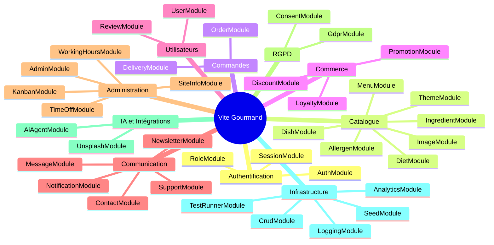

# Vite Gourmand — Cartographie des domaines métier

> Avant d'écrire le moindre composant, les responsabilités ont été découpées
> en **domaines métier autonomes**, chacun encapsulé dans un module NestJS dédié.
> Ce document cartographie les 10 domaines, leurs modules, leurs routes et leurs services.
>
> Audité contre le code source réel — 37 contrôleurs, 50+ services (mai 2026).

---

## 1. Vue d'ensemble — 10 domaines

---

## 2. Détail par domaine

### 🔐 Authentification & Identité

| Module | Contrôleur | Route | Responsabilité |
|---|---|---|---|
| `AuthModule` | `AuthController` | `/api/auth` | Inscription, connexion, JWT, Google OAuth, reset mot de passe |
| `SessionModule` | `SessionController` | `/api/sessions` | Sessions actives de l'utilisateur |
| `RoleModule` | `RoleController` | `/api/roles` | Rôles, permissions, attribution |
| `ConsentModule` | `ConsentController` | `/api/consent` | Enregistrement du consentement RGPD au moment de l'inscription |

**Services clés :** `AuthService` · `PasswordService` (bcrypt 12 rounds) · `TokenService` (JWT 15 min) · `JwtStrategy` · `GoogleStrategy`

**Décision architecturale :** 3 services pour 1 module car chaque responsabilité est distincte — l'orchestration (Auth), le hachage (Password), et la signature de token (Token) ne doivent pas se mélanger.

---

### 🍽️ Catalogue

| Module | Contrôleur | Route | Responsabilité |
|---|---|---|---|
| `MenuModule` | `MenuController` | `/api/menus` | Menus publiés, filtres, inclut plats + allergènes en une requête |
| `DishModule` | `DishController` | `/api/dishes` | Plats individuels, CRUD admin |
| `AllergenModule` | `AllergenController` | `/api/allergens` | Référentiel des 14 allergènes réglementaires |
| `DietModule` | `DietController` | `/api/diets` | Régimes alimentaires (végétarien, vegan, halal…) |
| `ThemeModule` | `ThemeController` | `/api/themes` | Thèmes de menus (mariage, entreprise, anniversaire…) |
| `IngredientModule` | `IngredientController` | `/api/ingredients` | Ingrédients liés aux plats |
| `ImageModule` | `ImageController` | `/api/images` | Images des menus et avis clients |

**Services clés :** `MenuService` (évite le N+1 avec `getMenuIncludes()`) · `MenuImageService` · `ReviewImageService`

**Décision architecturale :** Catalogue découpé en 7 modules car chaque entité a son propre cycle de vie — un allergène ne change pas au même rythme qu'un plat, qui ne change pas au même rythme qu'un thème.

---

### 📦 Commandes

| Module | Contrôleur | Route | Responsabilité |
|---|---|---|---|
| `OrderModule` | `OrderController` | `/api/orders` | Création, consultation, modification, annulation des commandes |
| `DeliveryModule` | `DeliveryController` | `/api/deliveries` | Affectation livreur, suivi, preuve de livraison |

**Services clés :** `OrderService` · `OrderStatusService` (machine à états : `pending → confirmed → preparing → ready → delivering → delivered / cancelled`)

**Décision architecturale :** `OrderStatusService` est séparé de `OrderService` — la logique de transition d'état est complexe et testable indépendamment.

---

### 💰 Commerce

| Module | Contrôleur | Route | Responsabilité |
|---|---|---|---|
| `DiscountModule` | `DiscountController` | `/api/discounts` | Codes promo, validation (existence → actif → dates → quota → montant minimum) |
| `PromotionModule` | `PromotionController` | `/api/promotions` | Promotions planifiées, campagnes |
| `LoyaltyModule` | `LoyaltyController` | `/api/loyalty` | Programme fidélité (10 pts/€, 100 pts = 1€) |

**Services clés :** `DiscountService` (validation séquentielle avec collecte de toutes les erreurs) · `LoyaltyService` (`POINTS_PER_EURO = 10`)

---

### 👤 Utilisateurs

| Module | Contrôleur | Route | Responsabilité |
|---|---|---|---|
| `UserModule` | `UserController` | `/api/users` | Profil, adresses, préférences |
| `ReviewModule` | `ReviewController` | `/api/reviews` | Avis clients sur les menus |

**Services clés :** `UserService` · `AddressService` · `ReviewService`

---

### 💬 Communication

| Module | Contrôleur | Route | Responsabilité |
|---|---|---|---|
| `MessageModule` | `MessageController` | `/api/messages` | Messagerie interne entre utilisateurs et équipe |
| `NewsletterModule` | `NewsletterController` | `/api/newsletter` | Abonnement, désabonnement, envoi de campagnes |
| `ContactModule` | `ContactController` | `/api/contact` | Formulaire de contact public → email transactionnel |
| `SupportModule` | `SupportController` | `/api/support` | Tickets de support, historique |
| `NotificationModule` | `NotificationController` | `/api/notifications` | Notifications in-app |

**Services clés :** `MailService` (Titan SMTP port 465, fallback Resend) · `NewsletterService` · `NotificationService`

---

### 🏗️ Administration & Opérations

| Module | Contrôleur | Route | Responsabilité |
|---|---|---|---|
| `AdminModule` | `AdminController` | `/api/admin` | Dashboard stats, gestion utilisateurs, création employés — `@Roles('admin')` |
| `KanbanModule` | `KanbanController` | `/api/kanban` | Board de suivi des commandes en cuisine |
| `TimeOffModule` | `TimeOffController` | `/api/time-off` | Congés et absences des employés |
| `WorkingHoursModule` | `WorkingHoursController` | `/api/working-hours` | Horaires d'ouverture du restaurant |
| `SiteInfoModule` | `SiteInfoController` | `/api/site-info` | Informations publiques de l'entreprise (nom, adresse, téléphone…) |

**Services clés :** `AdminService` + `StatsService` · `KanbanService` · `TimeoffService` + `EmployeeTimeoffService` + `AdminTimeoffService`

---

### ⚖️ RGPD & Consentement

| Module | Contrôleur | Route | Responsabilité |
|---|---|---|---|
| `GdprModule` | `GdprController` | `/api/gdpr` | Demandes de suppression de compte, anonymisation |
| `ConsentModule` | `ConsentController` | `/api/consent` | Enregistrement horodaté des consentements (type + IP) |

**Services clés :** `GdprService` · `ConsentService` · `DataDeletionService` (anonymisation transactionnelle : email → `deleted-{id}@anonymized.local`, `is_deleted: true`, révocation de tous les consentements)

**Décision architecturale :** RGPD est un domaine à part entière — pas un sous-domaine de User — car il a ses propres obligations légales, son propre cycle de traitement (demande → validation admin → anonymisation) et ses propres traces d'audit.

---

### 🤖 IA & Intégrations externes

| Module | Contrôleur | Route | Responsabilité |
|---|---|---|---|
| `AiAgentModule` | `AiAgentController` | `/api/ai-agent` | Assistant IA : composition de menu, conseil événement (Groq · LLaMA 3.3 70B) |
| `UnsplashModule` | `UnsplashController` | `/api/unsplash` | Recherche et récupération d'images pour les menus |

**Services clés :** `AiAgentService` (mode démo sans clé API) · `UnsplashService`

---

### 🔧 Infrastructure & Outils

Ces modules ne correspondent pas à un domaine métier mais à des **préoccupations transversales** (cross-cutting concerns).

| Module | Contrôleur | Route | Responsabilité |
|---|---|---|---|
| `AnalyticsModule` | `AnalyticsController` | `/api/analytics` | Vues MongoDB : menus, revenus, recherches, activité |
| `LoggingModule` | `LogController` | `/api/logs` | Buffer 500 entrées + SSE `/api/logs/stream` |
| `SeedModule` | `SeedController` | `/api/seed` | Génération de données de démo (déclenché par route en dev) |
| `CrudModule` | `CrudController` | `/api/crud` | Opérations CRUD génériques pour l'administration |
| `TestRunnerModule` | `TestRunnerController` | `/api/tests` | Dashboard QA : lancement et résultats des tests en temps réel |
| `AppModule` | `AppController` | `/api` + `/api/health` | Point d'entrée, healthcheck public |

**Modules globaux (aucun import nécessaire dans les autres modules) :**
- `PrismaModule` `@Global` — `PrismaService` injecté dans 31 services
- `MailModule` `@Global` — `MailService` injecté dans Auth, Contact, Newsletter
- `CrudModule` `@Global` — `CrudService` disponible partout
- `LoggingModule` `@Global` — `LogService` + `HttpLogInterceptor`

---

## 3. Récapitulatif

| Domaine | Modules | Contrôleurs | Services |
|---|---|---|---|
| Authentification & Identité | 4 | 4 | 5 |
| Catalogue | 7 | 7 | 9 |
| Commandes | 2 | 2 | 2 |
| Commerce | 3 | 3 | 3 |
| Utilisateurs | 2 | 2 | 3 |
| Communication | 5 | 5 | 5 |
| Administration & Opérations | 5 | 5 | 7 |
| RGPD & Consentement | 2 | 2 | 3 |
| IA & Intégrations | 2 | 2 | 2 |
| Infrastructure & Outils | 6 | 6 | 6+ |
| **Total** | **38** | **38** | **50+** |

---

## 4. Principe de découpage appliqué

Chaque domaine a été défini selon trois critères :

1. **Cycle de vie propre** — les entités d'un même domaine changent ensemble (ex : un `Menu` et ses `Dish` évoluent au même rythme, un `Allergen` évolue rarement).

2. **Acteur principal** — chaque domaine répond aux besoins d'un acteur précis : le client (Commandes, Catalogue), l'employé (Kanban, Opérations), l'admin (Administration, RGPD), le système (Infrastructure).

3. **Autonomie** — un domaine peut être testé, déployé et évolué sans modifier les autres. La preuve : 35 modules sur 38 n'ont aucun `imports:` explicite vers un autre module fonctionnel.

---

## 5. Voir aussi

- [backend-architecture.md](./backend-architecture.md) — flux vertical d'une requête (4 couches)
- [backend-module-dependencies.md](./backend-module-dependencies.md) — graphe des dépendances NestJS
- [../../wiki/architecture-mindmap.md](../../wiki/architecture-mindmap.md) — mindmap technique complète
