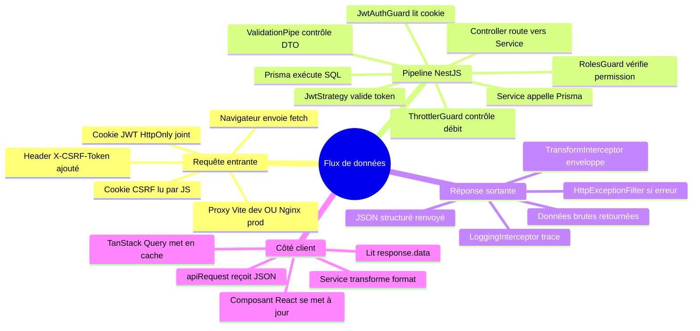
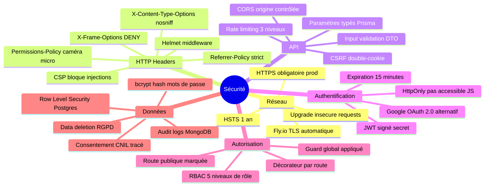
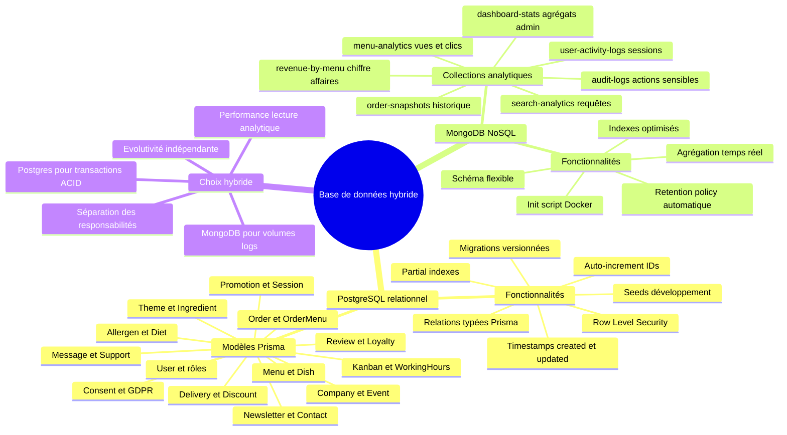
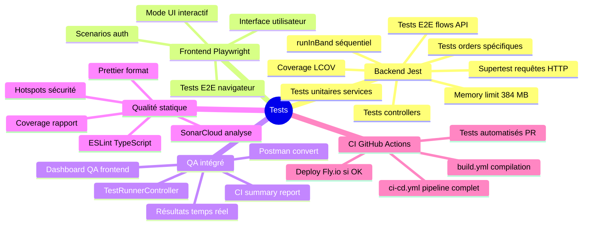

# Cartographie Architecturale & Technique — Vite & Gourmand

> Mindmap exhaustive de tous les choix techniques et architecturaux du projet.  
> Générée depuis l'analyse du code source réel (mai 2026).

---

## Vue d'ensemble

```mermaid
mindmap
  root((Vite and Gourmand))
    FRONTEND
      Framework
        React 19
        TypeScript 5.9
        Vite 7
      UI et Style
        TailwindCSS 4
        Radix UI
        Lucide React
        class-variance-authority
        clsx / tailwind-merge
      Routing
        React Router DOM 7
        SPA client-side
        Routes protégées par rôle
      Data Fetching
        TanStack React Query 5
        Fetch natif via apiRequest
        Axios disponible
      State Global
        React Context API
        ConsentContext
        NotificationContext
        PublicDataContext
        ToastContext
      Tests
        Playwright 1.60
        Tests E2E
        axe-core accessibilité
    BACKEND
      Framework
        NestJS 11
        Express platform
        TypeScript 6
        RxJS 7
      Architecture
        37 Controllers REST
        Module pattern
        DTO validation
        Interceptors globaux
        Guards globaux
        Filtres exceptions
      ORM et BDD
        Prisma 7
        PostgreSQL
        MongoDB
        Dual database
      Auth
        Passport.js
        Strategy JWT
        Strategy Google OAuth2
        JWT HttpOnly Cookie
        CSRF Cookie
        bcrypt passwords
      Communication
        REST API principale
        Server-Sent Events SSE
        Socket.io WebSockets
      Email
        Nodemailer
        Titan SMTP
        Resend disponible
      IA
        OpenAI SDK
        Groq API
        LLaMA 3.3 70B
      Cache
        NestJS CacheManager
        TTL 60 secondes
        Max 100 items
      Internationalisation
        nestjs-i18n
        EN et FR
      Tests
        Jest 30
        Supertest
        Tests unitaires
        Tests E2E API
        Test Runner QA intégré
    BASE DE DONNÉES
      PostgreSQL
        Prisma ORM
        Row Level Security
        Migrations Prisma
        Seed scripts
        30+ modèles
      MongoDB
        Analytics temps réel
        Audit logs
        Order snapshots
        Dashboard stats
        Search analytics
        User activity logs
        Retention policy
      Données métier
        Menus et Plats
        Commandes
        Utilisateurs et Rôles
        Allergènes et Régimes
        Livraisons
        Fidélité
        Kanban
        RGPD et Consentements
    INFRASTRUCTURE
      Conteneurisation
        Docker
        Docker Compose
        Multi-services
        Volumes nommés
        Profiles dev/prod/tools
      Déploiement
        Fly.io
        Région Paris CDG
        HTTPS forcé
        Min 1 machine running
        Concurrence 200 requêtes
      Proxy
        Nginx prod
        Vite proxy dev
        Port 3000 backend
        Port 5173 frontend
      Secrets
        Bitwarden CLI
        Docker secrets service
        Variables ENV
      CI/CD
        GitHub Actions
        build.yml
        ci-cd.yml
      Qualité code
        SonarCloud
        ESLint
        Prettier
        TypeScript strict
    SECURITE
      Authentification
        JWT RS256
        Cookie HttpOnly
        TTL 15 minutes
        Google OAuth 2.0
        Dual extraction Bearer et Cookie
      Autorisation
        RBAC
        Rôles admin
        Rôles manager
        Rôles employee
        Rôles user
        Decorator Roles
        Guard RolesGuard
      Protection HTTP
        Helmet
        CORS
        CSP strict
        X-Frame-Options DENY
        X-Content-Type-Options
        COOP same-origin
        HSTS prod
      Anti-abus
        ThrottlerGuard
        20 req/seconde
        100 req/10 secondes
        300 req/minute
      RGPD
        ConsentContext
        CNIL 13 mois
        GDPR Controller
        Data Deletion Request
        Audit logs MongoDB
      CSRF
        Double cookie pattern
        vg-csrf-token lisible
        Header X-CSRF-Token
        Mutations uniquement
    PATTERNS ARCHITECTURAUX
      Monorepo
        Back et View séparés
        Makefile orchestration
        Scripts partagés
      Côté Backend
        Controller Service Repository
        Module NestJS par domaine
        DTO class-validator
        TransformInterceptor envelope
        HttpExceptionFilter JSON
        ValidationPipe global
        LoggingInterceptor
      Côté Frontend
        Services par domaine
        apiRequest wrapper central
        Hooks React custom
        Composants UI découplés
        Layouts et Pages séparés
      Réponse API
        Envelope success data
        statusCode message
        path et timestamp
        Pagination meta
    INTEGRATIONS TIERCES
      Images
        Unsplash API
        Optimisation WebP
        CDN externe
      OAuth
        Google Identity Services
        Google OAuth 2.0
        GSI frontend
      IA Générative
        Groq Cloud
        LLaMA 3.3 70B versatile
        Composition menu IA
        Mode démo sans clé
      Email
        Titan Email
        SMTP TLS 465
        Templates HTML
      Documentation
        Swagger OpenAPI
        Accessible /api/docs
        Décoré automatiquement
```

---

## Légende des couches

| Couche | Technologie principale | Rôle |
|--------|----------------------|------|
| **Frontend** | React 19 + Vite 7 | SPA — interface utilisateur |
| **Backend** | NestJS 11 + Express | API REST — logique métier |
| **BDD relationnelle** | PostgreSQL + Prisma 7 | Données transactionnelles |
| **BDD analytique** | MongoDB | Logs, stats, snapshots |
| **Infra** | Docker + Fly.io | Conteneurisation & déploiement |
| **CI/CD** | GitHub Actions + SonarCloud | Automatisation qualité |
| **Secrets** | Bitwarden CLI | Gestion sécurisée des clés |

---

## Zoom : flux de données complet

---

## Zoom : sécurité en couches

---

## Zoom : base de données hybride

---

## Zoom : stack de tests

---

## Voir aussi

- [rest-api.md](./rest-api.md) — fichiers et structure de l'API REST
- [ARCHITECTURE.md](./ARCHITECTURE.md) — description textuelle de l'architecture
- [ORM.md](./ORM.md) — Prisma et schéma de données
- [security.md](./security.md) — détails sécurité
- [deployment.md](./deployment.md) — déploiement Fly.io
- [api-endpoints.md](./api-endpoints.md) — référence des endpoints
