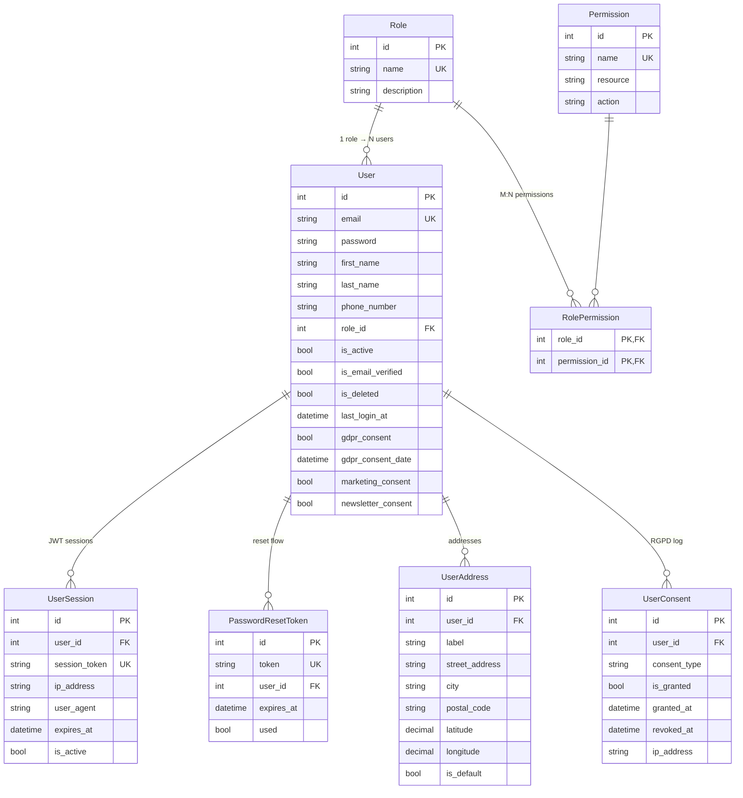
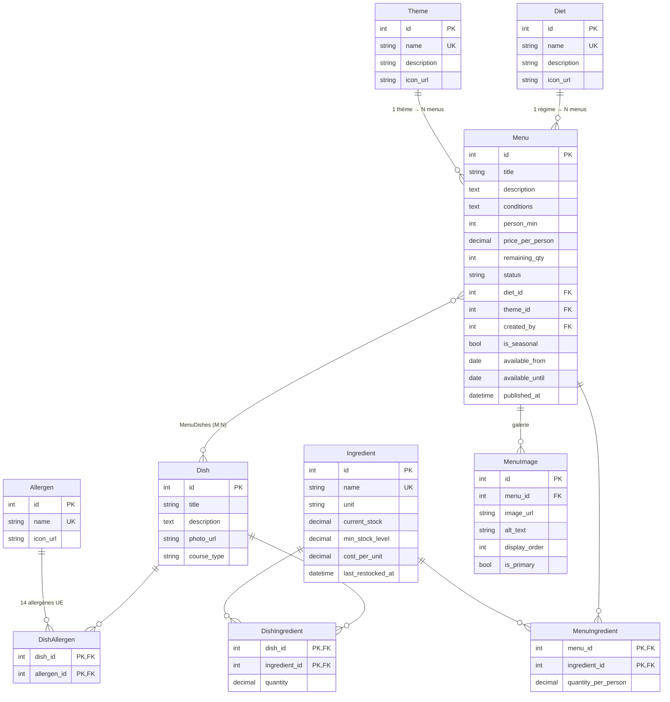
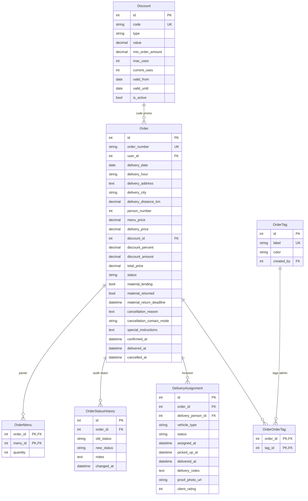
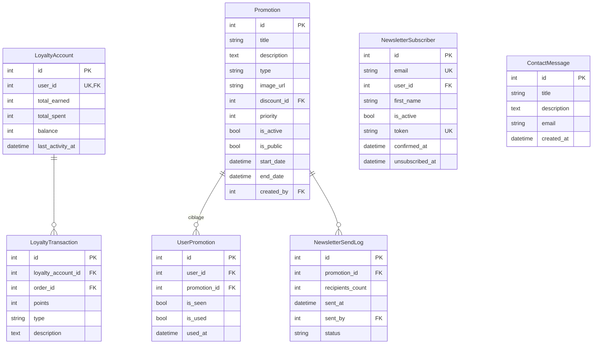
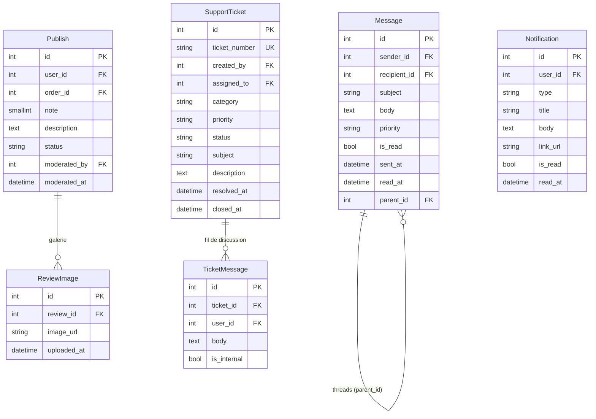
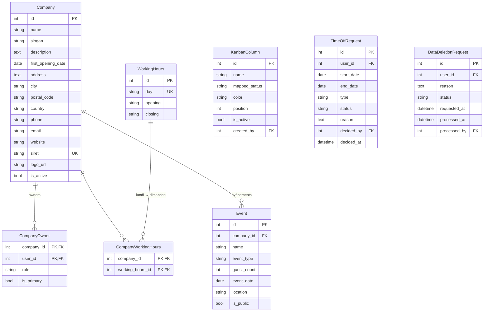

# Vite Gourmand — Diagramme entité-association complet

> Cartographie exhaustive du schéma relationnel PostgreSQL (Prisma).
> 46 modèles couvrant identité, catalogue, commande, fidélité, marketing, support, opérations, RGPD.

Le schéma est volumineux, donc cette page propose **deux niveaux de lecture** :

1. **Vue complète** — toutes les entités et toutes les relations, sur un seul diagramme.
2. **Vues par domaine** — versions allégées, regroupées par responsabilité métier (utiles pour comprendre un sous-système à la fois).

---

## 1. Vue complète (toutes les entités)

```mermaid
erDiagram
    %% ===== IDENTITY & ACCESS =====
    User ||--o{ Role : "role_id"
    Role ||--o{ RolePermission : "role_id"
    Permission ||--o{ RolePermission : "permission_id"
    User ||--o{ UserSession : "user_id"
    User ||--o{ PasswordResetToken : "user_id"
    User ||--o{ UserAddress : "user_id"
    User ||--o{ UserConsent : "user_id"

    %% ===== CATALOG =====
    Menu ||--o{ MenuImage : "menu_id"
    Menu ||--o{ MenuIngredient : "menu_id"
    Menu }o--|| Diet : "diet_id"
    Menu }o--|| Theme : "theme_id"
    Menu }o--|| User : "created_by"
    Dish ||--o{ DishAllergen : "dish_id"
    Dish ||--o{ DishIngredient : "dish_id"
    Menu }o--o{ Dish : "MenuDishes"
    Allergen ||--o{ DishAllergen : "allergen_id"
    Ingredient ||--o{ DishIngredient : "ingredient_id"
    Ingredient ||--o{ MenuIngredient : "ingredient_id"

    %% ===== ORDER LIFECYCLE =====
    User ||--o{ Order : "user_id"
    Order ||--o{ OrderMenu : "order_id"
    Menu ||--o{ OrderMenu : "menu_id"
    Order ||--o{ OrderOrderTag : "order_id"
    OrderTag ||--o{ OrderOrderTag : "tag_id"
    OrderTag }o--|| User : "created_by"
    Order ||--o{ OrderStatusHistory : "order_id"
    Order ||--o{ DeliveryAssignment : "order_id"
    DeliveryAssignment }o--|| User : "delivery_person_id"
    Order }o--|| Discount : "discount_id"
    Discount }o--|| User : "created_by"

    %% ===== LOYALTY =====
    User ||--|| LoyaltyAccount : "user_id"
    LoyaltyAccount ||--o{ LoyaltyTransaction : "loyalty_account_id"
    Order ||--o{ LoyaltyTransaction : "order_id"

    %% ===== MARKETING =====
    Promotion }o--|| Discount : "discount_id"
    Promotion }o--|| User : "created_by"
    User ||--o{ UserPromotion : "user_id"
    Promotion ||--o{ UserPromotion : "promotion_id"
    NewsletterSubscriber }o--|| User : "user_id (nullable)"
    NewsletterSendLog }o--|| Promotion : "promotion_id"

    %% ===== REVIEWS =====
    User ||--o{ Publish : "user_id"
    User ||--o{ Publish : "moderated_by"
    Order ||--o{ Publish : "order_id"
    Publish ||--o{ ReviewImage : "review_id"

    %% ===== SUPPORT & MESSAGING =====
    User ||--o{ SupportTicket : "created_by"
    User ||--o{ SupportTicket : "assigned_to"
    SupportTicket ||--o{ TicketMessage : "ticket_id"
    User ||--o{ TicketMessage : "user_id"
    User ||--o{ Message : "sender_id"
    User ||--o{ Message : "recipient_id"
    Message ||--o{ Message : "parent_id (thread)"
    User ||--o{ Notification : "user_id"

    %% ===== OPERATIONS =====
    Company ||--o{ CompanyOwner : "company_id"
    User ||--o{ CompanyOwner : "user_id"
    Company ||--o{ CompanyWorkingHours : "company_id"
    WorkingHours ||--o{ CompanyWorkingHours : "working_hours_id"
    Company ||--o{ Event : "company_id"
    User ||--o{ KanbanColumn : "created_by"
    User ||--o{ TimeOffRequest : "user_id"
    User ||--o{ TimeOffRequest : "decided_by"

    %% ===== GDPR / AUDIT =====
    User ||--o{ DataDeletionRequest : "user_id"
    User ||--o{ DataDeletionRequest : "processed_by"
    ContactMessage }o--|| User : "(anonyme)"
```

---

## 2. Vue par domaine

### 2.1 Identité, sessions, sécurité

### 2.2 Catalogue : menus, plats, allergènes, ingrédients

### 2.3 Commande, livraison, statuts

### 2.4 Fidélité & marketing

### 2.5 Avis, support, messagerie

### 2.6 Opérations : société, horaires, événements, RH, RGPD

---

## 3. Cardinalités & règles métier importantes

| Relation | Cardinalité | Règle |
|---|:---:|---|
| `User.role_id → Role` | 1..N | Un utilisateur a un seul rôle ; un rôle s'applique à plusieurs utilisateurs |
| `Role ↔ Permission` | M:N | Via `RolePermission` (RBAC) |
| `Menu ↔ Dish` | M:N | Un plat appartient à plusieurs menus, un menu contient plusieurs plats (`MenuDishes`) |
| `Dish ↔ Allergen` | M:N | 14 allergènes UE déclarés via `DishAllergen` |
| `Order → OrderMenu → Menu` | 1..N..1 | Une commande agrège plusieurs menus avec quantités |
| `Order → OrderStatusHistory` | 1..N | Chaque transition de statut est journalisée (auditable) |
| `User ↔ LoyaltyAccount` | 1:1 | Un compte fidélité unique par utilisateur (`user_id UNIQUE`) |
| `Order → Publish` | 1..N | Un avis est rattaché à une commande livrée |
| `Publish.moderated_by` | N..1 | L'admin qui modère est tracé |
| `Promotion → UserPromotion` | 1..N | Ciblage individuel : `(user_id, promotion_id) UNIQUE` |
| `Company ↔ WorkingHours` | M:N | Une société peut afficher 7 lignes horaires (lundi → dimanche) |
| `Message.parent_id` | N..1 | Auto-référence permettant les fils de discussion |

---

## 4. Conventions Prisma observées

- **PK auto-incrémentées** : `Int @id @default(autoincrement())` pour toutes les entités principales.
- **PK composées** : tables de jonction utilisent `@@id([col1, col2])` (`OrderMenu`, `DishAllergen`, `MenuIngredient`, `RolePermission`, `CompanyWorkingHours`, `OrderOrderTag`, `UserPromotion`).
- **Soft delete** : `User.is_deleted` + `User.deleted_at` (RGPD-compatible).
- **Timestamps** : `created_at` / `updated_at` en `Timestamptz(6)` pour préserver le fuseau horaire.
- **Audit** : `OrderStatusHistory`, `UserConsent`, `DataDeletionRequest` enregistrent qui/quand/quoi.
- **Index stratégiques** : `idx_order_user_date`, `idx_menu_status`, `idx_promotion_public` (index partiels sur lignes actives), `idx_session_token`.
- **Cascades** : `onDelete: Cascade` pour les enfants logiques (OrderMenu, DishAllergen, MenuImage, ReviewImage), `NoAction` pour les références "auteur" (préserver l'historique même si l'auteur est supprimé).
