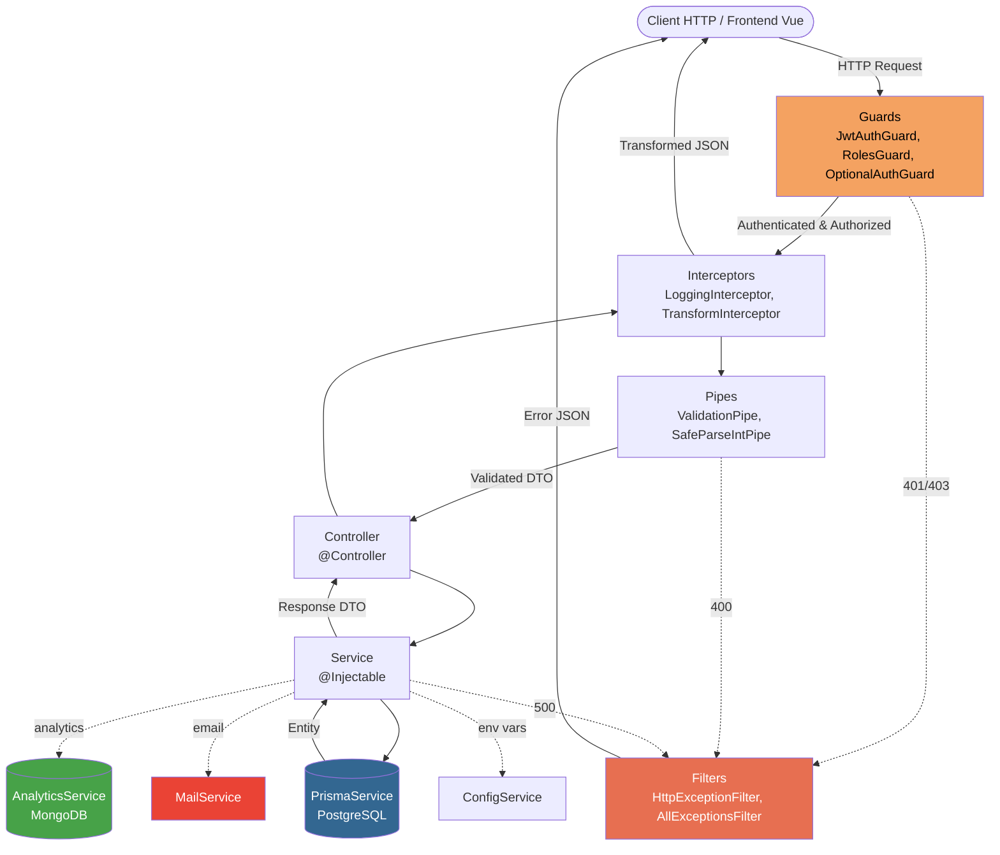
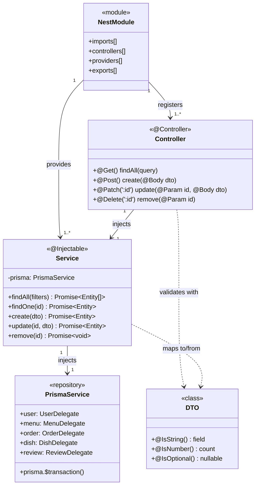
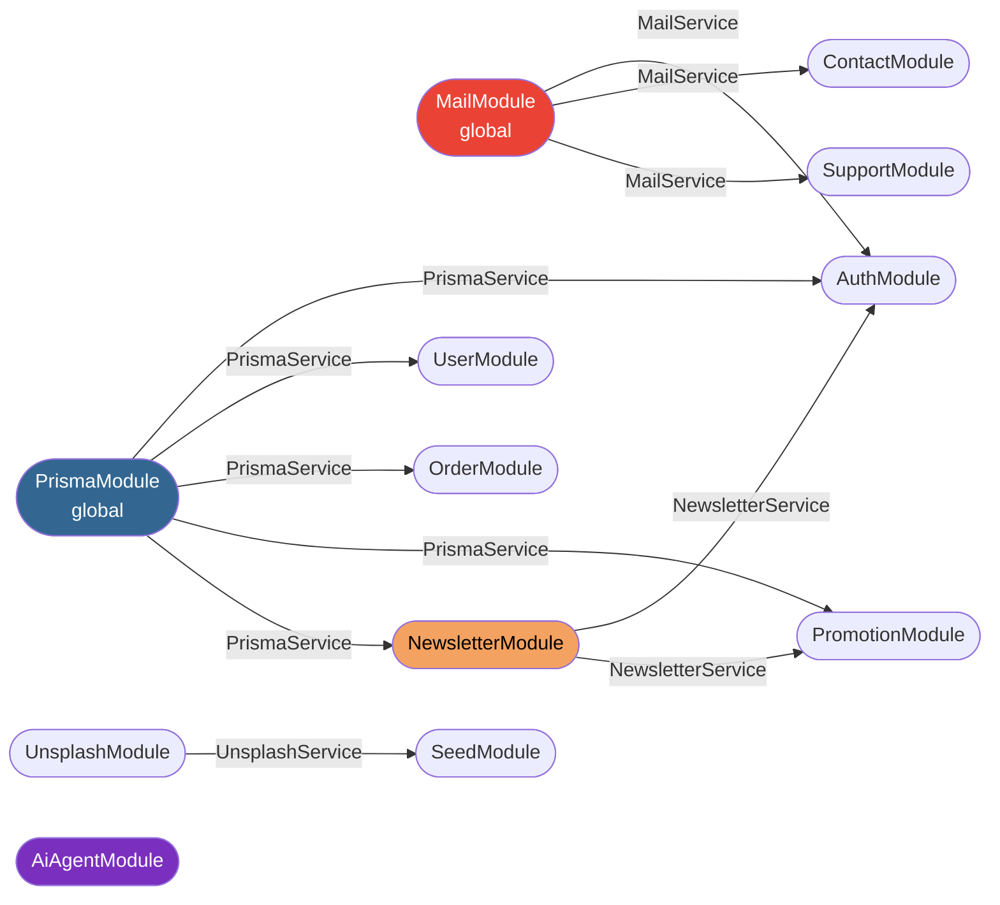

# Fig. 7 — Architecture des modules NestJS

> **Lecture du diagramme** : chaque requête HTTP entre par un **Controller**, traverse un ou plusieurs **Services** (logique métier), puis accède à la base via **PrismaService** (repository pattern). Les modules transversaux (Auth, Mail, Logger…) sont injectés par le système DI de NestJS.

---

## 7.1 — Flux général : Request → Controller → Service → Repository

---

## 7.2 — Carte des modules fonctionnels

```mermaid
graph TB
    subgraph INFRA["Infrastructure (globaux)"]
        APP[AppModule]
        PRISMA_M[PrismaModule]
        MAIL_M[MailModule]
        LOG_M[LoggingModule]
        COMMON_M["CommonModule<br/>decorators, guards, pipes, filters"]
    end

    subgraph AUTH_D["Domaine : Authentification"]
        AUTH_M[AuthModule]
        AUTH_C["AuthController<br/>POST /auth/register<br/>POST /auth/login"]
        AUTH_S[AuthService]
        PWD_S["PasswordService<br/>bcrypt"]
        TOKEN_S["TokenService<br/>JWT"]
        JWT_STRAT[JwtStrategy]
        GOOGLE_STRAT[GoogleStrategy]
        AUTH_C --> AUTH_S
        AUTH_S --> PWD_S
        AUTH_S --> TOKEN_S
        AUTH_M --> JWT_STRAT
        AUTH_M --> GOOGLE_STRAT
    end

    subgraph CATALOG["Domaine : Catalogue"]
        MENU_M[MenuModule]
        MENU_C["MenuController<br/>GET /menus"]
        MENU_S[MenuService]
        DISH_M[DishModule]
        DISH_C["DishController<br/>GET /dishes"]
        DISH_S[DishService]
        ING_M[IngredientModule]
        ING_S[IngredientService]
        ALLERGEN_M[AllergenModule]
        ALLERGEN_S[AllergenService]
        DIET_M[DietModule]
        DIET_S[DietService]
    end

    subgraph COMMERCE["Domaine : Commerce"]
        ORDER_M[OrderModule]
        ORDER_C["OrderController<br/>POST /orders"]
        ORDER_S[OrderService]
        ORDER_STATUS_S[OrderStatusService]
        PROMO_M[PromotionModule]
        PROMO_S[PromotionService]
        DISCOUNT_M[DiscountModule]
        DISCOUNT_S[DiscountService]
        DELIVERY_M[DeliveryModule]
        DELIVERY_S[DeliveryService]
        LOYALTY_M[LoyaltyModule]
        LOYALTY_S[LoyaltyService]
        ORDER_S --> ORDER_STATUS_S
    end

    subgraph USER_D["Domaine : Utilisateurs"]
        USER_M[UserModule]
        USER_C["UserController<br/>GET /users/me"]
        USER_S[UserService]
        ADDR_S[AddressService]
        REVIEW_M[ReviewModule]
        REVIEW_S[ReviewService]
        SESSION_M[SessionModule]
        SESSION_S[SessionService]
        USER_S --> ADDR_S
    end

    subgraph ADMIN_D["Domaine : Administration"]
        ADMIN_M[AdminModule]
        ADMIN_C["AdminController<br/>/admin/*"]
        ADMIN_S[AdminService]
        STATS_S[StatsService]
        ROLE_M[RoleModule]
        ROLE_S[RoleService]
        PERM_S[PermissionService]
        KANBAN_M[KanbanModule]
        KANBAN_S[KanbanService]
        TIMEOFF_M[TimeOffModule]
        TIMEOFF_S[TimeOffService]
        ADMIN_S --> STATS_S
        ROLE_S --> PERM_S
    end

    subgraph CONTENT["Domaine : Contenu & Communication"]
        NEWSLETTER_M[NewsletterModule]
        NEWSLETTER_S[NewsletterService]
        CONTACT_M[ContactModule]
        CONTACT_S[ContactService]
        SUPPORT_M[SupportModule]
        SUPPORT_S[SupportService]
        NOTIF_M[NotificationModule]
        NOTIF_S[NotificationService]
        MSG_M[MessageModule]
        MSG_S[MessageService]
        IMAGE_M[ImageModule]
        IMAGE_S[ImageService]
        SITEINFO_M[SiteInfoModule]
        SITEINFO_S[SiteInfoService]
        THEME_M[ThemeModule]
        THEME_S[ThemeService]
    end

    subgraph AI_ANALYTICS["Domaine : IA & Analytics"]
        AI_M[AiAgentModule]
        AI_S["AiAgentService<br/>Claude API"]
        ANALYTICS_M[AnalyticsModule]
        ANALYTICS_S["AnalyticsService<br/>MongoDB"]
        GDPR_M[GdprModule]
        GDPR_S[GdprService]
        CONSENT_S[ConsentService]
        UNSPLASH_M[UnsplashModule]
        UNSPLASH_S[UnsplashService]
        SEED_M[SeedModule]
        SEED_S[SeedService]
        GDPR_S --> CONSENT_S
    end

    %% Infrastructure connections
    APP --> PRISMA_M
    APP --> MAIL_M
    APP --> LOG_M
    APP --> COMMON_M

    %% Cross-module deps
    AUTH_S -->|imports| NEWSLETTER_S
    PROMO_S -->|imports| NEWSLETTER_S
    CONTACT_S -->|uses| MAIL_M
    SUPPORT_S -->|uses| MAIL_M
    AUTH_S -->|uses| MAIL_M
    SEED_S -->|imports| UNSPLASH_S

    style INFRA fill:#1a1a2e,color:#eee
    style AUTH_D fill:#16213e,color:#eee
    style CATALOG fill:#0f3460,color:#eee
    style COMMERCE fill:#1b4332,color:#eee
    style USER_D fill:#3d0c02,color:#eee
    style ADMIN_D fill:#240046,color:#eee
    style CONTENT fill:#2d1b69,color:#eee
    style AI_ANALYTICS fill:#0d1b2a,color:#eee
```

---

## 7.3 — Zoom sur le pattern Module / Controller / Service / Prisma

---

## 7.4 — Dépendances inter-modules critiques

