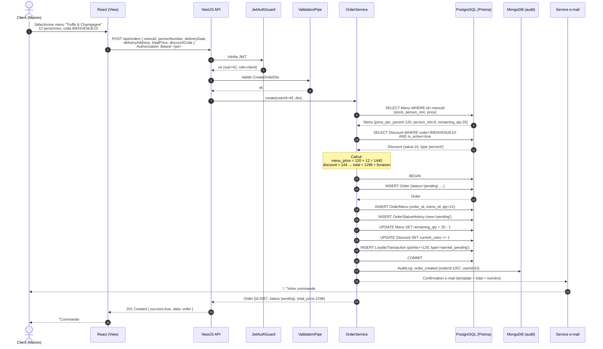
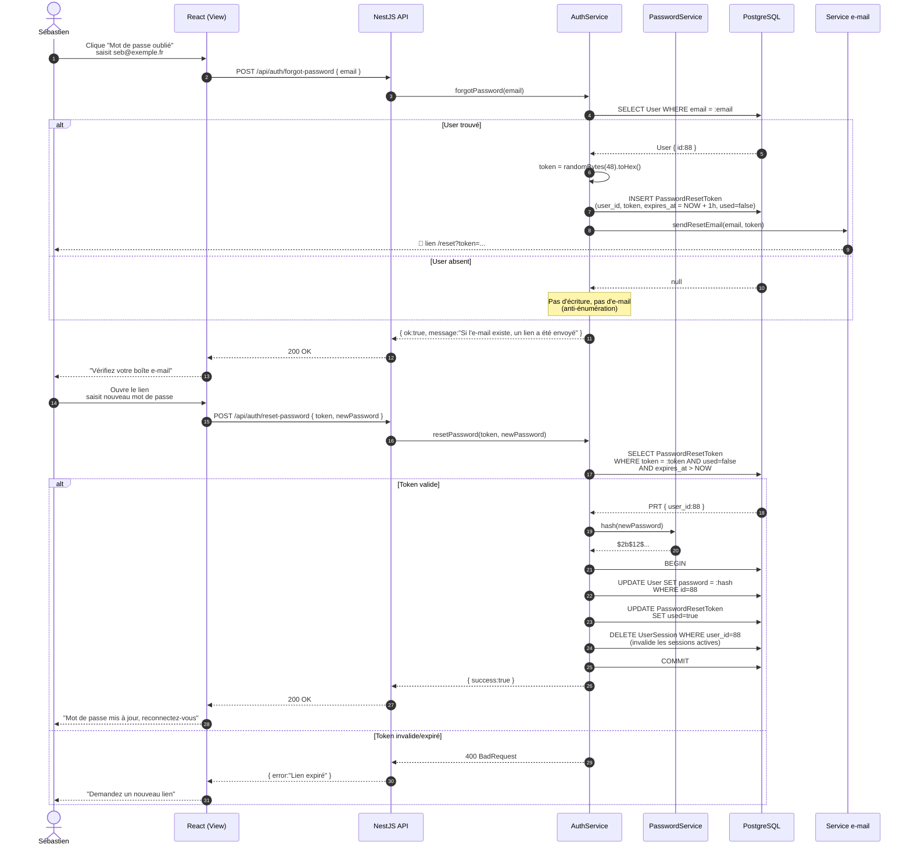
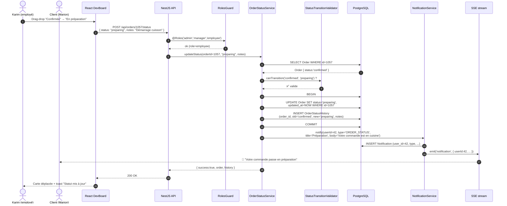
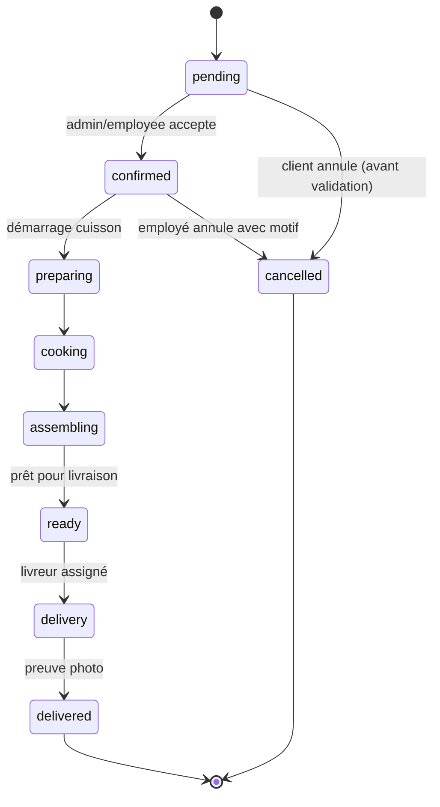
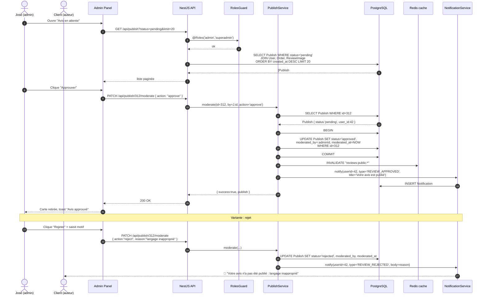

# Vite Gourmand — Diagrammes de séquence

> Quatre parcours utilisateurs représentatifs, du clic dans le navigateur jusqu'à la persistance en base.
> Chaque scénario combine **un narratif** (le contexte métier) et **un diagramme Mermaid** (le détail technique).

---

## Scénario 1 — Un client passe une commande

### Contexte
Marion, particulière, souhaite commander le menu *Truffe & Champagne* pour son anniversaire (12 personnes). Le `person_min` du menu est 8 ; à partir de `person_min + 5 = 13` une remise automatique de 10 % s'applique. Marion est en dessous du seuil, mais elle dispose d'un code promo `BIENVENUE10`. Elle souhaite valider, payer, et recevoir une confirmation par e-mail.

### Déroulement métier
1. Marion ouvre le site, parcourt les menus filtrés par thème "Gastronomique".
2. Elle ouvre la fiche du menu, choisit 12 personnes, saisit l'adresse de livraison.
3. Elle entre `BIENVENUE10` (remise 10 %).
4. Le système calcule : `menu_price × 12` puis applique la remise + ajoute les frais de livraison.
5. La commande est créée avec le statut `pending`, l'historique de statut est initialisé, des points fidélité sont provisionnés, et un e-mail de confirmation part.

### Diagramme

### Points techniques
- **Atomicité** : `BEGIN ... COMMIT` garantit que stock, remise, fidélité et commande sont cohérents.
- **Pré-validation** : `CreateOrderDto` rejette dates passées, adresses vides, prix négatifs.
- **Idempotence** : `order_number` est unique (`@unique`) ; double-clic = erreur 409 propre.
- **Décorrélation** : `AuditLog` MongoDB est *write-only* — l'écriture en NoSQL ne bloque pas la transaction SQL.

---

## Scénario 2 — Mot de passe oublié

### Contexte
Sébastien revient sur le site après plusieurs mois. Il ne se souvient plus de son mot de passe. Il clique sur *Mot de passe oublié*, saisit son e-mail, reçoit un lien contenant un token unique, choisit un nouveau mot de passe.

### Déroulement métier
1. Sébastien saisit `seb@exemple.fr` dans le formulaire *mot de passe oublié*.
2. Le backend ne révèle jamais si l'e-mail existe (anti-énumération).
3. Si l'utilisateur existe, un `PasswordResetToken` est créé avec une expiration de 1 h.
4. Un e-mail contenant `https://.../reset?token=...` est envoyé.
5. Sébastien clique, saisit son nouveau mot de passe, le backend valide le token, hashe le mot de passe (bcrypt 12 rounds), invalide le token.

### Diagramme

### Points techniques
- **Anti-énumération** : la réponse de l'étape 1 est identique que l'utilisateur existe ou non.
- **Token aléatoire** : 48 octets cryptographiquement sûrs (`crypto.randomBytes`).
- **Expiration courte** : 1 h, configurable via env.
- **Invalidation de session** : changer le mot de passe déconnecte les autres appareils (`DELETE UserSession`).
- **Hash bcrypt** : 12 rounds, conforme aux recommandations CNIL.

---

## Scénario 3 — Un employé fait avancer une commande sur le Kanban

### Contexte
Karim, employé en cuisine, ouvre son tableau Kanban. Il voit la commande #VG-1057 dans la colonne *Confirmée*. Il la déplace vers *En préparation*, ce qui doit déclencher la mise à jour atomique du statut, un historique, et une notification au client en temps réel.

### Déroulement métier
1. Karim s'authentifie, ouvre `/dashboard` (rôle employé).
2. Le tableau affiche les commandes regroupées par statut (`KanbanColumn.mapped_status`).
3. Karim glisse une carte de *confirmed* vers *preparing*.
4. Le backend valide la transition (machine d'états), persiste l'historique, notifie le client.
5. Le client connecté reçoit la notification via SSE (`Notification` + `useRealLogs` ne sert qu'aux logs ; ici c'est `Notification`).

### Diagramme

### Machine d'états des statuts

### Points techniques
- **FSM côté service** : transitions interdites (ex. `delivered → pending`) rejetées avec 400.
- **Audit immuable** : `OrderStatusHistory` n'est jamais modifié, seulement complété.
- **Notif temps réel** : SSE pour push instantané sur le dashboard client.
- **Transaction** : statut + historique commités ensemble (`BEGIN/COMMIT`).
- **RBAC** : seuls `admin`, `manager`, `employee` peuvent faire avancer un statut.

---

## Scénario 4 — Un admin modère un avis

### Contexte
José, l'admin propriétaire, reçoit une notification : un nouvel avis est en attente de modération. C'est un avis 5 étoiles avec une photo. Il l'approuve depuis l'interface d'administration. Si l'avis était problématique (langage inapproprié), il le rejetterait avec un motif et l'auteur recevrait une notification.

### Déroulement métier
1. José ouvre l'écran *Modération* dans l'admin.
2. Le backend liste les `Publish` avec `status='pending'`.
3. José clique *Approuver* sur l'avis #312.
4. Le backend met à jour le statut, trace le modérateur, et l'avis devient public sur le site.
5. Si rejet : statut `rejected`, motif enregistré, client notifié.

### Diagramme

### Points techniques
- **Traçabilité** : `moderated_by` + `moderated_at` sont obligatoires (qui a décidé, quand).
- **Cache** : la liste publique des avis est cachée — l'approbation invalide la clé pour rafraîchir le site.
- **Transparence** : en cas de rejet, le client est notifié avec le motif (conformité éditoriale).
- **Visibilité conditionnelle** : seul `Publish.status='approved'` est servi sur les pages publiques (filtre côté repo).
- **RBAC strict** : route protégée par `@Roles('admin','superadmin')`.

---

## Annexe — Conventions communes aux 4 séquences

| Élément | Convention | Implémentation |
|---|---|---|
| Authentification | Bearer JWT dans l'en-tête `Authorization` | `JwtAuthGuard` global |
| Validation entrée | DTO + `class-validator` | `CustomValidationPipe` (`whitelist:true`, `forbidNonWhitelisted:true`) |
| Permissions | Décorateur `@Roles(...)` | `RolesGuard` après JWT |
| Transactions | `BEGIN ... COMMIT` Prisma | `prisma.$transaction([...])` |
| Audit hors-bande | MongoDB collection `audit_logs` | Écriture *fire-and-forget* après le commit SQL |
| Notifications | Persistance + push temps réel | Table `Notification` + canal SSE/WebSocket |
| Réponse API | Wrapper uniforme | `TransformInterceptor` → `{ success, data, ... }` |
| Erreurs | Filtre global | `AllExceptionsFilter` → JSON `{ statusCode, message, error, path, timestamp }` |
