# Vite Gourmand — Diagramme de cas d'utilisation

> Vue d'ensemble des interactions entre les acteurs et le système.
> Quatre acteurs principaux, regroupés par périmètre fonctionnel.

---

## 1. Acteurs

| Acteur | Description | Authentification |
|---|---|---|
| **Visiteur** | Internaute non connecté qui consulte le site vitrine | Aucune |
| **Client** | Particulier ayant créé un compte pour commander | JWT (15 min) + refresh (7 j) |
| **Employé** | Personnel opérationnel (cuisine, livraison, service) | JWT + rôle `employee` |
| **Admin / Superadmin** | Gestion globale (José, propriétaire) | JWT + rôle `admin` / `superadmin` |

Acteur secondaire système : **Service e-mail** (envoi de tokens, confirmations).

---

## 2. Vue globale

```mermaid
graph LR
    %% ===== ACTORS =====
    V((Visiteur))
    C((Client))
    E((Employé))
    A((Admin))
    M[/Service e-mail/]

    %% ===== USE CASES =====
    subgraph Site["Site public"]
        UC1[Consulter les menus]
        UC2[Filtrer par régime/thème]
        UC3[Voir les horaires & contacts]
        UC4[Envoyer un message contact]
        UC5[Lire les avis publiés]
        UC6[S'inscrire à la newsletter]
    end

    subgraph Auth["Authentification & compte"]
        UC10[Créer un compte]
        UC11[Se connecter]
        UC12[Se connecter via Google]
        UC13[Réinitialiser mot de passe]
        UC14[Gérer son profil]
        UC15[Exporter ses données RGPD]
        UC16[Demander suppression compte]
    end

    subgraph Order["Commande client"]
        UC20[Composer une commande]
        UC21[Appliquer un code promo]
        UC22[Payer / valider]
        UC23[Suivre ses commandes]
        UC24[Modifier avant confirmation]
        UC25[Annuler une commande]
        UC26[Déposer un avis post-livraison]
        UC27[Consulter ses points fidélité]
        UC28[Ouvrir un ticket support]
    end

    subgraph Ops["Opérations employé"]
        UC30[Voir le Kanban des commandes]
        UC31[Faire avancer un statut]
        UC32[Marquer une livraison]
        UC33[Annuler une commande client]
        UC34[Répondre à un ticket]
        UC35[Demander un congé]
    end

    subgraph Admin["Administration"]
        UC40[Créer/désactiver employés]
        UC41[Gérer le catalogue menus]
        UC42[Gérer plats & allergènes]
        UC43[Modérer les avis]
        UC44[Créer codes promo]
        UC45[Lancer une newsletter]
        UC46[Statistiques par menu]
        UC47[Approuver suppression RGPD]
        UC48[Configurer horaires & société]
    end

    %% ===== LINKS =====
    V --> UC1
    V --> UC2
    V --> UC3
    V --> UC4
    V --> UC5
    V --> UC6
    V --> UC10
    V --> UC11
    V --> UC12

    C --> UC11
    C --> UC13
    C --> UC14
    C --> UC15
    C --> UC16
    C --> UC20
    C --> UC21
    C --> UC22
    C --> UC23
    C --> UC24
    C --> UC25
    C --> UC26
    C --> UC27
    C --> UC28

    E --> UC30
    E --> UC31
    E --> UC32
    E --> UC33
    E --> UC34
    E --> UC35

    A --> UC30
    A --> UC40
    A --> UC41
    A --> UC42
    A --> UC43
    A --> UC44
    A --> UC45
    A --> UC46
    A --> UC47
    A --> UC48

    %% Email service triggered by use cases
    UC10 -.->|déclenche| M
    UC13 -.->|déclenche| M
    UC22 -.->|déclenche| M
    UC45 -.->|déclenche| M
```



---

## 3. Relations `<<include>>` et `<<extend>>`

```mermaid
graph TD
    UC22[Payer / valider commande]
    UC22a((<<include>><br/>Vérifier stock menu))
    UC22b((<<include>><br/>Calculer remise auto<br/>person ≥ person_min + 5))
    UC22c((<<extend>><br/>Appliquer code promo))
    UC22d((<<include>><br/>Créer transaction fidélité))
    UC22e((<<include>><br/>Envoyer e-mail confirmation))

    UC22 --> UC22a
    UC22 --> UC22b
    UC22 -.-> UC22c
    UC22 --> UC22d
    UC22 --> UC22e

    UC31[Faire avancer un statut]
    UC31a((<<include>><br/>Logger OrderStatusHistory))
    UC31b((<<include>><br/>Notifier le client))
    UC31c((<<extend>><br/>Assigner livreur si "delivery"))
    UC31 --> UC31a
    UC31 --> UC31b
    UC31 -.-> UC31c

    UC43[Modérer un avis]
    UC43a((<<include>><br/>Mettre à jour Publish.status))
    UC43b((<<extend>><br/>Notifier le client si rejet))
    UC43 --> UC43a
    UC43 -.-> UC43b
```

---

## 4. Matrice acteur × cas d'utilisation (extrait)

| Cas d'utilisation | Visiteur | Client | Employé | Admin |
|---|:---:|:---:|:---:|:---:|
| Consulter menus | ✅ | ✅ | ✅ | ✅ |
| Envoyer formulaire contact | ✅ | ✅ | — | — |
| Créer un compte | ✅ | — | — | — |
| Passer une commande | — | ✅ | — | — |
| Annuler avant confirmation | — | ✅ | — | — |
| Modifier statut commande | — | — | ✅ | ✅ |
| Annuler commande confirmée | — | — | ✅ | ✅ |
| Modérer un avis | — | — | — | ✅ |
| Créer un menu | — | — | — | ✅ |
| Créer un employé | — | — | — | ✅ |
| Lancer une newsletter | — | — | — | ✅ |
| Consulter analytics | — | — | — | ✅ |
| Demander suppression RGPD | — | ✅ | — | — |
| Approuver suppression RGPD | — | — | — | ✅ |

---

## 5. Préconditions transversales

- **Authentification** : tout cas marqué client/employé/admin requiert un JWT valide (intercepteur `JwtAuthGuard`).
- **RBAC** : décorateur `@Roles(...)` + `RolesGuard` filtrent par rôle.
- **Throttling** : `ThrottlerGuard` global (300 req/min long, 20 req/s court) protège contre l'abus.
- **RGPD** : `gdpr_consent = true` exigé pour créer un compte ; le retrait du consentement déclenche la soft-deletion.
- **Audit** : chaque action sensible (statut commande, modération, suppression RGPD) écrit dans une table d'historique ou dans MongoDB (`AuditLog`).
