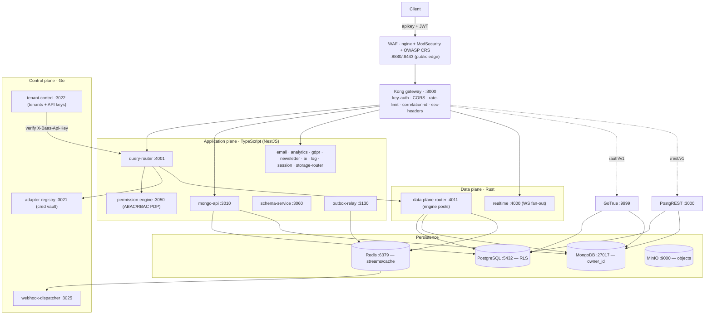

# 00 — Overview: what the BaaS is and how it is wired

> Plan index: **00 Overview** · [01 Gap analysis](01-gap-analysis.md) · [02 Layer & edition model](02-layer-edition-model.md) · [03 Control plane](03-control-plane.md) · [04 Data plane](04-data-plane.md) · [05 Orchestration, observability & roadmap](05-orchestration-observability-roadmap.md)

This document is the architectural map. Read it once; every other plan doc references the concepts defined here.

---

## 1. One sentence

A self-hosted, Docker-Compose-first **backend factory** — any frontend or service treats it as a complete backend (auth, relational + document data, realtime, object storage, email, multi-tenant query plane, ABAC/RBAC, edge functions, webhooks) over plain HTTP, **with no per-project server code**.

The design goal that everything else serves: **the platform never needs to know the shape of the data it manipulates**. It is generic, data-mesh oriented, and composed of swappable layers.

---

## 2. The 3-language plane pattern

The system is deliberately polyglot. Each language is used where its strengths pay off, and the boundaries between them are HTTP contracts, not shared memory.

| Plane | Language | Where | Owns | Why this language |
|---|---|---|---|---|
| **Application / business plane** | TypeScript (NestJS monorepo) | `src/apps/*` | Orchestration + domain services: `query-router`, `mongo-api`, `storage-router`, `email`, `permission-engine`, `schema-service`, `outbox-relay`, `analytics`, `gdpr`, `newsletter`, `ai`, `log`, `session` | Velocity, huge ecosystem, expressive DTO/guard/interceptor model for business rules that change often |
| **Control plane** | Go | `go/control-plane/*` | Tenancy + identity + secrets: `adapter-registry` (AES-256-GCM credential vault), `tenant-control` (tenants, API keys, JWT bootstrap), `webhook-dispatcher` (Redis stream → HMAC-signed delivery) | Tiny static binaries (48–96 MB RAM), fast cold start, fearless concurrency for daemons that must always be up |
| **Data plane** | Rust | `docker/services/data-plane-router/*` (3-crate workspace) + `realtime-agnostic` | The hot path: per-mount connection pools, query execution per engine, transactions, in-process ABAC, WS fan-out | Predictable latency, memory safety, long-lived pools that the per-call TS adapters could never match |

> The shared currency across all three is **the JWT secret** (HS256, issued by GoTrue, verified everywhere) and **stable HTTP envelopes**. No plane reaches into another's database directly except through its owning service.

---

## 3. Topology — how a request flows



### The universal query lifecycle (the heart of the product)

1. Client → Kong with `apikey` (Kong key-auth) + `Authorization: Bearer JWT` (or `X-Baas-Api-Key`).
2. Kong strips path prefix, injects `X-Request-ID`, forwards to **query-router**.
3. query-router validates identity (JWT, or exchanges an API key with **tenant-control** `/v1/keys/verify`).
4. query-router asks **permission-engine** for an ABAC/RBAC decision (cached, circuit-broken).
5. query-router fetches the encrypted DSN from **adapter-registry** (Go), which decrypts AES-256-GCM (cached with a short TTL).
6. query-router builds a `{identity, mount, operation}` envelope and forwards to the **Rust data-plane-router** `/v1/query`.
7. Rust selects the engine adapter, reuses (or opens) a per-mount pool, executes a **parameterised** operation, returns a normalised `DataResult`.
8. query-router normalises back to the legacy `QueryResult`, emits an outbox event, and responds.
9. **outbox-relay**/Debezium ships the change to Redis Streams → Mongo projection + realtime publish + **webhook-dispatcher** (HMAC).

---

## 4. The capability model (already in the code)

The data plane is **capability-driven**, which is what makes engines swappable. Every engine advertises an `EngineCapabilities` descriptor (`crates/data-plane-core/src/capability.rs`):

```
read · write · upsert · stream · ddl · transactions · savepoints
isolation_levels[] · two_phase_commit · native_idempotency · max_batch_size
cost { latency_class, pattern_search, joins }
```

- Adding an engine is **one line** in `routes.rs` (`AppState::new`) — register one `Arc<dyn EngineAdapter>` into the `PoolRegistry`. No call-site changes (Strategy pattern).
- The **SDK is capability-typed**: `client.engine('redis', …).subscribe()` is a *compile-time* error because Redis advertises `stream: false` (`sdk/src/generated/engines.ts`, regenerated from the live `/v1/capabilities`).
- `/v1/capabilities` exposes the catalog so the SDK can detect drift (`MiniBaasClient.introspectEngines()`).

This is the seed of "change layers according to need" — but today it is descriptive, not yet enforced at routing time (see [01 Gap analysis](01-gap-analysis.md), gap G6).

---

## 5. Layers today = compose profiles

"Layers" are realised as **compose profiles**. A service can belong to several.

| Profile | Representative services | Purpose |
|---|---|---|
| _(none)_ — core | waf, kong, postgres, db-bootstrap, gotrue, postgrest, redis | Minimum viable BaaS |
| `data-plane` | mongo(+init), mongo-api, realtime, analytics, ai, debezium | Document + realtime + analytical reads |
| `control-plane` | vault(+init), pg-meta, adapter-registry-go, tenant-control, webhook-dispatcher, permission-engine, schema-service, gdpr, supavisor, studio | Tenancy, identity, secrets, governance |
| `adapter-plane` | query-router, data-plane-router-rust, permission-engine, outbox-relay | The universal multi-tenant query path |
| `go-control-plane` | adapter-registry-go, tenant-control, webhook-dispatcher | Just the Go daemons |
| `rust-data-plane` | data-plane-router-rust | Just the Rust executor |
| `background` | email, newsletter, session, webhook-dispatcher, analytics, ai, gdpr, log, outbox-relay | Async / non-request-path work |
| `analytics` | trino, mysql, iceberg-rest, analytics-service | SQL federation + lakehouse |
| `storage` | minio, storage-router | Object storage + presign |
| `realtime` | realtime | WebSocket fan-out |
| `functions` | functions-runtime | Deno edge functions (worker-per-invocation) |
| `observability` | prometheus, grafana, loki, promtail, log-service | Metrics, dashboards, logs |
| `ops` / `backups` | pg-backup | Nightly logical dumps → MinIO |
| `studio` / `playground` | studio, playground | Admin UI / demo frontend |

The **product modes** that make a plane swappable at runtime:

- `DATA_PLANE_ROUTER_PRODUCT_MODE = enabled | shadow` (Rust)
- `ADAPTER_REGISTRY_GO_PRODUCT_MODE`, `TENANT_CONTROL_PRODUCT_MODE`, `WEBHOOK_DISPATCHER_PRODUCT_MODE = shadow | enabled` (Go)
- `RUST_DATA_PLANE_FORWARD` + `RUST_DATA_PLANE_FORWARD_ENGINES` (query-router decides per-engine which plane executes)
- `PERMISSION_MODE = abac | rbac` (PDP)

---

## 6. Current migration state (snapshot)

| Component | Mode today | Evidence |
|---|---|---|
| Rust data-plane-router | **LIVE** (`enabled`), all 5 engines forwarded | `docker-compose.yml` query-router env `RUST_DATA_PLANE_FORWARD=1`, `FORWARD_ENGINES=postgresql,mongodb,mysql,redis,http`; TS engine files deleted (`git status`) |
| Go adapter-registry | **PRIMARY** (TS retired) | compose comment + `ADAPTER_REGISTRY_URL` → `adapter-registry-go:3021`; TS `src/apps/adapter-registry` deleted |
| Go tenant-control | **shadow** | `TENANT_CONTROL_PRODUCT_MODE=shadow` |
| Go webhook-dispatcher | **shadow** | `WEBHOOK_DISPATCHER_PRODUCT_MODE=shadow` |
| Permission engine | abac | `PERMISSION_MODE=abac` |

The slice discipline (shadow → parity → cutover → delete) is documented in `.claude/instructions.md` and proven per slice by `scripts/verify/parity-probe.sh` and `scripts/verify/m1..m19`.

---

## 7. Where the plan goes from here

The platform is already a *working* BaaS. To become a **true product that changes its layers according to need**, it needs a small number of missing pieces — a layer/edition manifest, a provisioning brain, capability-aware routing, isolation-model selection, control-plane cutover, cross-tier observability, and a single orchestrator. Those are enumerated and prioritised in [01 Gap analysis](01-gap-analysis.md) and planned in docs 02–05.
