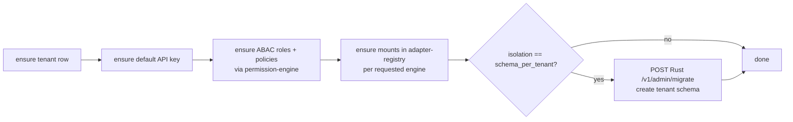

# 03 — Control plane plan (Go): tenancy, provisioning, secrets, gateway

> [00 Overview](00-overview.md) · [01 Gap analysis](01-gap-analysis.md) · [02 Layer & edition model](02-layer-edition-model.md) · **03 Control plane** · [04 Data plane](04-data-plane.md) · [05 Orchestration & roadmap](05-orchestration-observability-roadmap.md)

The control plane is the **brain** that decides *who* a tenant is, *what* layers they get, and *which secrets* unlock their data. It is Go because these are always-on, low-RAM daemons where concurrency and tiny static binaries matter more than expressiveness. Resolves **G2, G3, G4, G8**.

---

## 1. What exists today

`go/control-plane/` is a single module with three binaries sharing `internal/shared` (config, pgx pool, slog, HTTP middleware, health probes):

| Service | Port | Owns | Mode |
|---|---|---|---|
| `adapter-registry` | 3021 | encrypted DSN store (AES-256-GCM + scrypt), `/databases` CRUD + `/databases/:id/connect` | **enabled** (primary; TS retired) |
| `tenant-control` | 3022 | `tenants` + `tenant_api_keys`, `/v1/keys/verify`, JWT self-bootstrap | **shadow** |
| `webhook-dispatcher` | 3025 | `webhook_subscriptions` CRUD, consumes `outbox.<aggregate>` Redis streams, HMAC-signed POST + retry/DLQ | **shadow** |

Shared config (`internal/shared/config.go`) already standardises `<PREFIX>_HOST/_PORT`, `DATABASE_URL`, `INTERNAL_SERVICE_TOKEN`, `<PREFIX>_PRODUCT_MODE` (default `shadow`). Good bones.

Tenant lifecycle (`internal/tenants/service.go`) is solid: `Create`, `IssueKey` (prefix+hash, cleartext returned once, constant-time verify), `BootstrapForUser` (JWT path, idempotent key reuse), slug parity with the SQL trigger (migration 033/034). API keys + tenants schema in migrations 005 + 032.

---

## 2. Gaps and the plan

### 2.1 Promote the daemons out of shadow (G3)

**Problem.** `tenant-control` and `webhook-dispatcher` default to `shadow`; promotion is a human editing env. The doctrine (`.claude/instructions.md`) demands shadow → parity → CI-green → cutover.

**Plan.** Make promotion a *gate*, not a vibe:

1. `make parity PLANE=tenant-control` — replays a fixed request set against shadow + would-be-live and diffs (see [05](05-orchestration-observability-roadmap.md) §parity).
2. On green + CI green, `make cutover PLANE=tenant-control` flips `TENANT_CONTROL_PRODUCT_MODE=enabled`, restarts only that service, re-probes health, and appends a line to `wiki/cutover-log.md`.
3. Reversible: `make rollback PLANE=tenant-control` flips back; pools/keys are unaffected because the contract is identical (that's what parity proved).

This is exactly the path the adapter-registry already walked (TS deleted after `parity-probe.sh`) — the plan just makes it a button.

### 2.2 The provisioning orchestrator (G2) — the missing brain

**Problem.** Creating a tenant's stack is a manual dance across tenant-control + adapter-registry + permission-engine + Rust migrate. `seedDefaultRole()` is a literal no-op stub (`service.go` ~510–523).

**Plan.** Add a `provision` package (or a 4th binary `provision-control`) exposing a **declarative, idempotent, reconcile-style** API:

```http
POST /v1/provision
{
  "tenant": "acme",
  "owner_user_id": "uuid",
  "plan": "pro",
  "isolation": "schema_per_tenant",       // 02 §5
  "engines": ["postgresql", "redis"],      // mounts to create
  "planes":  ["realtime", "storage"],      // informational/quota hints
  "roles":   ["tenant_admin", "member"]
}
```

Reconcile loop (each step idempotent, safe to re-run):



The orchestrator is the concrete realisation of [02 §1](02-layer-edition-model.md)'s "Isolation" + "Engine" axes at the tenant grain.

> **✅ Delivered (2026-06) — `POST /v1/provision` reconcile endpoint.** A single
> idempotent call composes a tenant's stack: it bootstraps the tenant + first
> API key + default ABAC role (reusing the now-idempotent `Bootstrap`) and then
> registers each requested **data mount** in the adapter-registry. Because mount
> DSNs are AES-encrypted by the adapter-registry's scheme, tenant-control calls
> it over HTTP (`internal/tenants/provision.go`, new `ADAPTER_REGISTRY_URL` env)
> — the encryption boundary is respected. Each mount reports `created | exists |
> error` so one failure doesn't abort the rest. **Verified live**: 1st call →
> tenant `created:true` + role `user` + mount `created`; 2nd call → `created:false`,
> `key_reuse:true`, mount `exists`; the mount is confirmed in
> `public.tenant_databases`. Unit tests cover the 201/409/5xx status mapping
> (`provision_test.go`). `make verify-m19` **PASS**.
>
> **✅ Capstone (2026-06) — provision now closes the loop end-to-end.** Two
> corrections/additions made `/v1/provision` actually connect to the query path:
> - **Mounts are scoped by the tenant _slug_**, not the owner UUID. This was a
>   real bug: `VerifyKey` returns the slug, the api-key middleware sets
>   `x-baas-tenant-id` to it, and the query-router scopes the adapter-registry
>   lookup + Rust `mount.tenant_id` by it (`query.service.ts`). A UUID-scoped
>   mount would have been unreachable by the api-key product path. (Note: the
>   `tenant_databases.tenant_id` column is **TEXT**, and pre-existing internal
>   test data is UUID-scoped — the slug/UUID tenant-identity split is a real
>   inconsistency the team should unify; provision now standardises on the slug,
>   which is correct for the SDK/api-key flow.)
> - For `schema_per_tenant` postgres mounts, provision **creates `tenant_<slug>`**
>   via the Rust `/v1/admin/migrate` (`RUST_DATA_PLANE_URL`). The Go schema
>   derivation mirrors Rust's `tenant_schema` exactly, pinned by a shared test
>   vector (`TestTenantSchemaMatchesRust`).
>
> **Verified live (full chain)**: provision → schema `tenant_<slug>` created →
> mount `tenant_id = slug` → issued api-key `VerifyKey` → same slug → `/connect`
> by slug returns the DSN → a Rust query (`isolation: schema_per_tenant`,
> `tenant_id = slug`) reads the Go-created schema. `make verify-m19` **PASS**.
>
> Still open: gateway exposure of `/admin/v1/provision` (the path-rewrite item
> from §2.3 — tenant-control uses a `/v1` prefix Kong's `strip_path` would clip),
> the TS proxy forwarding a stored `isolation` (needs an isolation column on
> `tenant_databases`), and unifying the slug/UUID tenant-identity model.

> **✅ Delivered (2026-06) — `seedDefaultRole` is real.** The stub now seeds a
> baseline ABAC role on bootstrap (`internal/tenants/service.go`). Design notes,
> grounded in migration 007's schema:
> - The ABAC schema is **global** (unique role names, no `tenant_id` on roles;
>   `has_permission()` is not tenant-scoped), so a per-tenant `tenant_admin`
>   cannot be modelled yet — it assigns the **requested role if it exists, else
>   falls back to the baseline `user` role** (owner-scoped CRUD).
> - It **never silently escalates** to the platform `admin` role; the default
>   (no role requested) is `user`. Explicit `default_role_name` is honoured
>   because the endpoint is service-token gated.
> - It assigns via **direct SQL on the shared Postgres** (tenant-control already
>   owns that pool), not an HTTP call into permission-engine — whose
>   `/permissions/roles/assign` requires a JWT `admin`/`service_role` identity
>   that's awkward to mint service-to-service. Idempotent via
>   `user_roles UNIQUE(user_id, role_id)`.
> - **Verified live**: `has_permission(owner,'table','x','select')` flips
>   `false→true` after bootstrap; re-running adds no duplicate row; a non-UUID
>   owner is skipped cleanly while the API key still issues.
>
> **✅ Fixed (2026-06) — Bootstrap is now an idempotent upsert.** The
> `Service.Create` bug (pgx surfaces `23505` during the row *scan*, not query
> exec, so the conflict mapping was bypassed) is fixed with a shared
> `isUniqueViolation` helper applied to **both** error paths of every INSERT
> (`Create`, `IssueKey`). `Bootstrap` now `findOrCreateBySlug` + reuses an
> existing active key (`key_reuse:true`, no re-mint) instead of 500ing —
> mirroring `BootstrapForUser`. New `BootstrapResponse` fields: `created`,
> `key_reuse`. Unit test covers the wrapped-23505 case; **verified live**:
> re-bootstrap returns `created:false, key_reuse:true` with exactly one active
> key and one role row. This is the idempotency foundation the reconcile API
> (§2.2) builds on.

**Why Go.** It's control-plane glue: many small idempotent HTTP/SQL calls, must be always-up, benefits from goroutine fan-out across the sub-services. Reuses `internal/shared`.

### 2.3 Put the control plane behind the gateway (G4)

**Problem.** Go + Rust services bind `127.0.0.1` only; the public `/admin/v1/databases` route documented in the README pointed at the **deleted** TS service. The admin surface regressed.

**Plan.** Add Kong routes (declarative `kong.yml`) for one coherent Admin API, `service_role`-gated:

| Route | → upstream | Owner |
|---|---|---|
| `/admin/v1/tenants*` | tenant-control:3022 | Go |
| `/admin/v1/keys*` | tenant-control:3022 | Go |
| `/admin/v1/databases*` | adapter-registry:3021 | Go |
| `/admin/v1/webhooks*` | webhook-dispatcher:3025 | Go |
| `/admin/v1/provision` | provision-control | Go |
| `/admin/v1/migrate` | data-plane-router:4011 (`/v1/admin/migrate`) | Rust |

Keep the `127.0.0.1` ports for direct dev/debug, but the **product** surface is one gateway path family. Document it in the README to replace the stale TS reference.

### 2.4 Pluggable credential providers + rotation (G8)

**Problem.** `DatabaseMount.credential_ref{provider, reference, version}` exists, but in practice DSNs flow **inline** and the only provider is `adapter-registry`. Vault runs but isn't a credential source. No tenant-DSN rotation.

**Plan.**
- Define a `CredentialProvider` seam (resolver side in Rust, see [04 §4](04-data-plane.md)) keyed by `credential_ref.provider`: `adapter-registry` (decrypt-on-demand) and `vault` (KV v2 read).
- adapter-registry grows `POST /databases/:id/rotate` → re-encrypts with a new `version`, returns the new `credential_ref`. The data plane drains old pools by `pool_key` (which already includes `credential_ref.version`).
- `make secrets-rotate` gains a `GROUP=tenant-dsn` path, mirroring the existing JWT rotation.

---

## 3. Service-by-service target state

| Service | Add | Keep |
|---|---|---|
| tenant-control | parity+cutover automation; real `seedDefaultRole` via permission-engine; `/metrics` | tenants/keys CRUD, JWT bootstrap, slug parity |
| adapter-registry | `/databases/:id/rotate`; vault provider option; `/metrics` | AES-256-GCM store, RLS, `/connect` |
| webhook-dispatcher | parity+cutover; DLQ inspection endpoint; `/metrics` | stream consume, HMAC, retry |
| **provision-control (new)** | declarative reconcile API behind `/admin/v1/provision` | — |

`/metrics` on all three is the control-plane half of **G7** (see [05](05-orchestration-observability-roadmap.md)).

---

## 4. How I (Claude) help here

- Scaffold the `provision` package against `internal/shared`, with table-driven unit tests (the module already tests crypto/jwt/keys).
- Write the `kong.yml` admin routes + the README correction in one PR, then `make verify-m19` (Go control-plane gate) + `make verify-m11` (trust boundary) to prove no regression.
- Implement `seedDefaultRole` as an HTTP call into permission-engine and add an integration test that asserts a freshly-provisioned tenant can immediately pass an ABAC `decide`.
- Add the `make cutover/rollback PLANE=…` targets and dry-run them against shadow before any real flip — never cut over without a green parity verdict (the deletion-gate discipline in `.claude/instructions.md`).
