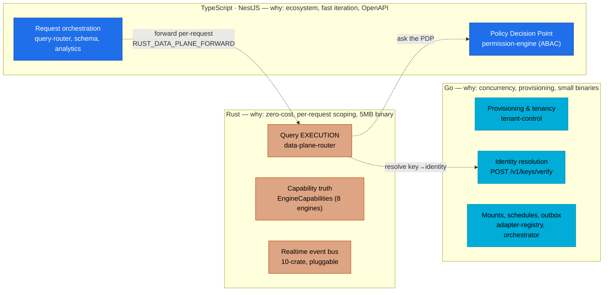
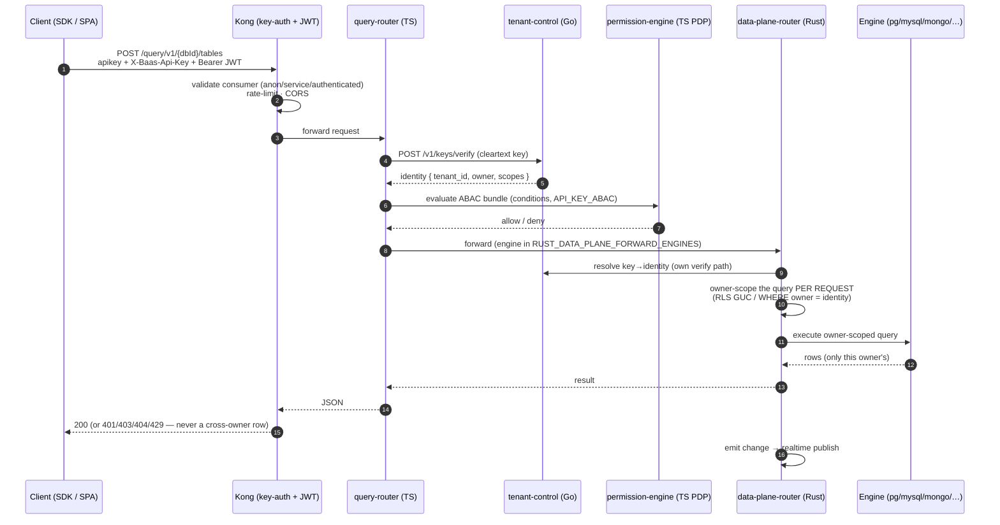
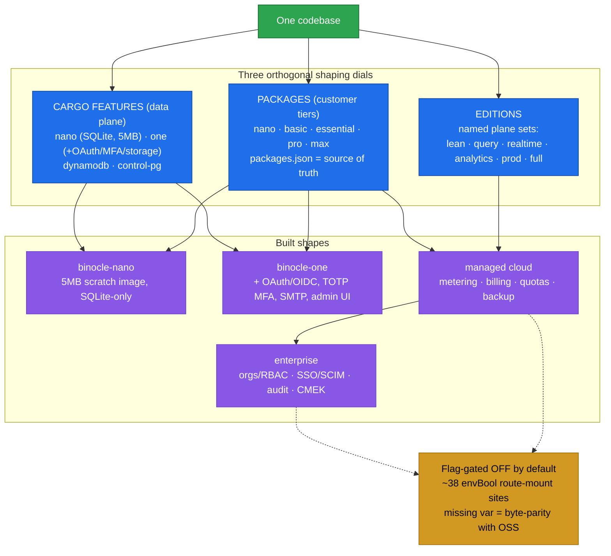
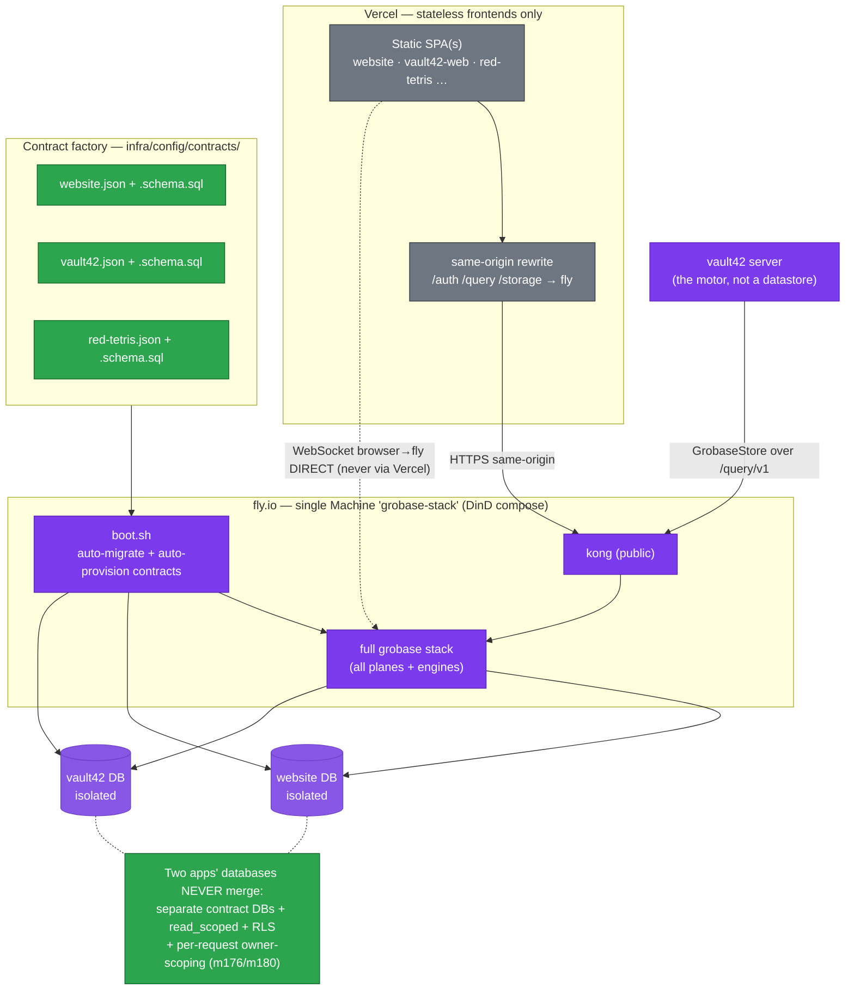
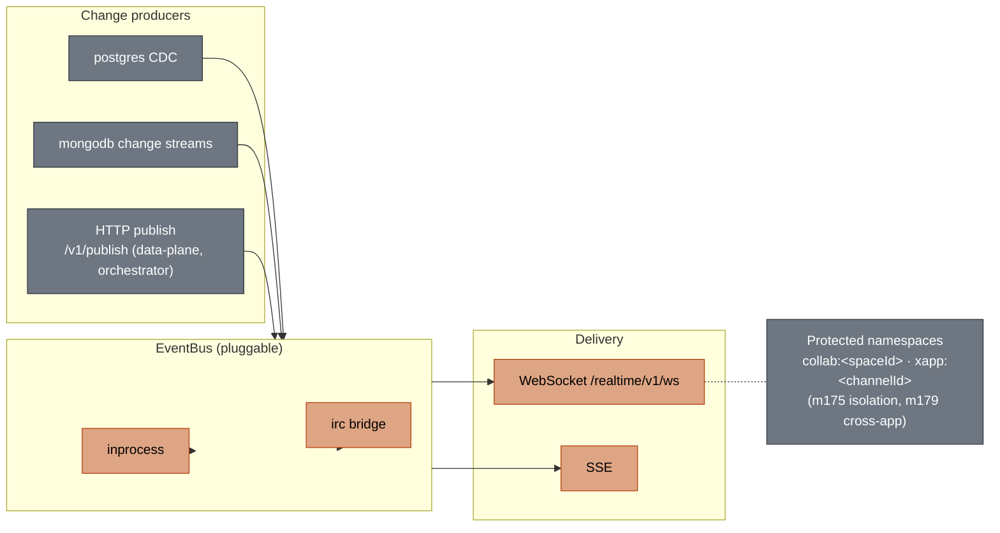

# Grobase — Global Architecture & Technology Relationships

> One backend, any frontend, no per-project server code — **5 MB single binary → 10K-tenant
> platform on one codebase, no rewrite.** This document maps every technology in the stack and how
> they relate. Grounded in the live compose graph (`orchestrators/compose/base/*.yml`) and the Kong
> declarative routing (`infra/docker/services/kong/conf/kong.yml`), not from memory.

---

## 1. The architecture, by layer

Grobase is a **three-language, multi-plane** system. Each plane is a different language chosen for
what it is best at, and they meet at one load-bearing seam (§4).

| Layer | Technology | Language | Role |
|---|---|---|---|
| **Edge / TLS** | `waf` (nginx) → `kong` (DB-less, declarative) | Lua/conf | Public HTTPS entrypoint; one gateway, all routes; key-auth + JWT + CORS + rate-limit + Prometheus |
| **Auth** | `gotrue` (Supabase Auth fork) | Go | Identity, sessions, JWT issuer; OAuth (Google · GitHub · 42) + email-OTP |
| **Direct REST** | `postgrest` · `pg-meta` · `mongo-api` | — | PostgREST over Postgres (`/rest/v1`, `/graphql/v1`), PG metadata, Mongo REST facade |
| **Application plane** | `query-router` · `permission-engine` · `schema-service` · `analytics-service` · `storage-router` · `log-service` · `gdpr-service` | **TypeScript (NestJS)** | Request orchestration, the PDP (policy decision point), schema, analytics, signed-URL storage |
| **Control plane** | `tenant-control` · `adapter-registry` · `orchestrator` · `webhook-dispatcher` · `function-scheduler` | **Go** | Provisioning, tenancy, **key→identity verify**, mount registry, outbox relay, schedules, **44 `internal/` domain pkgs** |
| **Data plane** | `data-plane-router` (8 engine adapters) | **Rust** | Query **execution** + per-request owner-scoping; the cutover target of the TS→Rust migration |
| **Realtime** | `realtime-agnostic` (10-crate event bus) | **Rust** | Pluggable EventBus (`inprocess`/`irc`) + DB change producer (`postgres`/`mongodb`) → WebSocket/SSE |
| **Engines** | `postgres` `mysql` `mariadb` `cockroach` `mssql` `mongo` `redis` `sqlite` `dynamodb` | — | 8 swappable adapters; Postgres is the control/primary store |
| **Object storage** | `minio` (S3-compatible) | — | Buckets + objects; `storage-router` mints signed URLs |
| **Functions** | `functions-runtime` | — | Edge functions; secrets resolved via `webhook-dispatcher` |
| **Lakehouse** | `trino` | — | Federated SQL (`/sql`) |
| **Observability** | `prometheus` · `grafana` · `loki` | — | Metrics, dashboards, logs |
| **Studio** | `studio` | — | Admin UI (`/studio`) |
| **Dev mail** | `mailpit` | — | Local SMTP catch-all |
| **SDKs** | `@grobase/js` (hand-written) + python · kotlin · swift · dart (OpenAPI-gen) | poly | One spec → 5 clients |
| **Deploy** | `fly.io` (single Machine, DinD compose) + `Vercel` (stateless frontends) | — | grobase owns ALL state; Vercel hosts pure clients |
| **Secrets motor** | `vault42` (+ `42ctl` CLI) | Rust | Zero-knowledge vault that uses grobase as its **store** (GrobaseStore) |

---

## 2. The global relationship diagram

Every box is a real service; every edge is a real dependency or call path from the compose graph and
Kong config. Colour = language plane (blue TS · teal Go · orange Rust · purple engine · grey infra).

```mermaid
flowchart TB
    %% ---------- Clients ----------
    subgraph CLIENTS["Clients"]
        BR["Browser SPA / Frontends<br/>(Vercel, same-origin rewrite)"]
        SDK["SDKs<br/>@grobase/js · py · kotlin · swift · dart"]
        V42["vault42 + 42ctl CLI<br/>(GrobaseStore consumer)"]
    end

    %% ---------- Edge ----------
    subgraph EDGE["Edge — public HTTPS"]
        WAF["waf (nginx + TLS)"]
        KONG["kong<br/>DB-less gateway<br/>key-auth · JWT · CORS · rate-limit"]
    end

    %% ---------- Auth + direct REST ----------
    subgraph AUTH["Auth & direct REST"]
        GOTRUE["gotrue (auth, JWT issuer)"]
        PGREST["postgrest (/rest, /graphql)"]
        PGMETA["pg-meta (/meta)"]
        MONGOAPI["mongo-api (/mongo)"]
        MAILPIT["mailpit (dev SMTP)"]
    end

    %% ---------- TS application plane ----------
    subgraph APP["Application plane — TypeScript / NestJS"]
        QR["query-router (/query)"]
        PE["permission-engine (PDP)"]
        SS["schema-service"]
        AN["analytics-service"]
        SR["storage-router (signed URLs)"]
        LOG["log-service"]
    end

    %% ---------- Go control plane ----------
    subgraph CTRL["Control plane — Go"]
        TC["tenant-control<br/>provision · tenants · KEY→IDENTITY verify"]
        AR["adapter-registry (mount catalog)"]
        ORCH["orchestrator (outbox · email · gdpr)"]
        WD["webhook-dispatcher (webhooks · fn-secrets)"]
        FSCH["function-scheduler"]
    end

    %% ---------- Rust data plane ----------
    subgraph DATA["Data plane — Rust"]
        DPR["data-plane-router (/data)<br/>8 engine adapters · per-request owner-scoping"]
        RT["realtime (/realtime/v1/ws)<br/>pluggable EventBus + CDC"]
    end

    %% ---------- Engines ----------
    subgraph ENG["Engines & storage"]
        PG[("postgres — primary/control")]
        MY[("mysql / mariadb")]
        CR[("cockroach")]
        MS[("mssql")]
        MG[("mongo")]
        RD[("redis")]
        SQ[("sqlite")]
        DY[("dynamodb")]
        MINIO[("minio — objects")]
    end

    %% ---------- Adjacent ----------
    subgraph EXTRA["Functions · Lakehouse · Studio · Observability"]
        FN["functions-runtime"]
        TRINO["trino (/sql)"]
        STUDIO["studio (/studio)"]
        OBS["prometheus · grafana · loki"]
    end

    %% ===== client → edge =====
    BR --> WAF
    SDK --> WAF
    V42 --> WAF
    WAF --> KONG

    %% ===== kong routing (the spine) =====
    KONG -->|"/auth/v1"| GOTRUE
    KONG -->|"/rest /graphql"| PGREST
    KONG -->|"/meta/v1"| PGMETA
    KONG -->|"/mongo/v1"| MONGOAPI
    KONG -->|"/query/v1"| QR
    KONG -->|"/data/v1"| DPR
    KONG -->|"/realtime/v1/ws"| RT
    KONG -->|"/storage/v1 sign"| SR
    KONG -->|"/storage/v1 raw"| MINIO
    KONG -->|"/admin/v1 provision·tenants·keys"| TC
    KONG -->|"/admin/v1 webhooks·fn-secrets"| WD
    KONG -->|"/admin/v1 schedules"| FSCH
    KONG -->|"/admin/v1 registry"| AR
    KONG -->|"/admin/v1 migrate·rotate"| DPR
    KONG -->|"/email/v1"| ORCH
    KONG -->|"/sql"| TRINO
    KONG -->|"/studio"| STUDIO

    %% ===== the load-bearing seam (highlighted) =====
    QR ==>|"forward (RUST_DATA_PLANE_FORWARD)"| DPR
    QR -.->|"verify key"| TC
    QR -.->|"PDP bundle"| PE
    DPR ==>|"resolve key→identity"| TC
    DPR -.->|"permission bundle"| PE
    DPR -.-> AR

    %% ===== execution fan-out =====
    DPR --> PG
    DPR --> MY
    DPR --> CR
    DPR --> MS
    DPR --> MG
    DPR --> RD
    DPR --> SQ
    DPR --> DY

    %% ===== supporting edges =====
    GOTRUE --> PG
    GOTRUE --> MAILPIT
    PGREST --> PG
    PGMETA --> PG
    MONGOAPI --> MG
    PE --> PG
    SS --> AR
    AN --> MG
    SR --> MINIO
    QR --> RD
    QR --> LOG

    TC --> PG
    TC --> AR
    AR --> PG
    ORCH --> PG
    ORCH --> RD
    ORCH --> MG
    ORCH -->|"publish"| RT
    ORCH -->|"logs"| OBS
    WD --> RD
    WD --> FN
    FSCH --> FN
    FN -->|"resolve secrets"| WD

    RT -->|"CDC"| PG
    RT --> MG
    DPR -->|"publish change"| RT

    %% ===== styling =====
    classDef ts fill:#1f6feb,color:#fff,stroke:#0d419d;
    classDef go fill:#00ADD8,color:#000,stroke:#007d9c;
    classDef rust fill:#dea584,color:#000,stroke:#b7410e;
    classDef engine fill:#8957e5,color:#fff,stroke:#6e40c9;
    classDef edge fill:#2da44e,color:#fff,stroke:#116329;
    classDef infra fill:#6e7681,color:#fff,stroke:#30363d;
    classDef client fill:#d29922,color:#000,stroke:#9e6a03;

    class BR,SDK,V42 client;
    class WAF,KONG edge;
    class QR,PE,SS,AN,SR,LOG ts;
    class TC,AR,ORCH,WD,FSCH,GOTRUE go;
    class DPR,RT rust;
    class PG,MY,CR,MS,MG,RD,SQ,DY,MINIO engine;
    class PGREST,PGMETA,MONGOAPI,MAILPIT,FN,TRINO,STUDIO,OBS infra;
```



---

## 3. The three planes — why one codebase, three languages



**The cutover is a per-request switch, not a build flag.** `RUST_DATA_PLANE_FORWARD=1` (TS side) is
independent of the Rust-side `DATA_PLANE_ROUTER_PRODUCT_MODE` (`shadow`/`enabled`). Legacy TS engine
code stays behind the deletion gate (shadow → parity → cutover → delete) while Rust serves traffic.

---

## 4. The load-bearing seam — the most powerful part of Grobase

The single most important relationship: **a cleartext API key becomes an owner-scoped query against
any of 8 engines, with isolation enforced per request — not by pool state.** This is what lets
`SHARE_POOLS` collapse 10,000 tenants onto one connection pool, and what makes the platform
engine-agnostic by construction.



**Why this is the moat:**

- **Identity from the credential, never from a path `{id}`** — no cross-owner access by construction
  (the `api-convention` rule).
- **Owner-scoping per request, not per pool** — one pool, 10K tenants, zero leakage. Proven live by
  `read_scoped` (migration `070`) and gates `m46-share-pools-isolation`, `m176-contract-isolation-live`.
- **Capability truth lives in Rust** (`data_plane_core::EngineCapabilities`); a fix that works for
  Postgres but breaks the other seven is *not done*.

---

## 5. One codebase → many shapes

The same source builds a 5 MB binary or a 10K-tenant cloud. Three orthogonal dials:



Every cloud/enterprise/parity behaviour is **structurally OFF**: in Go the feature routes are
physically not mounted unless `if envBool("FLAG")`. Several need *both* a master and a sub-flag
truthy across two planes (e.g. metering = `METERING_ENABLED` **AND** `DATA_PLANE_METERING`) — flip
one and you get a silent no-op.

---

## 6. Deployment & the contract factory

Grobase contains **zero app-specific code**. Each app is a declarative **provisioning contract**
that the generic provisioner consumes to create an isolated database, seed it, mint keys, and emit
the frontend's `PUBLIC_*` config (gate `m165`).



**Binding boundary** (`.claude/rules/service-boundaries.md`): grobase (fly) owns **all** state — DB,
auth, OTP, realtime, files; Vercel hosts only stateless clients + an optional same-origin forwarder
(never a BFF, never a datastore); WebSocket goes browser → fly directly. App = contract + frontend.

---

## 7. Realtime — the pluggable event bus



---

## 8. Quick map: route → service → plane

| Kong route | Upstream | Plane |
|---|---|---|
| `/auth/v1` | gotrue:9999 | Go (auth) |
| `/rest/v1`, `/graphql/v1` | postgrest:3000 | direct REST |
| `/meta/v1` | pg-meta:8080 | infra |
| `/mongo/v1` | mongo-api:3010 | TS facade |
| `/query/v1` | query-router:4001 | **TS app** |
| `/data/v1` | data-plane-router:4011 | **Rust data** |
| `/realtime/v1/ws` | realtime:4000/ws | **Rust realtime** |
| `/storage/v1` (sign/object/list/bucket) | storage-router:3040 → minio:9000 | TS + object store |
| `/admin/v1/{provision,tenants,keys}` | tenant-control:3022 | **Go control** |
| `/admin/v1/{webhooks,function-secrets}` | webhook-dispatcher:3025 | Go control |
| `/admin/v1/function-schedules` | function-scheduler:3027 | Go control |
| `/admin/v1/{migrate,rotate}` | data-plane-router:4011 | Rust data |
| `/email/v1` | orchestrator:3026 | Go control |
| `/sql` | trino:8080 | lakehouse |
| `/studio` | studio:3000 | admin UI |

---

### Reproduce these facts

```bash
cat docker-compose.yml                                   # the plane include-graph
grep -rnE '_URL:|depends_on:|paths:' orchestrators/compose/base/*.yml
grep -nE 'url:|paths: \[/' infra/docker/services/kong/conf/kong.yml   # the route table
make planes && make editions && make packages            # the shaping dials
```
