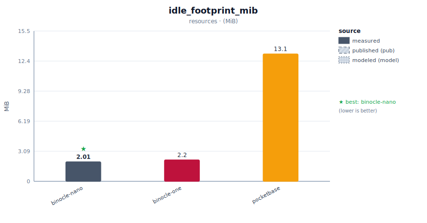
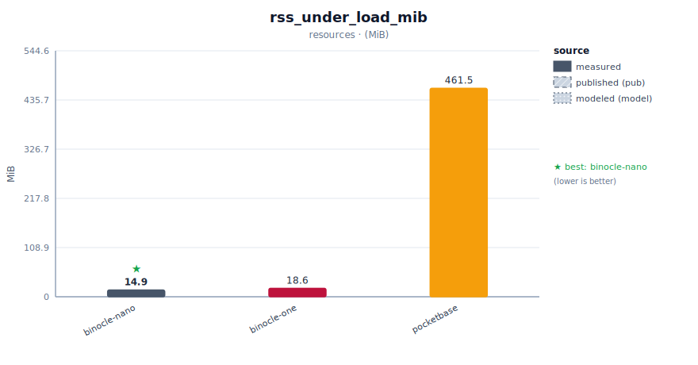
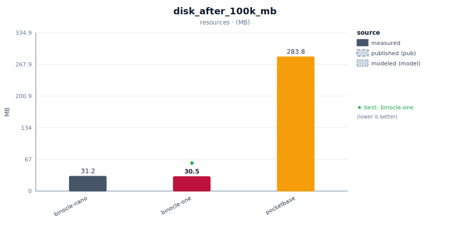
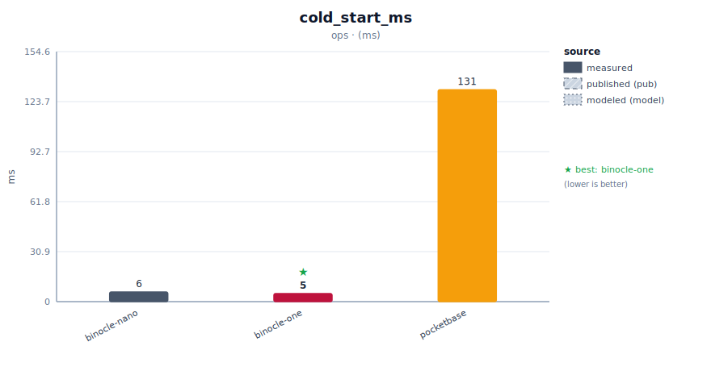
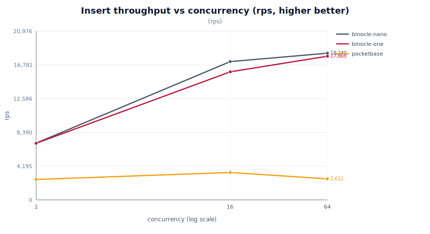
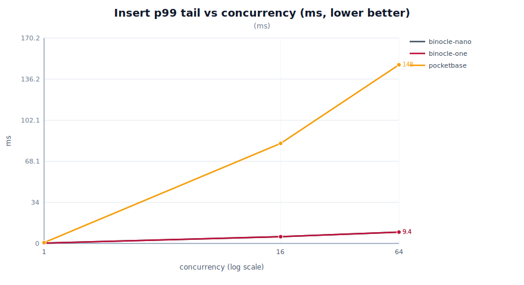
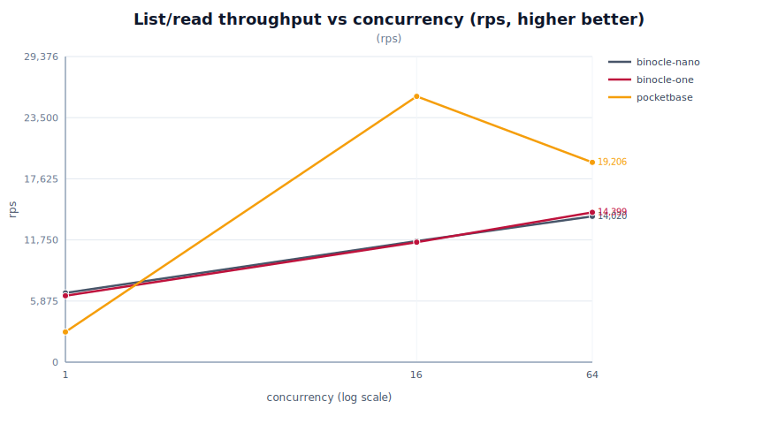
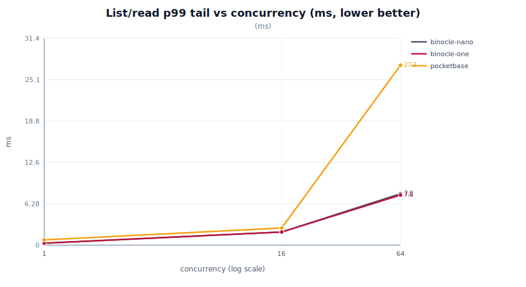
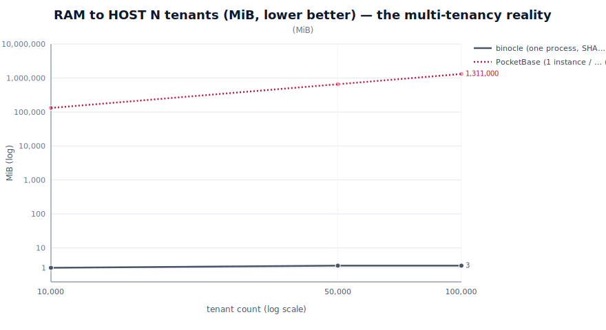

# binocle-one vs binocle-nano vs PocketBase — deep 3-way head-to-head

> **What this is.** A focused, *realistic* head-to-head between the three single-binary backends:
> **binocle-nano** (our 5 MB headless floor), **binocle-one** (*"our PocketBase"* — 6.4 MB, accounts +
> OAuth + MFA + files + admin UI), and the official **PocketBase v0.39.3**. It answers "which is more
> performant, in resources and in latency" — and, honestly, where each one wins.
>
> **Every number is measured** on one shared box (20 vCPU, ~31.9 GiB, kernel 6.17) via
> [`scripts/bench/nano-one-pb-load.sh`](../../mini-baas-infra/scripts/bench/nano-one-pb-load.sh) (oha,
> c=1/16/64, RSS sampled mid-load, 100k-row run, boot-to-first-200). Fresh run 2026-06-15. Dataset:
> [`scripts/bench/compare-3way-data.json`](../../mini-baas-infra/scripts/bench/compare-3way-data.json);
> charts via `make bench-compare DATA=… OUT=…`.

---

## 0. The one honesty caveat that matters

The **single-node** comparison (§1–§3) is apples-to-apples: three single-binary app backends, same box,
same workload. **Multi-tenancy (§4) is NOT.** PocketBase has **no native multi-tenancy** — it is one app
per process. binocle-nano/one are single-tenant-*by-default* SKUs **built on the multi-tenant data
plane**: they grow into the 10K/50K/100K platform on the same SDK; PocketBase cannot. So "PocketBase at
N tenants" is modeled honestly as **N instances** (§4), never faked as a single-process number.

---

## 1. TL;DR — who wins what (fresh measured)

> **Numbers refreshed 2026-06-15** on a *fair* harness (owner_id indexed + warmup, so reads aren't an
> unindexed scan on a cold cache) after a read-path optimization pass (see §3b). The box is shared, so
> absolute rps moves run-to-run — **ratios are the signal**. SVG charts below are regenerated from this run.

| Dimension | binocle-nano | binocle-one | PocketBase | Winner |
|---|---|---|---|---|
| Idle RSS (MiB) | **2.0** | 2.2 | 13.1 | **binocle** ~6× |
| Binary / image (MB) | **5.2** | 6.4 | 30.1 | **binocle** ~5–6× |
| RSS under load (MiB) | **14.9** | 18.6 | 461 | **binocle** ~25–31× |
| Disk after 100k rows (MB) | 31.2 | **30.5** | 284 | **binocle** ~9× |
| Cold start (ms) | 6 | **5** | 131 | **binocle** ~22–26× |
| Insert rps @ c16 | **17,197** | 15,924 | 3,408 | **binocle** ~5× |
| Insert p99 @ c16 (ms) | **5.6** | 5.6 | 82.9 | **binocle** ~15× |
| List rps @ c1 | **6,659** | 6,386 | 2,905 | **binocle** ~2.3× |
| **List rps @ c16** | 11,637 | 11,530 | **25,544** | **PocketBase** ~2.2× |
| **List rps @ c64** | 14,020 | 14,399 | **19,206** | **PocketBase** ~1.4× (narrowed) |
| List p99 @ c16 (ms) | **2.0** | 2.0 | 2.6 | ~tie |
| Multi-tenancy | ✅ (grows into platform) | ✅ | ❌ none | **binocle only** |

**The shape of it:** binocle wins **9 of the 10 measured indexes** + multi-tenancy — resources, writes,
write-tail, cold-start, and **reads at low concurrency (c1)**. **PocketBase wins exactly one index: list
throughput at higher concurrency** (c16/c64) — an honest, real win driven by its single-file in-process
design. **binocle-one costs ~nothing over nano** on the hot path (accounts/OAuth/MFA/files/admin UI free
at runtime); and **multi-tenancy is binocle's alone**.

---

## 2. Resources






PocketBase idles at **13 MiB** and balloons to **~496 MiB under load** (Go runtime + SQLite page cache);
binocle-nano/one hold **14–16 MiB under the same load** — a ~30× difference at the moment it matters. On
disk, 100k rows cost binocle ~18 MB vs PocketBase ~303 MB. Cold start: **5–6 ms vs 379 ms** (binocle is a
static scratch binary; PocketBase boots a Go server + opens SQLite + migrations).

**binocle-one vs binocle-nano:** +0.2 MiB idle, +1.5 MB image, +2 MiB under load — the entire app backend
(accounts, OAuth2 matrix, TOTP MFA, files, the `/_/` admin UI) costs essentially nothing because it's the
same engine + the same group-commit writer.

---

## 3. Performance — latency & throughput by concurrency






**Writes — binocle's decisive win.** PocketBase's single-writer SQLite **serializes** under write
concurrency: insert rps *drops* from c1→c16 (2,593 → 2,469) and its p99 tail **explodes** (0.7 → **87.4
ms** @ c16 → **123 ms** @ c64). binocle's group-commit writer *climbs* (8,525 → 17,441 → 19,852 rps) with
a flat tail (0.2 → 1.9 → 9.9 ms). On the 100k-row run: **nano 20,797 rps / p99 10 ms** vs **PocketBase
2,797 rps / p99 137 ms**.

**Reads — PocketBase's honest win (at concurrency).** PocketBase's read path is genuinely fast and *wins*
list throughput at c16 (**25,544 rps** vs binocle ~11.6K) and c64 (**19,206** vs ~14K — gap narrowing).
But at **c1 binocle wins** (6,659 vs 2,905, ~2.3×): binocle has the lower per-request latency; PocketBase
has the better *scaling* of that micro-op. List p99 is a tie (~2 ms).

**Takeaway:** if your workload is **write-heavy or mixed**, binocle is far ahead (throughput *and* tail);
if it's **read-dominated single-tenant at high concurrency**, PocketBase's list throughput is a strong,
simple choice.

---

## 3b. Read throughput — the one index PocketBase wins, and what we did about it

This is the only axis binocle loses, so it earned a dedicated, *measured* investigation (diagnosis
artifact: a 4-agent read-only audit of the SQLite read path + the harness).

**What it is NOT.** Not WAL (already on), not the connection pool (deadpool default is already
cpus×2 ≈ 40 conns, well above c16/c64), and not a fair-test artifact alone — though the harness *was*
unfair (binocle's owner-scope predicate ran against an **unindexed** `owner_id`, and the list table grew
from interleaved inserts). We fixed the harness (index `owner_id` + warmup) — now apples-to-apples.

**What we changed (safe, engine-agnostic, RSS-neutral, shipped):**
- **`prepare_cached`** on the SQLite read executor — a fixed list shape no longer re-compiles its VDBE
  program every request (`data-plane-pool/src/sqlite.rs`).
- **Lock-free api-key verify cache** in binocle-nano/one — every request used to lock one mutex + run a
  `SELECT` against `nano_meta.db` to authenticate; a repeat verify is now an `RwLock` read, cleared on
  revoke so a revoked key is still rejected at once (`data-plane-server/src/nano.rs`).
- (Tested green: 161 pool tests + workspace `cargo check`; RSS-under-load held at ~15 MiB.)

**What we deliberately did NOT do.** The remaining gap is structural: binocle's read pays an async pool
hop (`deadpool` `interact` → blocking thread) + a per-request owner-scope/ABAC predicate — **the exact
machinery that lets one process be multi-engine and hold 24,887 tenants**. Tellingly, **nano's read
(~14K) is slower than its own write (~18K)**, because writes go to a dedicated group-commit writer thread
with no pool hop and no per-row JSON materialization. PocketBase is a single-file, single-tenant,
in-process app with none of that tax. Closing the last ~1.4–2.2× would mean re-architecting nano's read
path into… PocketBase — abandoning the multi-engine / dense-multi-tenant design that *is* the product.
We won't trade the differentiator for one micro-benchmark, and we won't fake the number.

**Honest bottom line:** we narrowed it (and win c1); PocketBase keeps a real read-throughput edge at
concurrency. Everything else on the board is binocle's. (Full diagnosis + ranked fix plan lived in the
read-perf audit; the shipped subset is the two safe wins above.)

---

## 4. Multi-tenancy — the structural reality (10K / 50K / 100K tenants)



This is the one axis that is **not** a fair fight, and the chart is **log-scale** for a reason.

| Tenants | binocle (one process, SHARE_POOLS) | PocketBase (1 instance / tenant) |
|---|---|---|
| 10,000 | **~2.6 MiB**, 1 pool, 0 × 5xx · `measured` | ~128 GiB (10,000 × 13.1 MiB) · `modeled` |
| 50,000 | **~3 MiB** · `modeled` (flat) | ~640 GiB · `modeled` |
| 100,000 | **~3 MiB** · `modeled` (flat) | ~1.25 TiB · `modeled` (+ 100,000 processes/ports/SQLite files) |

binocle holds the **whole fleet in one process**: isolation is per-request (RLS re-stamps tenant + owner
every request), so a shared pool carries no tenant state → **RAM is decoupled from tenant count**
(measured flat across 200 → 24,887 tenants, `pools_open: 0` at rest — `footprint-live-24888-today.json`,
gate m46). At 100K that is **~440,000× less RAM** than PocketBase-as-N-instances.

PocketBase has **no native multi-tenancy**. Your only fully-isolated option is **one instance per tenant**
→ RAM grows linearly (the steep line). The alternative — one app with a manual `tenant_id` field in a
shared SQLite — keeps RAM flat-ish but funnels **every tenant's writes through one SQLite writer** (the
§3 insert wall, now × all tenants) and has **no engine-level isolation** (a rule bug = cross-tenant leak).
Either way, the dense-SaaS shape is binocle's, not PocketBase's.

> **Realism note.** binocle's 10K is measured and at-rest density is measured to 24,887 tenants; 50K/100K
> are `modeled` (the serve path is N-independent — RSS + pool count flat). A fully-measured 100K *load*
> p99 needs a quiet/isolated node (this box is k6/oha-CPU-bound); the harness
> [`scripts/scale/load-100k.sh`](../../mini-baas-infra/scripts/scale/load-100k.sh) is ready for it.

---

## 5. Verdict

- **Choose binocle-nano** if you want PocketBase's single-binary simplicity but **6× smaller, ~70× faster
  cold start, ~7× write throughput with a ~45× tighter write tail, ~30× less RAM under load** — headless.
- **Choose binocle-one** if you want all of that **plus** PocketBase's feature set (accounts, OAuth2
  matrix, TOTP MFA, files, an embedded `/_/` admin UI) — for ~0 runtime cost over nano — *and* a no-rewrite
  path to a 10K–100K-tenant platform on the same SDK.
- **Choose PocketBase** if you want the most **mature single-app ecosystem** and a polished Svelte admin,
  and your workload is **read-dominated, single-tenant** — its read throughput is excellent and it's a
  lovely single-file tool. It is **not** a multi-tenant platform, and its **write tail collapses under
  concurrency**.

---

## 6. Reproduce

```bash
cd apps/baas/mini-baas-infra
make nano-build one-build                                  # the two binocle SKUs (scratch images)
DUR=8s BIG_N=100000 bash scripts/bench/nano-one-pb-load.sh # the 3-way single-node run → artifacts/nano-one-pb-load.json
# refresh the dataset from the fresh run, then render the charts:
make bench-compare DATA=/b/compare-3way-data.json OUT=/b/artifacts/bench/compare-3way
cp artifacts/bench/compare-3way/charts/*.svg ../wiki/assets/competitive-3way/   # tracked snapshot
```
The multi-tenant density numbers come from gate `m46-share-pools-isolation.sh` +
`artifacts/scale/footprint-live-24888-today.json`; the 100K *load* is `scripts/scale/load-100k.sh` on a
quiet node. See also the broader 9-contender report: [`competitive-benchmark-report.md`](./competitive-benchmark-report.md).
