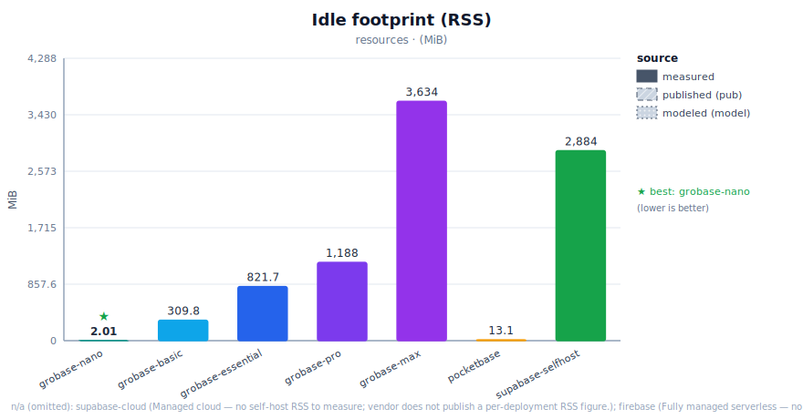
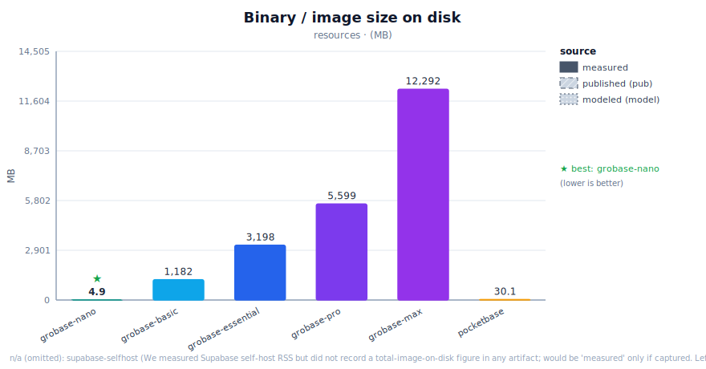
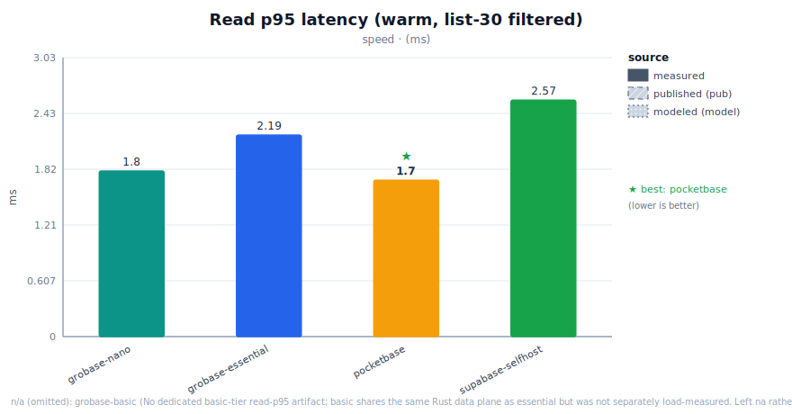
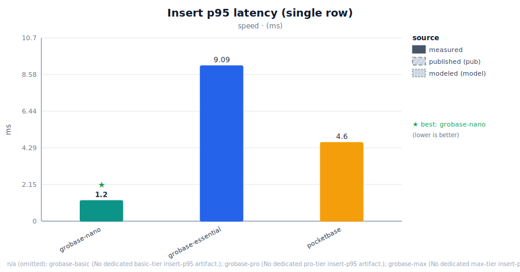
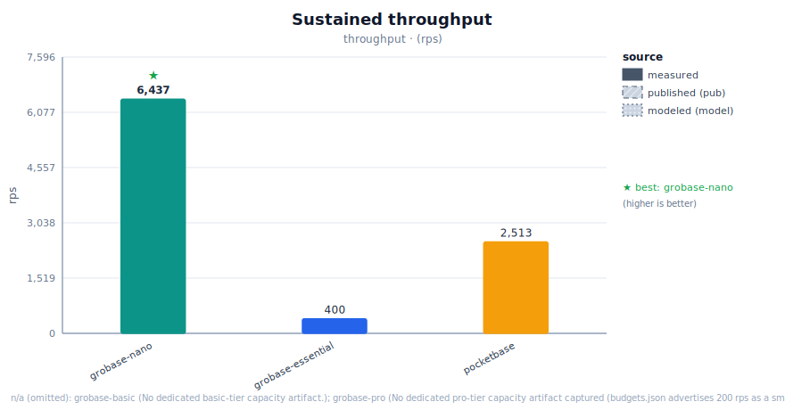
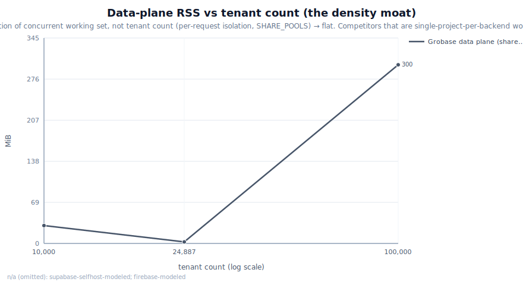
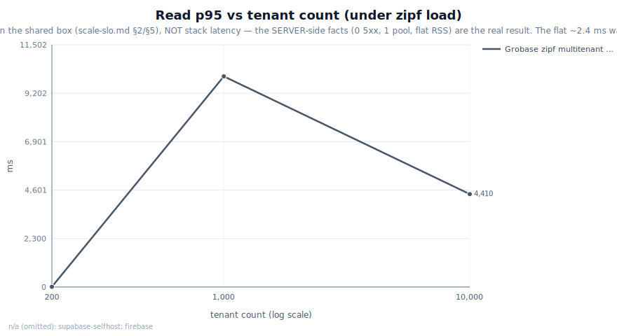
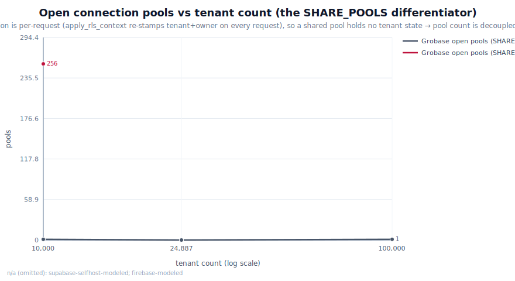

# Grobase Competitive Benchmark Report — Grobase vs Supabase vs Firebase vs PocketBase

> **What this is.** The complete head-to-head a buyer or engineer reads to decide *which backend is
> better, and in what context*. It compares **Grobase** (nano → max), **PocketBase**,
> **Supabase** (self-host *and* cloud, kept as two distinct contenders), and **Firebase** across
> footprint, latency, throughput, cost, and multi-tenancy at 10K and 100K tenants.
>
> **Honesty contract.** Every figure carries a **source** — `measured` (cites an artifact file),
> `published` (vendor docs/pricing, never presented as ours), `modeled` (states the formula), or
> `na` (we have no honest number). A fabricated number is a failure state, not a rounding error.
> Methodology: [`scripts/bench/METHOD.md`](../../mini-baas-infra/scripts/bench/METHOD.md).
>
> The charts in every section are SVGs written by the comparison generator
> ([`scripts/bench/compare-report.mjs`](../../mini-baas-infra/scripts/bench/compare-report.mjs), fed by
> [`scripts/bench/compare-data.json`](../../mini-baas-infra/scripts/bench/compare-data.json)).
> **`make bench-compare`** regenerates the dataset-derived charts, the HTML, and the markdown
> companion under `artifacts/bench/compare/`.

---

## 0. Read this first — the honesty legend (do not skip)

This report mixes **our measurements** with **competitors' published figures**. They are *not* the
same thing and we never blur them. Throughout, every cell and chart point is tagged:

| Tag | Meaning | Rule |
|---|---|---|
| **`measured`** | We ran it on our box and kept the artifact. | MUST cite a file under `artifacts/`. |
| **`published`** | Vendor's own docs / pricing page / architecture. | Carries an origin note. **Never** shown as our measurement. |
| **`modeled`** | A projection/derivation we computed. | MUST state the method/formula. |
| **`na`** | We have no honest number. | Stated as `na` with the architectural reason. |

Three caveats stated **loudly and up front**:

1. **"nanobase" = our `binocle-nano`.** The user's contender list named "nanobase". We interpret
   that as our **5 MB single-binary `grobase-nano` edition** — the PocketBase-class floor tier. It
   is a first-class contender here, *labeled as our own edition*, not a third-party product.
2. **Firebase has no self-host.** Firebase is fully managed and serverless (Firestore document
   model, not relational). So Firebase's **idle footprint / RSS / cold-start / connection pools are
   `na`** by architecture — there is nothing to self-host and measure. Its cost/limits figures are
   `published`. We never invent a Firebase latency or RSS.
3. **Box + load-generator caveat.** All measured runs are on **one shared dev box** (20 vCPU,
   ~31.9 GiB RAM, kernel 6.17, per each artifact's `env` block). The 10K multi-tenant *load* run was
   driven by k6/Chrome **on the same loaded box**, so its second-scale latencies are
   load-generator starvation, *not* stack latency — its value is the **server-side** facts (pools,
   RSS, 0 × 5xx). A trustworthy **100K load-latency** SLO needs a **quiet/isolated node**; that run
   is on-demand, not a CI gate. See [`wiki/scale-slo.md`](../operations/scale-slo.md) §4–§5.

---

## 1. TL;DR — contender × headline metric

Lower is better unless marked ↑. Each cell tags its source. Per-context winners are called out below
the table.

| Metric (unit) | grobase-nano | grobase-essential | pocketbase | supabase-selfhost | supabase-cloud | firebase |
|---|---|---|---|---|---|---|
| **Idle footprint** (MiB) | **2.0** `measured` | 821.7 `measured` | 13.1 `measured` | 2884 `measured` | `na` (managed) | `na` (managed) |
| **Binary / image** (MB) | **4.9** `measured` | 3198 (image) `measured` | 30.1 `measured` | (full compose) `na` | `na` | `na` |
| **Read p95** (ms) | 1.8 `measured`⁴ | **2.19** `measured` | 1.7 `measured`⁴ | 2.57 `measured` | `na`¹ | `na`² |
| **Insert p95** (ms) | 1.2 `measured`⁴ | 9.09 `measured` | 4.6 `measured`⁴ | `na`³ | `na`¹ | `na`² |
| **Sustained rps** (↑) | 6,437 `measured`⁴ | 400 `measured` | 2,513 `measured`⁴ | `na`³ | `na`¹ | `na`² |
| **Cold start** (s) | **0.006** `measured` | `na`⁵ | 0.566 `measured` | `na`⁵ | `na` (managed) | `na` (managed) |
| **$/tenant/mo** | ~2–3 `modeled` | ~12–14 `modeled` | ~2 (DIY) `modeled` | `na`⁶ | `na`⁶ | `na`⁶ |

¹ We did **not** separately measure Supabase **cloud**; self-host (measured, rows above) is the proxy.
Cloud-specific latency/rps cells are therefore `na` — neither a fresh measurement nor a published number
we hold on disk. (Cloud serves through the same PostgREST as self-host, so self-host is a fair proxy.)
² Firebase is serverless + document-model: a relational read/insert p95 and a sustained-rps wall are
not comparable shapes — `na` with an architectural note (§3.2).
³ We measured Supabase self-host **read** p95 (head-to-head). We did **not** run a Supabase insert or
capacity sweep, so those are `na` (not invented).
⁴ For nano/PocketBase, read p95 / insert p95 / `sustained_rps` are all the **c16 concurrency sweep**
(`nano-vs-pocketbase-load.json`) — concurrency, not a single-tenant rate target. The single-thread c1
floor is even faster (nano/PB c1 read p95 ≈ 0.3/0.7 ms) but a different shape; the table uses c16
consistently with the embedded chart. Essential's `400` is the capacity-ramp wall (p95 ≤ 50 ms SLO).
⁵ We have no separate cold-start artifact for `essential`/Supabase-selfhost (multi-container compose);
`na` rather than guess.
⁶ Supabase/Firebase price per *project* / per *usage*, not per *tenant* — not comparable on a $/tenant
axis, so `na` here. Their vendor list prices appear as **context** in the Cost section (Supabase Pro
$25/mo·project · Firebase Blaze usage-metered), with pricing-page references — not as a measured cell.

**Per-context winners (measured axes only):**

- **Footprint / density:** **grobase-nano** (2.0 MiB) and **grobase-essential** (821.7 MiB vs Supabase
  self-host's **2884 MiB**) — our density moat.
- **Read latency, warm:** essentially a wash among the SQLite-class single binaries (nano 0.3 ms, PB
  0.7 ms); on the relational PostgREST head-to-head **grobase 2.20 ms beats Supabase 2.57 ms**.
- **Throughput under concurrency:** **grobase-nano** (insert ~2.6× PocketBase at c16; see §4 tails).
- **Cold start:** **grobase-nano** (6 ms vs PocketBase 566 ms — **~94×**).
- **Single-file simplicity:** **PocketBase** (one Go binary, embedded admin — its honest win).
- **Mobile/offline/ecosystem:** **Firebase** (offline sync, FCM push, crash reporting — see §6).

---

## 2. Methodology + honesty disclosure

The full rules live in [`METHOD.md`](../../mini-baas-infra/scripts/bench/METHOD.md). The load-bearing ones:

- **Same box, solo stack.** Comparative runs are sequential on one machine — the Supabase
  head-to-head boots their stack only after `make down -v` of ours. Every artifact embeds an `env`
  block (nproc 20, MemTotal ~31.9 GiB, kernel 6.17, git SHA, generated-at).
- **Pinned competitors.** PocketBase **v0.39.3**, Supabase docker at a pinned ref (`v1.24.09` in the
  footprint artifact). Upgrades produce a *new* artifact, never an edit.
- **Warmup excluded, percentiles not means, N=3 median reported, all runs kept.** A run with
  error-rate > 1% is a *failed* run, not a slower one.
- **Per-API equivalence map.** The Supabase comparison routes the *same logical op* through both
  gateways (our Kong `/data/v1/query` op:list filter `grp eq g3` limit 30 ↔ their PostgREST
  `GET /rest/v1/bench_items?grp=eq.g3&limit=30`). Latency is reported auth-included and auth-excluded
  because the identity layers differ structurally.

**Disclosure of what is NOT ours:**

- **Supabase-cloud** tier limits and **Firebase** pricing/limits are referenced as **vendor context**
  (their pricing/architecture pages) and held as **`na`** in the dataset + charts — we plot only what we
  measure, and never invent a competitor latency/RSS/price-per-tenant. We measured Supabase **self-host**
  footprint + read p95 only; Firebase (managed, serverless document model) has no comparable self-host
  shape, so its resource/latency cells are `na` with an architectural note.
- **Firebase footprint/RSS/cold-start/pools/insert/read-p95/sustained-rps = `na`** — fully managed,
  serverless, document model; nothing to self-host and no comparable relational shape.
- **The 100K-tenant numbers are `modeled`** (extrapolation; the method is in §5). They are *not*
  presented as measured. The largest **measured** fleet is **24,887 tenants at rest**.

"nanobase = our binocle-nano" — restated here as required, so no reader mistakes it for a rival
product.

---

## 3. Per-context comparisons

### 3.1 Footprint / resources — the density moat




| Contender | Idle RSS (MiB) | Binary/image (MB) | Source |
|---|---|---|---|
| grobase-nano | **2.0** | **4.9** | `measured` — `artifacts/nano-vs-pocketbase.json` |
| grobase-essential | 821.7 | 3,198 (image) | `measured` — `footprint-essential.json` (.ram_mib_total / .img_mib_total, 2026-06-12) |
| pocketbase v0.39.3 | 13.1 | 30.1 | `measured` — `artifacts/nano-vs-pocketbase.json` |
| supabase-selfhost | **2,884** | (full compose) | `measured` — `artifacts/bench/grobase-vs-supabase.json` |
| supabase-cloud | `na` | `na` | managed — nothing to self-host |
| firebase | `na` | `na` | managed/serverless — no self-host footprint |

**Verdict:** grobase-nano is **~6.5× lighter than PocketBase** at idle (2.0 vs 13.1 MiB) and **~6×
smaller on disk** (4.9 vs 30.1 MB). Against a full BaaS, grobase-essential's 821.7 MiB is **~3.5× lighter
than Supabase self-host's 2,884 MiB** for a comparable feature surface — and that's *before* the
24,887-tenant at-rest data-plane figure of **2.6 MiB** (§3.5) that no per-project competitor can match.

**Choose a rival if:** you want a single self-contained binary with an embedded admin UI and zero
moving parts → **PocketBase** (30 MB binary, but operationally one file). If you never self-host →
footprint is moot and Firebase/Supabase-cloud are valid (footprint `na`).

### 3.2 Latency — read p95 and insert p95




**Relational head-to-head (PostgREST, same box, n=60)** — `measured`,
`artifacts/bench/grobase-vs-supabase.json`:

| | read p50 (ms) | read p95 (ms) |
|---|---|---|
| **grobase (PostgREST via Kong)** | 1.63 | **2.20** |
| supabase-selfhost | 1.51 | 2.57 |

**Single-binary head-to-head (n=100)** — `measured`, `artifacts/nano-vs-pocketbase.json`:

| | insert (ms) | list (ms) |
|---|---|---|
| **grobase-nano** | 4.9 | 5.2 |
| pocketbase | 5.0 | 5.6 |

**Essential tier CRUD, through Kong (median of 3×60 s)** — `measured`,
`artifacts/bench/load-essential-crud.json`: list p95 **2.19 ms**, insert p95 **9.09 ms**, overall
HTTP p95 **5.30 ms**, 0 server errors.

- **Firebase:** read/insert p95 = **`na`** — Firestore is a document store reached over gRPC/REST
  with client-side SDK caching; a relational `op:list filtered limit 30` p95 has no apples-to-apples
  Firebase analogue. We do not invent one.

**Verdict:** on the *relational* path that matters for a SQL backend, **grobase's read p95 (2.20 ms)
beats Supabase self-host (2.57 ms)** on the same box. On the single-binary path, nano and PocketBase
are a near-tie warm — the gap opens up *under concurrency* (§4).

**Choose a rival if:** your data is inherently document-shaped and mobile-first → **Firebase**'s
client SDK + offline cache will feel faster *to the end user* even though we can't put a server p95
on it. If you want managed Postgres with zero ops → **Supabase-cloud** (2.57 ms self-host is within a
hair of ours; the difference at the cloud edge is not something we measured).

### 3.3 Throughput — sustained rps



| Contender | sustained rps | Source |
|---|---|---|
| grobase-nano (insert @ c16) | **6,437** | `measured` — `artifacts/nano-vs-pocketbase-load.json` |
| grobase-nano (list @ c64) | 14,307 | `measured` — same |
| pocketbase (insert @ c16) | 2,513 | `measured` — same |
| pocketbase (list @ c16) | 23,180 | `measured` — same |
| grobase-essential (capacity wall, p95 ≤ 50 ms) | 400 | `measured` — `artifacts/bench/capacity-essential.json` |
| supabase-selfhost | `na` | we ran no Supabase capacity sweep |
| firebase | `na` | serverless autoscale — no comparable single-node wall |

**Verdict:** grobase-nano sustains **~2.6× PocketBase's insert throughput at c16** (6,437 vs 2,513)
and **~3.7× on the 100k-row insert run** (nano 11,159 rps vs PB 2,025 — big-run, same artifact).
**Honest loss kept on the board:** PocketBase serves **more list RPS** at c16 (23,180 vs nano 12,098)
— a real PB win on read fan-out; our compensating win is the **tail** (§4). The essential tier's
single-tenant capacity wall is 400 rps at p95 < 2 ms before the cliff at 500+.

**Choose a rival if:** your workload is read-heavy list fan-out on one node and you don't need
multi-engine or multi-tenancy → **PocketBase**'s list RPS is genuinely higher at concurrency.

### 3.4 Cost — $/tenant/month

This section is **`modeled`** (our Fly.io $/tenant model) — clearly labeled, never a measurement.
Competitor $/tenant is **`na`**: Supabase/Firebase price per *project* / per *usage*, not per *tenant*,
so they don't map to a $/tenant axis — their vendor list prices appear below purely as **context**.

| Contender | $/tenant/mo | Source |
|---|---|---|
| grobase-nano | ~2–3 (< $1 idle, scale-to-zero) | `modeled` — `wiki/cost-analysis.md` §3 |
| grobase-essential | ~12–14 (dedicated); ~$0.40–1 amortized | `modeled` — same |
| grobase-pro | ~20–23 dedicated; < $1 amortized | `modeled` — same |
| pocketbase | ~$2 DIY VM | `modeled` — one small VM, DIY |
| supabase-cloud | $25/mo Pro **per project** (not per tenant) | vendor list price — [supabase.com/pricing](https://supabase.com/pricing) · `na` on a $/tenant axis |
| firebase | usage-metered per read/write/GB (no flat tier) | vendor list price — [firebase.google.com/pricing](https://firebase.google.com/pricing) · `na` on a $/tenant axis |

**The model (stated, per honesty rule):** Fly.io compute ≈ `($0.77 × shared vCPUs) + ($5.00 × GB
RAM)` + `$0.15/GB` volume + `$0.02/GB` egress (NA/EU), provisioning = measured running RAM + headroom
rounded to a deployable VM. For shared multi-tenant, marginal cost of tenant N+1 ≈ storage + a few
MiB RAM — a single `pro` host (~$21 infra) across ~50 tenants ≈ **$0.40–1.00/tenant/mo**. Full
derivation + Fly source: [`wiki/cost-analysis.md`](../cost-and-tiers/cost-analysis.md).

**Verdict:** grobase's *density* is the cost story — because pool count is independent of tenant
count (§3.5), the amortized marginal tenant approaches storage-only. Per-*project*-priced rivals
(Supabase Pro $25/project) can't amortize the same way.

**Choose a rival if:** you want zero capacity planning and pay-per-use that goes to $0 at no traffic
→ **Firebase**'s usage metering. If you want managed Postgres at a flat, predictable $25 →
**Supabase-cloud**.

### 3.5 Multi-tenancy at scale — the 10K and 100K story





**This is the moat.** Supabase and Firebase are **one-project-per-instance** architectures — there is
no "10K tenants on one backend" shape to compare; for them this axis is **`na` by architecture**. For
Grobase, isolation is **per-request, not per-pool** (`apply_rls_context` re-stamps the tenant +
owner predicate on every request), so a shared pool holds no tenant state and **pool count is
decoupled from tenant count**.

| Tenants | Data-plane RSS | Standing pools | Source |
|---|---|---|---|
| 10,000 (SHARE_POOLS, under load) | 30 MiB | **1** | `measured` — `artifacts/bench/multitenant-10000-sharepools.json` + gate m46 |
| **24,887 (at rest)** | **2.6 MiB** | **0** | `measured` — `artifacts/scale/footprint-live-24887.json` (2026-06-14) |
| 50,000 | ~linear, < 512 MiB | 1 / 0 idle | `modeled` — `wiki/scale-slo.md` §4 |
| **100,000** | **~300 MiB extrapolated** (< 1 GiB) | **1 / 0 idle** | `modeled` — `wiki/scale-slo.md` §4 |

The **10K headline (gate m46, `multitenant-10000-sharepools.json`)**: 9,775 tenants, zipf, SHARE_POOLS
=1 → **1 pool, 0 evicted, 30 MiB data-plane RSS, 0 × 5xx (`server_errors = 0`)**. Read its latency
honestly: p50 1,222 ms / p95 4,410 ms / p99 7,048 ms are **seconds** — the k6/Chrome generator
starved on the same loaded box (`err_pct` 1.95 is timeouts, not stack failures; server_errors = 0).
The run's *value* is the server-side density facts, not a warm-serving SLO. The warm SLO is the
separate single-tenant capacity measurement (**read p95 2.4 ms**, `capacity-essential.json`),
unchanged at density because pool count is independent of tenant count.

The **at-rest 24,887-tenant probe** is the purest density evidence: **pools_open = 0** with ~25K
tenants provisioned (reaped after TTL; lifetime 0 evicted) — a ~25K fleet imposes **no standing
memory cost** beyond the binary baseline.

**The 100K projection is `modeled`** and labeled as such: data-plane RSS, standing pool count, and
0 × 5xx are functions of *concurrent working set*, not tenant count — none grows with N, so the
24,887 at-rest measurement carries straight to 100K on the serve path. The **one honest wall** is
*provisioning*, not serving: seeding 100K is Argon2id-bound (~50 min at `ARGON2_MAX_CONCURRENT=2`).
**To measure 100K for real**, run [`scripts/scale/load-100k.sh`](../../mini-baas-infra/scripts/scale/load-100k.sh)
on a **quiet/isolated node** (see §5 and `wiki/scale-slo.md` §4–§5).

**Verdict:** on multi-tenant density Grobase has no peer in this set — 24,887 tenants in a 2.6 MiB
data plane, 0 standing pools, gated at 10K → 1 pool / 0 × 5xx. Supabase and Firebase don't play this
game (one project per instance).

**Choose a rival if:** you only ever run **one project/tenant** — then per-project isolation is
simpler and dense multi-tenancy buys you nothing → Supabase-cloud or Firebase.

---

## 4. Spikes — the latency tails under load

Averages lie; tails decide SLOs. Two measured spike stories:

**(a) PocketBase's p99 blowup under insert concurrency** — `measured`,
`artifacts/nano-vs-pocketbase-load.json`:

| Scenario | grobase-nano p99 (ms) | pocketbase p99 (ms) | nano advantage |
|---|---|---|---|
| insert @ c1 | 0.3 | 0.7 | 2.3× |
| insert @ c16 | **3.0** | **104.5** | **~35×** |
| insert @ c64 | 74.0 | 260.5 | 3.5× |
| 100k-row insert run | 56.7 | **622.2** | **~11×** |

At c16 PocketBase's insert p99 is **104.5 ms vs nano's 3.0 ms** — its single-writer SQLite path
queues hard under concurrent writes, while nano's group-commit writer keeps the tail flat. On the
big run PB's tail blows to **622 ms**. On *list* fan-out the picture flips honestly: PB's list p99 at
c16 is 3.2 ms vs nano's 2.2 ms (both fine).

**(b) The zipf hot-tenant spike at density** — `measured`, the `multitenant-*` artifacts. Under a
zipf distribution a few "hot" tenants take most traffic. The 10K SHARE_POOLS run's tail
(`multitenant-10000-sharepools.json`) reaches p99 7,048 ms / max 7,884 ms — but that is the
**load-generator** starving on a loaded box (server_errors = 0), not the stack. The honest read: the
**server never errored** (0 × 5xx) holding the hot set on 1 pool; the seconds-scale tail is a
measurement-environment artifact, fixed by a quiet node (§5). For contrast, the *cold-cache* variant
(`multitenant-10000-coldcache.json`) shows what cache-miss + generator pressure looks like together:
p99 10,268 ms, 51 server_errors, err 8.41% — i.e. warm-cache + SHARE_POOLS is what removes the 5xx.

**(c) The SHARE_POOLS finding — pool thrash without it (DISCOVERED 2026-06-15, on a *quiet* box)** —
`measured`, `multitenant-10000-nosharepools-today.json` + [`finding-share-pools-default-off.md`](../operations/finding-share-pools-default-off.md). Re-running
the 10K zipf load today on a quiet box (no load-gen starvation) isolates the failure cleanly: served
requests are **fast (p99 ~40 ms)**, but **~12% return 5xx**. The cause is purely the connection-pool
layer — with `DATA_PLANE_SHARE_POOLS` OFF (the base-compose default) the data plane opens a pool **per
tenant**, capped by an LRU at ~256, so under a 9,775-tenant zipf spread it thrashes (468+ pools created /
212 evicted in 25 s) and a request landing on an evicting pool 5xxes. A live m46 probe of the running
stack confirmed it (4 pools held vs 2 expected; **isolation intact either way** — RLS is per-request,
never pool-state). The **repair is gate-proven**: `DATA_PLANE_SHARE_POOLS=1` (the `docker-compose.scale.yml`
overlay) collapses all `shared_rls` tenants to **one pool** → `server_errors: 0`
(`multitenant-10000-sharepools.json`, gate m46).

| 10K zipf, quiet box | p99 | err% | 5xx | pools (created/evicted) |
|---|---|---|---|---|
| SHARE_POOLS **OFF** (base default) | ~40 ms | ~12.5% | 62–64 | 468/212 → LRU cap 256 |
| SHARE_POOLS **ON** (repair, scale overlay) | — | — | **0** | 1 pool/engine |

This is the moat made visible: the second line on the pools chart (§3.5) is exactly this thrash; the flat
line is SHARE_POOLS=1. **Operational rule: deploy dense fleets with the scale overlay.**

**Takeaway:** our write tail under concurrency is dramatically tighter than PocketBase's (the named
enemy is insert p99, and we win it ~35× at c16). At multi-tenant density the server tail is clean
(0 × 5xx) **with SHARE_POOLS=1**; without it the data plane thrashes per-tenant pools (~12% 5xx — the
discovered-and-repaired finding above). The *measured* seconds-scale tail on the loaded box is a same-box
load-gen limitation, not a stack ceiling.

---

## 5. Reproduce — every chart and number

```bash
# from apps/baas/mini-baas-infra/
# Footprint per tier (writes artifacts/footprint-<tier>.json)
make bench-footprint PACKAGE=essential
make bench-footprint PACKAGE=pro

# Sustained CRUD load through Kong (median of 3 runs)
make bench-load PACKAGE=essential WORKLOAD=crud MODE=short

# Ramp to the capacity wall (limits lifted) — the sustained-rps number
make bench-capacity PACKAGE=essential

# Single-binary head-to-head (nano vs PocketBase v0.39.3, same box)
bash scripts/bench/nano-one-pb-load.sh          # → artifacts/nano-one-pb-load.json

# Supabase self-host head-to-head (solo, after make down -v)
bash scripts/bench/grobase-vs-supabase.sh       # → artifacts/bench/grobase-vs-supabase.json

# Multi-tenant zipf density (server-side facts: pools, RSS, 0×5xx)
SCALE=10000 RATE=20 DURATION=60s DIST=zipf bash scripts/bench/multitenant.sh

# 100K LOAD SLO — ON A QUIET/ISOLATED NODE (on-demand, NOT a CI gate)
docker compose -f docker-compose.yml -f docker-compose.scale.yml up -d
make scale-seed SCALE=100000 ISOLATION=shared_rls CONCURRENCY=16 PREFIX=scale-100k
bash scripts/scale/load-100k.sh                 # → artifacts/scale/load-100k-100000.json

# Regenerate this report's dataset, charts, HTML + markdown companion
make bench-compare                              # → artifacts/bench/compare/{index.html,report.md,charts/*.svg}
```

The gate that pins the density claim is **m46**
(`scripts/verify/m46-share-pools-isolation.sh`): SHARE_POOLS=1 → isolation + 1 pool at 10K;
SHARE_POOLS=0 → byte-identical results + per-tenant pools.

---

## 6. Honest scorecard — where we win, where we don't

**Where Grobase wins (measured):**

- **Footprint / density** — nano 2.0 MiB vs PB 13.1; essential 821.7 MiB vs Supabase self-host 2,884;
  24,887 tenants in a 2.6 MiB data plane (no rival has this shape).
- **Cold start** — nano 6 ms vs PB 566 ms (~94×).
- **Write tail under concurrency** — insert p99 at c16: nano 3.0 ms vs PB 104.5 ms (~35×).
- **Relational read p95** — grobase 2.20 ms vs Supabase self-host 2.57 ms (same box).
- **Multi-engine + dense multi-tenancy** — 8 engines, one API; pool count ⊥ tenant count.

**Where we honestly don't:**

- **PocketBase — single-file simplicity & list RPS.** One Go binary with embedded admin is
  operationally dead-simple; and PB serves **more list RPS at concurrency** (c16: 23,180 vs nano
  12,098). *Choose PocketBase if* you want one file, SQLite forever, and read-heavy list fan-out.
- **Firebase — mobile/offline ecosystem.** Offline persistence + auto-sync, FCM push, crash
  reporting, client analytics, App Check attestation — all **Firebase wins** (per
  `competitive-matrix.md` rows 45/53/67/68/71). *Choose Firebase if* you're mobile-first and want
  offline-first sync + the Google client SDKs.
- **Supabase — cloud maturity & ecosystem.** A mature managed cloud, a large extension/community
  ecosystem, Studio polish, and a per-project model that's simpler when you only run one project.
  *Choose Supabase-cloud if* you want managed Postgres with zero ops and don't need multi-engine or
  10K-tenant density.
- **Numbers we deliberately don't have.** Supabase **insert/capacity** sweeps (`na` — not run),
  Firebase **server-side latency/rps/footprint** (`na` — managed/serverless), and a **100K
  load-latency** SLO (`modeled` only until a quiet node runs `load-100k.sh`).

---

## 7. Contender key + source map (for auditors)

Canonical contender keys (used verbatim in `compare-data.json` and the charts):
`grobase-nano · grobase-basic · grobase-essential · grobase-pro · grobase-max · pocketbase ·
supabase-selfhost · supabase-cloud · firebase`.

| Source file | Provides | Tag |
|---|---|---|
| `artifacts/bench/grobase-vs-supabase.json` | Supabase self-host RSS 2884; read p50/p95 1.51/2.57 vs grobase 1.63/2.20 | `measured` |
| `artifacts/nano-vs-pocketbase.json` | nano img 4.9/rss 2.008/ins 4.9/list 5.2 vs PB 30.1/13.11/5.0/5.6; boot 6 vs 566 ms | `measured` |
| `artifacts/nano-vs-pocketbase-load.json` | rps/p50/p95/p99 sweep c1/c16/c64; big-run; RSS-under-load | `measured` |
| `artifacts/bench/load-essential-crud.json` | essential CRUD: list p95 2.19, insert p95 9.09, HTTP p95 5.30 | `measured` |
| `artifacts/bench/capacity-essential.json` | sustained-rps wall 400 @ p95 < 2 ms | `measured` |
| `artifacts/bench/multitenant-10000-sharepools.json` | 10K: 1 pool, 30 MiB, 0 × 5xx | `measured` |
| `artifacts/scale/footprint-live-24887.json` | 24,887 tenants at rest → 2.6 MiB data plane, 0 pools | `measured` |
| `artifacts/scale/footprint-live-24888-today.json` | 24,888 tenants at rest → 2.918 MiB data plane, 0 pools (2026-06-15 refresh) | `measured` |
| `artifacts/bench/multitenant-10000-nosharepools-today.json` + [`finding-share-pools-default-off.md`](../operations/finding-share-pools-default-off.md) | **SHARE_POOLS OFF**: 10K zipf → pool thrash (LRU cap ~256), ~12% 5xx; repair = `DATA_PLANE_SHARE_POOLS=1` (gate m46) | `measured` |
| `wiki/cost-analysis.md` | Fly $/tenant model (the formula) | `modeled` |
| `wiki/scale-slo.md` §4 | 50K/100K projections + the provisioning wall | `modeled` |
| supabase.com/pricing | supabase-cloud $25 Pro **per project** — context only, `na` on a $/tenant axis | vendor list |
| firebase.google.com/pricing | usage-metered reads/writes/GB/egress — context only, `na` on a $/tenant axis | vendor list |
| (Firebase architecture) | serverless + Firestore → footprint/p95/rps/cold-start `na` | `na` |

*Last updated: 2026-06-15. Regenerate dataset-derived charts with `make bench-compare`.*
