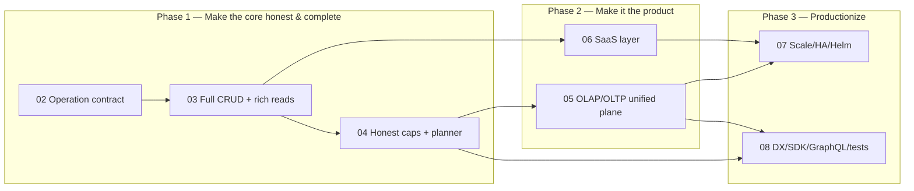

# 01 — Product Completion Plan: from skeleton to product

> The roadmap that turns the platform from "a beautifully engineered chassis with the engine half-built" (see [../06-product-assessment.md](../06-product-assessment.md)) into the product in the vision: an **engine-agnostic** BaaS that does **all operations, not just CRUD**, and can run as an **OLAP** *or* **OLTP** model — switchable as a runtime context, not just a deploy shape.

## The 8 workstreams

| # | Doc | Closes | Depends on |
|---|---|---|---|
| 02 | [Operation contract](02-operation-contract.md) | the single most important redesign — the wire/SDK shape for *all* operations | — |
| 03 | [Engine adapters: full CRUD + rich reads](03-engine-adapters-full-crud-and-rich-reads.md) | Postgres can't U/D/upsert; no aggregations/joins/search/cursors anywhere | 02 |
| 04 | [Honest capabilities + planner](04-honest-capabilities-and-planner.md) | descriptors *lie*; planner trusts the lie; SDK typing is dishonest | 02, 03 |
| 05 | [OLAP/OLTP unified query plane](05-olap-oltp-unified-query-plane.md) | Trino is a separate `/sql` endpoint; no cost-driven routing; OLAP/OLTP is deploy-only | 02, 04 |
| 06 | [SaaS layer: quotas, rate limits, metering, plans](06-saas-multitenancy-quotas-billing.md) | `plan` stored but unenforced; rate-limit per-IP not per-tenant; no usage accounting | 03 |
| 07 | [Scale, HA & Helm deployment](07-scale-ha-helm-deployment.md) | single-node Compose; no horizontal scale; manifest doesn't compile to K8s | 02–06 land first |
| 08 | [DX, SDK, GraphQL & the test pyramid](08-dx-sdk-graphql-testing.md) | SDK incomplete; no GraphQL; gateway query path was silently 404 → thin e2e | 02–05 |

## North star (definition of "good product")

A consumer can, through **one** SDK / one gateway surface:

1. Register **any** supported engine and run **every** operation it can support — full CRUD **plus** filtered/sorted/paginated reads, **aggregations**, **relationships/joins**, **search** — with the platform rejecting only what the engine *truly* can't do, and telling the truth about it.
2. Issue a query without knowing or caring whether it lands on an **OLTP** engine pool or the **OLAP** federation (Trino/Iceberg) — the platform routes by **cost**, and the tenant can flip the **workload context** (OLTP ⇄ OLAP) with a corresponding, predictable change in resource footprint.
3. Operate as a real SaaS: **quotas, per-tenant rate limits, usage metering, plan enforcement**, on an **HA** deployment they can scale.

## Sequencing — three phases, each shippable

- **Phase 1 (core honesty):** finish operations + tell the truth about capabilities. After this the brochure matches reality — the prerequisite for trust. *This is the product.*
- **Phase 2 (the differentiators):** the OLAP/OLTP unified plane (the vision's heart) + the SaaS layer (what makes it sellable).
- **Phase 3 (scale & polish):** HA/Helm, SDK/GraphQL, and the e2e test pyramid that stops flagship paths from silently breaking.

## Execution discipline (carry over what works)

This project already lives by a good model — keep it:

- **Slice-based & additive.** Each change is a small, independently shippable slice. The `EngineAdapter`/`PoolRegistry` and capability/cost model are the *correct* foundation — extend, don't redesign.
- **Verify-before-claim.** Every slice has a gate: `cargo test` / `go test` / `tsc`, the `mNN` milestone scripts, and — new and non-negotiable (08) — **e2e through the gateway** for the operation×engine matrix.
- **Capabilities reflect implementation.** No descriptor may advertise an op an adapter doesn't run (04). `/v1/capabilities` is the single source the SDK regenerates from.
- **Parity for swaps.** Anything that changes routing (05) ships behind a flag + `make parity` before becoming default.

## Cross-cutting invariants

1. **Safety first** — every user value is parameter-bound; identifiers validated; tenant scope enforced in the adapter (RLS GUC / search_path / owner filter). New operations must not weaken this.
2. **One operation contract** — 02 is the spine; 03/04/05/08 all consume the *same* `DataOperation`/SDK shape. No per-engine bespoke APIs.
3. **The cost model is the routing brain** — 04 makes it honest, 05 makes it route. It is the connective tissue between "all operations" and "OLAP/OLTP."

## What "done" looks like per phase

| Phase | Done when |
|---|---|
| P1 | Every advertised op runs on every engine (or is honestly absent); `/v1/capabilities` == reality; SDK regenerated; e2e matrix green for CRUD + rich reads |
| P2 | A join/aggregation transparently routes to Trino; flipping a tenant's workload context changes the footprint; quotas + plan limits enforced live |
| P3 | `helm install` brings up an edition; query-router/Rust scale horizontally; SDK covers the full surface incl. GraphQL; CI blocks on the e2e matrix |
